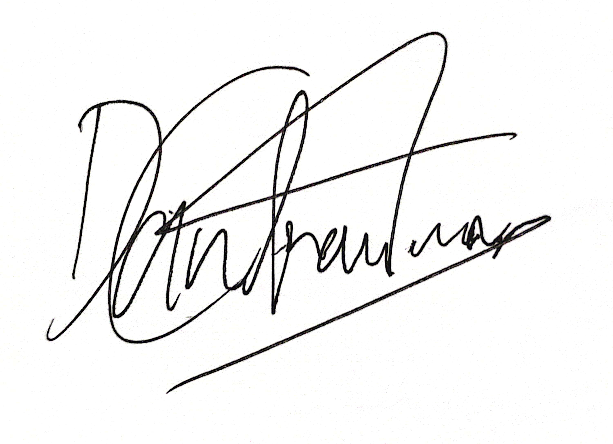
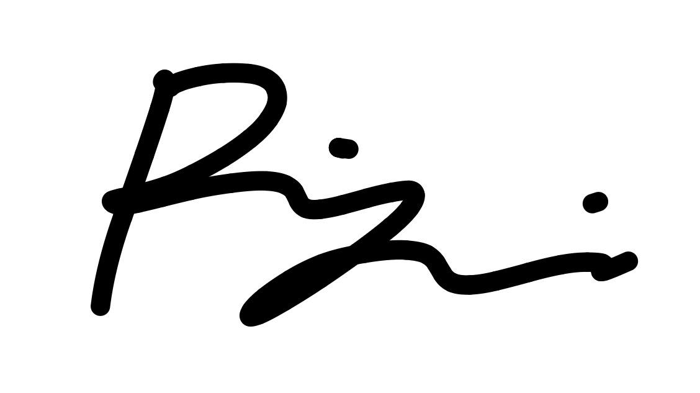

# Deklarasi Penggunaan AI

## Tugas Besar IF2150 - Rekayasa Perangkat Lunak

| Informasi            | Keterangan             |
| -------------------- | ---------------------- |
| Kelas                | K01                    |
| Nomor Kelompok       | G04                    |
| Nama Kelompok        | LompatMulai            |
| Nama Perangkat Lunak | "Nama Perangkat Lunak" |

**Anggota Kelompok:**

| NIM      | Nama                         |
| -------- | ---------------------------- |
| 13525052 | Daniel Charisma Christian    |
| 13525061 | Rifqi Irfan Indrawan         |
| 13525082 | Ausa Haadiyaan Mukhtar Yusuf |
| 13525058 | Farish Firstian Erifiawan    |

---

### Daftar Isi

- [Milestone 1](#milestone-1)
- Notes: Copy bagian Daftar Isi seperti Milestone 1 untuk Milestone berikutnya, contoh `* [Milestone 2](#milestone-2)`. Ketika Daftar isi diklik maka akan langsung diarahkan ke bagian bawah sesuai dengan Milestone tujuan.

---

### Log Penggunaan AI per Milestone

Silakan catat penggunaan AI yang berdampak signifikan pada pengerjaan tugas (misal: _generate_ fungsi algoritma yang kompleks, _generate_ draf dokumen SKPL/DPPL, atau _debugging_ error utama).
*Penggunaan sepele seperti memperbaiki *typo* atau auto-complete satu baris kode tidak perlu dicatat.*

### Milestone 1

| Tool AI  | Tujuan Penggunaan                                                                             | Contoh Prompt Utama                                                                                                                                                                                                                                                                                                                                                                                                       | Modifikasi & Validasi Manusia                                                                                                                                |
| :------- | :-------------------------------------------------------------------------------------------- | :------------------------------------------------------------------------------------------------------------------------------------------------------------------------------------------------------------------------------------------------------------------------------------------------------------------------------------------------------------------------------------------------------------------------ | :----------------------------------------------------------------------------------------------------------------------------------------------------------- |
| _Claude_ | _Mencari Referensi Solusi-Solusi Sebelumnya dan Brainstorming Ide-Ide Solusi Perangkat Lunak_ | _"Dalam konteks SDG 3, apa yang dapat mahasiswa-mahasiswa teknik informatika dapat bantu lewat pengembangan perangkat lunak di daerah Indonesia, lebih spesifiknya untuk Pusat Kesehatan Masyarakat (PusKesMas) (jika ada layanan kesehatan lain yang menurutmu lebih bermanfaat bagi masyarakat dalam lingkup yang banyak juga sebutkan saja)? Kalau bisa sertakan beberapa contoh yang sebelumnya pernah dikembangkan"_ | _AI memberikan beberapa ulasan seperti Operasional Puskesmas yang masih kurang namun pada akhirnya kami memutuskan untuk mengganti topik menjadi well-being_ |
|          |                                                                                               |                                                                                                                                                                                                                                                                                                                                                                                                                           |                                                                                                                                                              |

---

### Pernyataan Integritas dan Persetujuan

Kami yang bertanda tangan di bawah ini menyatakan bahwa seluruh log penggunaan AI di atas adalah benar. Kami telah memvalidasi seluruh hasil AI dan bertanggung jawab penuh atas orisinalitas, keamanan, dan kebenaran hasil akhir dari tugas ini.

|                   Tanda Tangan                    | Nama Anggota                                  |
| :-----------------------------------------------: | :-------------------------------------------- |
|  | **[13525052 - Daniel Charisma Christian]**    |
|  | **[13525061 - Rifqi Irfan Indrawan]**         |
|  | **[13525082 - Ausa Haadiyaan Mukhtar Yusuf]** |
|  | **[13525058 - Farish Firstian Erifiawan]**    |

