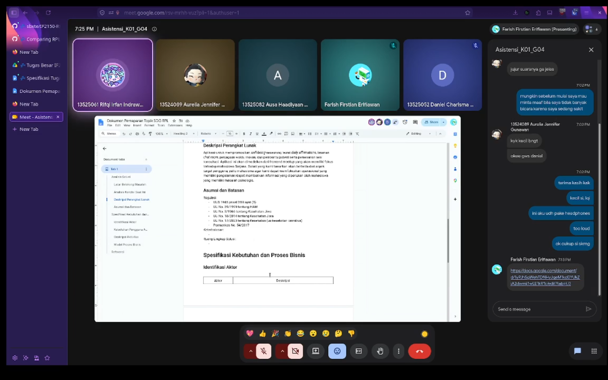

# Form Asistensi

## Tugas Besar IF2150 - Rekayasa Perangkat Lunak

| Informasi                | Keterangan        |
| ------------------------ | ----------------- |
| **Hari**                 | _\[Selasa\]_      |
| **Tanggal**              | _\[01/09/2026\]_  |
| **Kelas**                | _\[K01\]_         |
| **Nomor Kelompok**       | _\[4\]_           |
| **Nama Kelompok**        | _\[LompatMulai\]_ |
| **Nama Perangkat Lunak** | _\[Sehati\]_      |
| **Dokumen**              | _\[K01_G04_TB\]_  |

### Anggota Kelompok

| NIM      | Nama                         |
| -------- | ---------------------------- |
| 13525052 | Daniel Charisma Christian    |
| 13525061 | Rifqi Irfan Indrawan         |
| 13525082 | Ausa Haadiyaan Mukhtar Yusuf |
| 13525058 | Farish Firstian Erifiawan    |

### Catatan

| Catatan                                                                                            |
| -------------------------------------------------------------------------------------------------- |
| 1. Latar belakang perlu data yang konkret                                                          |
| 2. Bagian deskripsi perangkat lunak perlu dipertegas (karena kita cuman bikin mockup frontend dlu) |
| 3. Asumsi berikan sesuai dengan deskripsi perangkat lunak                                          |
| 4. Model Proses Bisnis ada 3 Kolom                                                                 |
| 5. Deksripsi Aktivitas didapat dari Kebutuhan Awal Aktor                                           |

## Dokumentasi

<!--  -->

  

  <i>Gambar 1. Dokumentasi kegiatan asistensi.</i>

