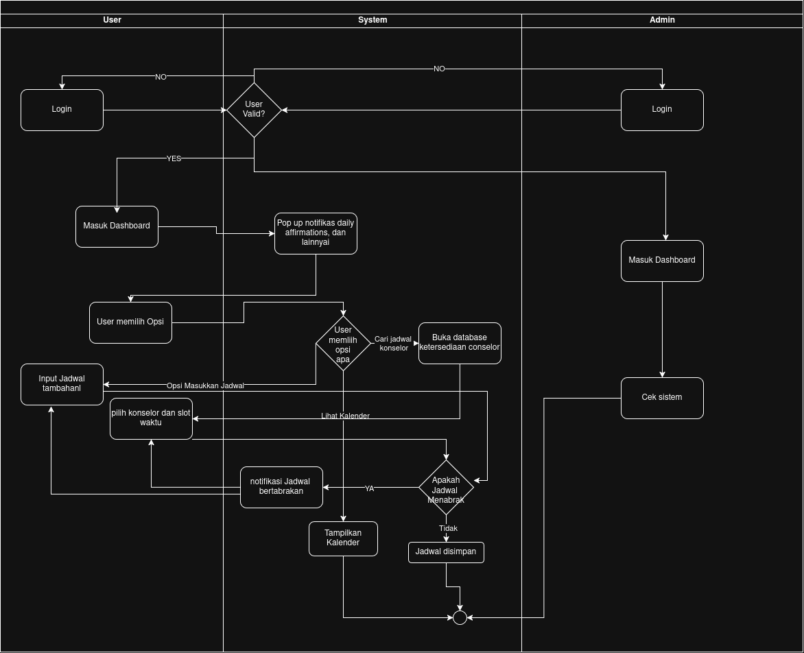

<h1>
IF2150 REKAYASA PERANGKAT LUNAK
 
TUGAS 1
 
TOPIC BRAINSTORMING
</h1>
 

## Sehati

### Untuk: Aurelia Jennifer Gunawan

Dipersiapkan oleh:
| Informasi | Keterangan |
| --- | --- |
| Kelas | K01 |
| Kelompok | G04 |

| NIM      | Nama                         |
| -------- | ---------------------------- |
| 13525052 | Daniel Charisma Christian    |
| 13525061 | Rifqi Irfan Indrawan         |
| 13525082 | Ausa Haadiyaan Mukhtar Yusuf |
| 13525058 | Farish Firstian Erifiawan    |

---

 
 

# BAB 1: Analisis Permasalahan

## 1.1 Latar Belakang Masalah

Kesehatan mental itu penting. Namun, masyarakat Indonesia cenderung untuk mengabaikan hal ini. Buktinya, pergi ke psikolog untuk terapi seringkali dipandang sebagai hal yang tabu dan dianggap melemahkan diri.

Selain itu, jumlah kasus bunuh diri di Indonesia cukup tinggi, terutama yang terjadi pada remaja dan mahasiswa. Estimasi IHME dan Global Burden of Disease menyatakan, pada tahun 2023 untuk setiap 100.000 orang, terjadi sekitar 2 kematian akibat bunuh diri di Indonesia.

Di samping kasus bunuh diri, kondisi mental yang kurang ideal menurunkan tingkat produktivitas dan kualitas aktivitas sosial. Kedua faktor ini sangat penting bagi mahasiswa, target utama produk kami, untuk mencapai perkuliahan yang optimal.

Kami ingin mengaitkan latar belakang ini dengan poin ketiga Tujuan Pengembangan Bersama (_Sustainable Development Goals_ [SDGs]), yaitu kehidupan yang sehat dan sejahtera. Perserikatan Bangsa-Bangsa telah mencanangkan sejumlah SDG yang perlu pemerintah dan masyarakat dunia capai sebelum tahun 2030. Namun, pada tahun 2024, terlaporkan bahwa hanya 17% target SDG telah tercapai.

Dari latar belakang ini, diharapkan solusi perangkat lunak ini dapat menjadi sarana untuk menggiatkan kesadaran akan kesehatan mental yang baik dan ketercapaian bersama dalam SDGs di lingkungan kami sebagai mahasiswa, serta memperkaya alternatif solusi yang telah ada.

## 1.2 Analisis Kondisi Saat Ini

[Riliv](https://riliv.co/), [bicarakan.id](http://Bicarakan.id), KALM, 7 Cups, [Headspace](https://www.headspace.com/), BetterHelp, dan Woebot menawarkan beberapa solusi perangkat lunak yang telah dikembangkan sebelumnya. Ada pun _hotline_ yang disediakan oleh pemerintah (SEJIWA, yang dapat diakses via nomor telepon 119 _extension_ 8\) dan lembaga lainnya, seperti LISA Suicide Prevention Helpline, yang diprakarsai oleh 11 LSM dalam kolektif Bali Bersama Bisa.

Namun, terdapat beberapa keluhan yang diberikan oleh _review online_ yang diberikan pengguna. Beberapa hal seperti:

| ID  | Kekurangan                                                                                                                                                                                                                                                              |
| --- | ----------------------------------------------------------------------------------------------------------------------------------------------------------------------------------------------------------------------------------------------------------------------- |
| AK1 | Aplikasi Riliv tergolong sulit dan kurang sesuai dalam pemakaiannya, terdapat fitur pemesanan konsultasi namun harus mengikuti jadwal yang tersedia dan tidak langsung.                                                                                                 |
| AK2 | Aplikasi Bicarakan.id yang memiliki kekurangan pada bug aplikasi yang dapat terjadi kapan saja, seperti terjadi pemesanan yang tulisannya selesai namun gagal, pembuatan akun yang terus gagal, pendaftaran yang menggunakan nomor baru namun dituliskan sudah dipakai. |
| AK3 | Sebagian besar layanan konseling memiliki tarif yang dapat tergolong cukup tinggi maka tidak dapat meng-_cover_ keseluruhan demografi                                                                                                                                   |
| AK4 | Layanan BetterHelp yang memiliki marketplace konseling memiliki masalah menaruh iklan yang bersangkutan dengan pihak ketiga yang menjual data pribadi pengguna                                                                                                          |
| AK5 | Chatbot Woebot yang pada awalnya memiliki basis pengguna yang cukup tinggi namun karena perusahaan beralih ke model enterprise pengguna-pengguna tersebut ditinggalkan begitu saja tanpa adanya pengganti                                                               |

---

# BAB 2: Analisis Solusi

## 2.1 Deskripsi Perangkat Lunak

Solusi perangkat lunak yang kami berikan merupakan desktop application yang akan mempromosikan well-being pengguna. Solusi tersebut merupakan solusi yang berkaitan dengan SDG kami yaitu SDG 3, ensure healthy lives and promote well-being for all at all ages. Aplikasi kami akan memfokuskan target berupa mahasiswa sebagai target pengguna, mengingat latar belakang kami yang masih menargetkan kalangan secara umum dan kami rasa hal tersebut masih kurang, maka dari itu kami memfokuskan target pengguna kami adalah mahasiswa. Penargetan tersebut juga akan membantu kami untuk memfokuskan/mempersempit operasional ke dalam kajian mahasiswa saja. Fitur-fitur utama yang kami berupa daily affirmations, pengingat waktu makan, tidur, dan juga pembantu jadwal serta pemesanan sesi konsultasi.

## 2.2 Asumsi dan Batasan

### 2.2.1 Asumsi

| ID     | Asumsi                                                                                                                                                                                                   |
| ------ | -------------------------------------------------------------------------------------------------------------------------------------------------------------------------------------------------------- |
| AB-A-1 | Pengguna (mahasiswa) memiliki akun Google aktif dan bersedia memberikan izin akses ke Google Calendar mereka untuk keperluan integrasi jadwal                                                            |
| AB-A-2 | Pengguna memiliki koneksi internet yang stabil selama menggunakan aplikasi, mengingat fitur-fitur utama (sinkronisasi kalender, pemesanan konsultasi) bergantung pada komunikasi real-time dengan server |
| AB-A-3 | Konselor yang terdaftar bersedia memperbarui ketersediaan jadwal mereka secara berkala melalui sistem                                                                                                    |
| AB-A-4 | Data jadwal dan preferensi yang dimasukkan pengguna (waktu makan, tidur, olahraga) mencerminkan kondisi dan kebutuhan nyata mereka                                                                       |
| AB-A-5 | Pengguna memiliki perangkat yang mendukung environment desktop aplikasi (OS dan spesifikasi minimum yang akan ditentukan)                                                                                |

### 2.2.2 Regulasi

| ID     | Asumsi                                                  |
| ------ | ------------------------------------------------------- |
| AB-R-1 | UUD 1945 pasal 28H ayat (1)                             |
| AB-R-2 | UU No. 39/1999 tentang HAM                              |
| AB-R-3 | UU No. 3/1966 tentang Kesehatan Jiwa                    |
| AB-R-4 | UU No. 18/2014 tentang Kesehatan Jiwa                   |
| AB-R-5 | UU No. 17/2023 tentang Kesehatan (uu kesehatan omnibus) |
| AB-R-6 | Permenkes No. 54/2017                                   |

### 2.2.3 Keterbatasan

| ID     | Asumsi                                                                                                                                                                                                                    |
| ------ | ------------------------------------------------------------------------------------------------------------------------------------------------------------------------------------------------------------------------- |
| AB-K-1 | Aplikasi bukan pengganti layanan intervensi krisis atau hotline darurat (seperti SEJIWA 119 ext 8\) — tidak dirancang untuk menangani situasi darurat kesehatan mental                                                    |
| AB-K-2 | Fitur integrasi jadwal bergantung pada ketersediaan dan kebijakan API pihak ketiga (Google Calendar API); jika pengguna mencabut izin akses atau layanan API mengalami gangguan, sinkronisasi jadwal tidak akan berfungsi |
| AB-K-3 | Verifikasi kredensial profesional konselor dilakukan secara manual oleh administrator, bukan otomatis                                                                                                                     |
| AB-K-4 | Konselor yang tersedia terbatas pada mitra yang telah terdaftar dan diverifikasi di dalam sistem, bukan direktori terbuka                                                                                                 |
| AB-K-5 | Sebagai aplikasi desktop, rilis awal tidak mencakup versi mobile                                                                                                                                                          |
| AB-K-6 | Aplikasi tidak menyediakan rekam medis elektronik atau fitur diagnosis klinis                                                                                                                                             |

### 2.2.4 Ruang Lingkup Solusi

#### 2.2.4.1 Termasuk dalam ruang lingkup

| ID         | Asumsi                                                                                                                                                         |
| ---------- | -------------------------------------------------------------------------------------------------------------------------------------------------------------- |
| AB-RLS-D-1 | Pengaturan dan pengiriman daily affirmations sesuai jadwal yang ditentukan pengguna                                                                            |
| AB-RLS-D-2 | Pengingat (reminder) makan, tidur, dan olahraga yang dapat dikustomisasi                                                                                       |
| AB-RLS-D-3 | Tampilan jadwal harian terintegrasi dengan Google Calendar pengguna (read access)                                                                              |
| AB-RLS-D-4 | Pemesanan sesi konsultasi dengan konselor, termasuk deteksi bentrok (overlap) antara slot yang dipilih dengan event yang sudah ada di Google Calendar pengguna |
| AB-RLS-D-5 | Panel administrator untuk mengelola ketersediaan konselor dan data pengguna                                                                                    |

#### 2.2.4.2 Di luar ruang lingkup

| ID         | Asumsi                                                           |
| ---------- | ---------------------------------------------------------------- |
| AB-RLS-L-1 | Layanan konseling darurat atau intervensi krisis real-time       |
| AB-RLS-L-2 | Rekam medis elektronik atau riwayat diagnosis klinis pengguna    |
| AB-RLS-L-3 | Sistem pembayaran/billing (belum disebutkan sebagai fitur utama) |
| AB-RLS-L-4 | Aplikasi versi mobile (native Android/iOS) pada rilis awal       |
| AB-RLS-L-5 | Fitur komunitas atau forum antar-pengguna                        |

---

# BAB 3: Spesifikasi Kebutuhan dan Proses Bisnis

## 3.1 Identifikasi Aktor

| Aktor         | Deskripsi                                                                                  |
| ------------- | ------------------------------------------------------------------------------------------ |
| Mahasiswa     | Pengguna ini berlaku sebagai pengguna utama dari aplikasi ini.                             |
| Administrator | Pengguna ini berperan untuk merawat dan mengelola keberjalanan dari aplikasi ini.          |
| Konselor      | Pengguna ini akan mengatur jadwal ketersediaan untuk sesi konseling di dalam aplikasi ini. |

## 3.2 Kebutuhan Pengguna Awal

Definisikan apa yang ingin dicapai oleh pengguna saat menggunakan sistem ini dalam format _User Story_ (Sebagai [Aktor], saya ingin [Aktivitas/Kebutuhan], sehingga [Tujuan/Nilai]). Pastikan kalian berfokus pada "apa yang ingin dilakukan pengguna".

| ID    | Aktor          | Kebutuhan / Aktivitas     | Tujuan / Nilai                                |
| :---- | :------------- | :------------------------ | :-------------------------------------------- |
| US-01 | _Kasir_        | _Memindai barcode barang_ | _Proses pembayaran berjalan cepat dan akurat_ |
| US-02 | _[Nama Aktor]_ | _[Kebutuhan pengguna]_    | _[Tujuan yang dicapai pengguna]_              |
| ...   | ...            | ...                       | ...                                           |

## 3.3 Deskripsi Aktivitas

| ID   | Aktivitas                                     | Penjelasan                                                                                                                                                                        | ID User Story |
| ---- | --------------------------------------------- | --------------------------------------------------------------------------------------------------------------------------------------------------------------------------------- | ------------- |
| A-01 | Menyetel daily affirmations                   | Pengguna dapat mengatur kapan mendapatkan daily affirmations lewat aplikasi.                                                                                                      | US-01         |
| A-02 | Melihat jadwal sehari-hari secara keseluruhan | Pengguna dapat melihat jadwal sehari-hari lewat integrasi dengan google calendar termasuk jadwal reminder dan event-event lain yang ada di jadwal google calendar pengguna.       | US-04         |
| A-03 | Menyetel reminder makan                       | Pengguna dapat mengatur kapan diberikan reminder lewat aplikasi.                                                                                                                  | US-02         |
| A-04 | Menyetel reminder tidur                       | Pengguna dapat mengatur kapan diberikan reminder lewat aplikasi.                                                                                                                  | US-03         |
| A-05 | Mengatur reminder olahraga                    | Pengguna dapat mengatur kapan diberikan reminder lewat aplikasi.                                                                                                                  | US-06         |
| A-06 | Menjadwalkan konsultasi dengan tenaga medis   | Pengguna dapat melihat jadwal konsultasi yang tersedia sekaligus melihat apakah jadwal tersebut bertabrakan dengan jadwal yang sudah ada di kalender pengguna di google calendar. | US-05         |

## 3.4 Model Proses Bisnis

  

<i>Gambar 1. Model Proses Bisnis Sehati</i>
 
www.drawio.com

# Referensi

- [https://garuda.kemdiktisaintek.go.id/documents/detail/4396353](https://garuda.kemdiktisaintek.go.id/documents/detail/4396353)
- [https://play.google.com/store/apps/details?id=id.bicarakan.client_app](https://play.google.com/store/apps/details?id=id.bicarakan.client_app)
- [https://play.google.com/store/apps/details?id=com.icreativelabs.sahabatku](https://play.google.com/store/apps/details?id=com.icreativelabs.sahabatku&hl=id)
- [https://play.google.com/store/apps/details?id=com.betterhelp\&hl=id](https://play.google.com/store/apps/details?id=com.betterhelp&hl=id)
- [https://psycnet.apa.org/doiLanding?doi=10.1037%2Fsah0000392](https://psycnet.apa.org/doiLanding?doi=10.1037%2Fsah0000392)
- [https://ourworldindata.org/grapher/suicide-death-rates?tab=line\&country=\~IDN\&mapSelect=\~IDN\&globe=1\&globeRotation=-2.27%2C117.36\&globeZoom=2.5](https://ourworldindata.org/grapher/suicide-death-rates?tab=line&country=~IDN&mapSelect=~IDN&globe=1&globeRotation=-2.27%2C117.36&globeZoom=2.5)
- [https://databoks.katadata.co.id/demografi/statistik/636e76fcf8dc70d/berapa-angka-bunuh-diri-di-indonesia](https://databoks.katadata.co.id/demografi/statistik/636e76fcf8dc70d/berapa-angka-bunuh-diri-di-indonesia)
- [De Oliveira, Claire, et al. "The Role of Mental Health on Workplace Productivity: A Critical Review of the Literature: C. de Oliveira et al." _Applied health economics and health policy_ 21.2 (2023): 167-193.](https://pmc.ncbi.nlm.nih.gov/articles/PMC9663290/pdf/40258_2022_Article_761.pdf)
- [Sayce, Liz. "Social inclusion and mental health." _Psychiatric Bulletin_ 25.4 (2001): 121-123.](https://www.cambridge.org/core/services/aop-cambridge-core/content/view/36D14A7DEF64A0CE9F7CFF3728A89DFA/S095560360009588Xa.pdf/social_inclusion_and_mental_health.pdf)
- [https://www.undp.org/sustainable-development-goals/good-health](https://www.undp.org/sustainable-development-goals/good-health)
- Diagram UML: https://www.drawio.com/, https://staruml.io/
- Konflik Riliv: [Garuda Kemdiktisaintek](https://garuda.kemdiktisaintek.go.id/documents/detail/4396353)
- Ulasan Bicarakan.id: [https://play.google.com/store/apps/details?id=id.bicarakan.client_app](https://play.google.com/store/apps/details?id=id.bicarakan.client_app)
- Ulasan Sahabatku: [https://play.google.com/store/apps/details?id=com.icreativelabs.sahabatku](https://play.google.com/store/apps/details?id=com.icreativelabs.sahabatku&hl=id)
- Ulasan BetterHelp: [https://play.google.com/store/apps/details?id=com.betterhelp\&hl=id](https://play.google.com/store/apps/details?id=com.betterhelp&hl=id)
