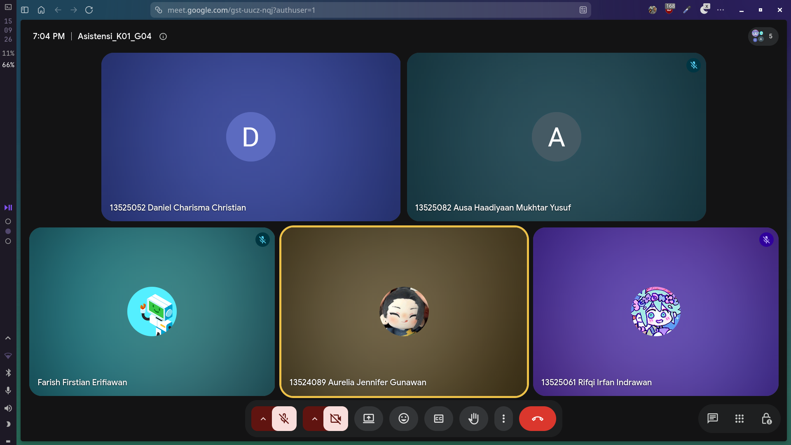

# Form Asistensi

## Tugas Besar IF2150 - Rekayasa Perangkat Lunak

| Informasi                | Keterangan    |
| ------------------------ | ------------- |
| **Hari**                 | Selasa        |
| **Tanggal**              | 15/09/2026    |
| **Kelas**                | K01           |
| **Nomor Kelompok**       | G04           |
| **Nama Kelompok**        | LompatMulai   |
| **Nama Perangkat Lunak** | Sehati        |
| **Dokumen**              | K01_G04_UC.md |

### Anggota Kelompok

| NIM      | Nama                         |
| -------- | ---------------------------- |
| 13525052 | Daniel Charisma Christian    |
| 13525061 | Rifqi Irfan Indrawan         |
| 13525082 | Ausa Haadiyaan Mukhtar Yusuf |
| 13525058 | Farish Firstian Erifiawan    |

### Catatan

| Catatan                                                                                                                                                                  |
| ------------------------------------------------------------------------------------------------------------------------------------------------------------------------ |
| 1. Kalo misal ada perubahan ada 2 source of truth, sebaiknya sih gausah disentuh milestone sebelumnya, gapapa copy dari milestone terakhir aja yang ada perubahannya tsb |
| 2. Use case diagram bisa tambah include, extend yang perlu masuk ke tabel juga                                                                                           |
| 3. Uptime, keamanan, intuitif harusnya di KNF                                                                                                                            |
| 4. KF-03 KF-04 duplikat                                                                                                                                                  |
| 5. Ttg cookies (KF-02) itu ttg keputusan desain jd mending dihapus/diubah                                                                                                |
| 6. KF-11 itu subset dari KF-10, jadi itungannya sama aja jd 1 KF aja                                                                                                     |
| 7. Kalo mau ngepisahin KF (semacam diuraikan) jangan terlalu diulang bahasanya, make it different                                                                        |
| 8. KF-13 dihapus aja krn mirip KF-12 tapi lebih ke KNF yang bagian maintainability                                                                                       |
| 9. KF-17 diubah biar lebih nekanin ke administrator (diubah jadi ngomongin ttg comment dari feedback pengguna)                                                           |
| 10. Untuk poin 2, misal kaya mesen sesi konsultasi (include ngeliat calendar) terus extend kaya nambahin pertanyaan di form website                                      |
| 11. Untuk poin notul 4, baru keinget duplikat karena R-03 R-04 yang mirip                                                                                                |
| 12. Bikin docs isinya full revisi yang diperlukan buat milestone tengah2 nanti                                                                                           |

**Notes for this section:** -

## Dokumentasi

<!--  -->

  

  <i>Gambar 1. Dokumentasi kegiatan asistensi.</i>

