<h1>
IF2150 REKAYASA PERANGKAT LUNAK
 
TUGAS 4
 
CLASS DIAGRAM
</h1>
 

## Sehati

### Untuk: Aurelia Jennifer Gunawan

Dipersiapkan oleh:

| Informasi | Keterangan |
| --------- | ---------- |
| Kelas     | K01        |
| Kelompok  | G04        |

| NIM      | Nama                         |
| -------- | ---------------------------- |
| 13525052 | Daniel Charisma Christian    |
| 13525061 | Rifqi Irfan Indrawan         |
| 13525082 | Ausa Haadiyaan Mukhtar Yusuf |
| 13525058 | Farish Firstian Erifiawan    |

---

## Daftar Perubahan

| Revisi    | Deskripsi                           |
| --------- | ----------------------------------- |
| REV-M4-01 | Menambahkan deskripsi UC-01 – UC-05 |
| REV-M4-02 | Menghilangkan UC-12                 |

 
 

# BAB 1: Deskripsi Perangkat Lunak

Melalui “Sehati”, pengguna utama diharapkan untuk bisa memesan jadwal sesi terapi, utamanya. Selain itu, ada aksi-aksi tambahan yang dapat dilakukan, seperti melihat daily affirmation dan pengingat makan, olahraga, dan tidur. Bagi konselor, mereka bisa mendaftarkan diri dan menjadwalkan sesi terapi.

---

# BAB 2: Kebutuhan Fungsional

## 2.1 Kebutuhan Fungsional

 _**Catatan**_: _Kebutuhan ditulis mengikuti pola EARS. Pada contoh di bawah, sebagian besar KF dipicu oleh satu aksi pelanggan, sehingga memakai pola event-driven "Ketika ⟨pemicu⟩, sistem harus ⟨respons⟩"._

Tabel 2.1. Daftar Kebutuhan Fungsional

| ID KF | ID Kebutuhan     | Penjelasan                                                                                                                                                                               |
| ----- | ---------------- | ---------------------------------------------------------------------------------------------------------------------------------------------------------------------------------------- |
| KF-01 | R-01             | Sistem menyediakan opsi untuk menyetel waktu pengiriman _daily affirmations_ dan dapat mengirim notifikasi _daily affirmations_ di waktu yang disetel                                    |
| KF-02 | R-03             | Sistem dapat mengambil data Google Calendar pengguna melalui API yang tersedia dan menampilkannya di antarmuka                                                                           |
| KF-03 | R-04, R-05, R-06 | Sistem menyediakan opsi untuk menyetel waktu pengiriman pengingat makan, tidur, olahraga dan dapat mengirim pengingatnya di waktu yang disetel                                           |
| KF-04 | R-07             | Sistem memberikan tampilan notifikasi di mana pun user berada dalam aplikasi, dilengkapi juga dengan konten seperti label yang diberikan pengguna                                        |
| KF-05 | R-08             | Sistem dapat menampilkan kalender yang telah terintegrasi dengan Google Calendar pengguna lalu memberikan kalender gabungan dengan data jadwal sesi konsultasi yang terdapat di database |
| KF-06 | R-09, R-10       | Sistem dapat mengambil data jadwal dari database dan dapat ditampilkan data tersebut ke pengguna                                                                                         |
| KF-07 | R-12             | Sistem dapat menampilkan daftar pertanyaan yang sering diajukan (FAQ) pada aplikasi.                                                                                                     |
| KF-08 | R-14             | Sistem menyediakan fitur bagi pengguna untuk memberikan umpan balik terhadap aplikasi.                                                                                                   |
| KF-09 | R-15             | Sistem dapat menampilkan status server (up/down) kepada administrator.                                                                                                                   |
| KF-10 | R-17             | Sistem dapat memberikan akses kepada administrator untuk memberikan tanggapan/feedback terhadap umpan balik pengguna.                                                                    |
| KF-11 | R-22             | Sistem dapat memverifikasi identitas pengguna melalui login akun Google dan memberikan akses ke aplikasi setelah autentikasi berhasil.                                                   |

---

# BAB 3: Model Use Case

## 3.1 Identifikasi Aktor

| Aktor         | Deskripsi                                                                                                                                             |
| ------------- | ----------------------------------------------------------------------------------------------------------------------------------------------------- |
| Mahasiswa     | Pengguna ini akan menggunakan fitur-fitur pengingat makan, olahraga, dan tidur serta mendapatkan daily affirmations dan dapat memesan sesi konsultasi |
| Administrator | Pengguna ini akan menambahkan jadwal konsultasi sesuai jadwal yang terdapat pada informasi konsultan.                                                 |

## 3.2 Identifikasi Use Case

| ID UC | Nama Use Case                 | Deskripsi Singkat                                                                                           | Aktor Terlibat           | ID KF Terkait       |
| ----- | ----------------------------- | ----------------------------------------------------------------------------------------------------------- | ------------------------ | ------------------- |
| UC-01 | Menyetel Daily Affirmations   | Mahasiswa mengatur waktu penerimaan daily affirmations dan menerima notifikasinya.                          | Mahasiswa                | KF-01, KF-02        |
| UC-02 | Menyetel Pengingat Kesehatan  | Mahasiswa mengatur waktu pengingat makan, tidur, dan olahraga, serta menerima notifikasinya.                | Mahasiswa                | KF-03, KF-04        |
| UC-03 | Melihat Kalender Terintegrasi | Mahasiswa melihat jadwal gabungan antara Google Calendar dan jadwal sesi konsultasi dalam satu tampilan.    | Mahasiswa                | KF-02, KF-05, KF-06 |
| UC-04 | Memesan Sesi Konsultasi       | Mahasiswa memilih dan memesan sesi konsultasi pada jadwal yang tersedia.                                    | Mahasiswa                | KF-05, KF-06        |
| UC-05 | Mengelola Jadwal Konsultan    | Administrator memasukkan dan memperbarui jadwal sesi konsultasi ke dalam sistem tanpa mengubah source code. | Administrator            | KF-06               |
| UC-06 | Melihat FAQ                   | Mahasiswa membuka dan mencari daftar pertanyaan yang sering diajukan.                                       | Mahasiswa                | KF-07               |
| UC-07 | Mengelola FAQ                 | Administrator menambah, mengubah, atau menghapus daftar FAQ.                                                | Administrator            | KF-07               |
| UC-08 | Memberikan Umpan Balik        | Mahasiswa mengirimkan umpan balik terhadap aplikasi.                                                        | Mahasiswa                | KF-08               |
| UC-09 | Menanggapi Umpan Balik        | Administrator melihat dan memberikan tanggapan atas umpan balik yang masuk.                                 | Administrator            | KF-10               |
| UC-10 | Memantau Status Server        | Administrator memeriksa status up/down server secara berkala.                                               | Administrator            | KF-09               |
| UC-11 | Masuk Melalui Akun Google     | Pengguna login ke aplikasi menggunakan akun Google sebelum mengakses fitur lainnya.                         | Mahasiswa, Administrator | KF-11               |
| UC-12 | Form Pengajuan pertanyaan     | Pengguna mengajukan pertanyaan diluar yang ada di FAQ                                                       | Mahasiswa                | KF-07               |

## 3.3 Use Case Diagram

Buatlah diagram use case keseluruhan berdasarkan identifikasi use case beserta aktor yang melakukan use case tersebut. Perhatikan garis `<<extend>>` dan `<<include>>`.

Pada bagian ini, Anda diperbolehkan untuk menyalin dari dokumen sebelumnya.

 

<i>Gambar 1. Use Case Diagram</i>

 

## 3.4 Skenario Use Case

### 3.4.1 Skenario UC-01

**Nama Use Case:** _Menyetel_ Daily Affirmations

**Skenario Normal**

| No  | Aksi Aktor                                                      | Reaksi Perangkat Lunak                                           |
| --- | --------------------------------------------------------------- | ---------------------------------------------------------------- |
| 1   | Mahasiswa memasukkan input waktu pengiriman _daily affirmation_ | Sistem menampilkan input pada _input box_                        |
| 2   | Mahasiswa mengklik tombol konfirmasi                            | Sistem menyimpan preferensi waktu pengiriman _daily affirmation_ |

 

**Skenario Alternatif 1: Sistem tidak mampu menyimpan setelan**

| No  | Aksi Aktor                                                      | Reaksi Perangkat Lunak                                                                                     |
| --- | --------------------------------------------------------------- | ---------------------------------------------------------------------------------------------------------- |
| 1   | Mahasiswa memasukkan input waktu pengiriman _daily affirmation_ | Sistem menampilkan input pada _input box_                                                                  |
| 2   | Mahasiswa mengklik tombol konfirmasi                            | Sistem tidak dapat menyimpan preferensi waktu pengiriman _daily affirmation_ dan menampilkan pesan _error_ |

### 3.4.2 Skenario UC-02

**Nama Use Case:** _Menyetel Pengingat Kesehatan_

**Skenario Normal**

| No  | Aksi Aktor                                                      | Reaksi Perangkat Lunak                                           |
| --- | --------------------------------------------------------------- | ---------------------------------------------------------------- |
| 1   | Mahasiswa memasukkan input waktu pengiriman pengingat kesehatan | Sistem menampilkan input pada _input box_                        |
| 2   | Mahasiswa mengklik tombol konfirmasi                            | Sistem menyimpan preferensi waktu pengiriman pengingat kesehatan |

 

**Skenario Alternatif 1: Sistem tidak mampu menyimpan setelan**

| No  | Aksi Aktor                                                      | Reaksi Perangkat Lunak                                                                                     |
| --- | --------------------------------------------------------------- | ---------------------------------------------------------------------------------------------------------- |
| 1   | Mahasiswa memasukkan input waktu pengiriman pengingat kesehatan | Sistem menampilkan input pada _input box_                                                                  |
| 2   | Mahasiswa mengklik tombol konfirmasi                            | Sistem tidak dapat menyimpan preferensi waktu pengiriman pengingat kesehatan dan menampilkan pesan _error_ |

### 3.4.3 Skenario UC-03

**Nama Use Case:** _Melihat Kalender Terintegrasi_

**Skenario Normal**

| No  | Aksi Aktor                                 | Reaksi Perangkat Lunak                                         |
| --- | ------------------------------------------ | -------------------------------------------------------------- |
| 1   | Mahasiswa mengklik tombol "Lihat Kalender" | Sistem menampilkan kalender dengan data-data _event_ mahasiswa |

 

**Skenario Alternatif 1: Sistem tidak mampu mengambil data _event_**

| No  | Aksi Aktor                                 | Reaksi Perangkat Lunak                                                                                                              |
| --- | ------------------------------------------ | ----------------------------------------------------------------------------------------------------------------------------------- |
| 1   | Mahasiswa mengklik tombol "Lihat Kalender" | Sistem tidak menampilkan kalender dengan data-data _event_ mahasiswa dan menyediakan pesan _error_ dan tombol untuk mengulangi aksi |
| 2   | Mahasiswa mengklik tombol "Refresh"        | Jika gagal, sama seperti no. 1. Jika berhasil, sistem bereaksi pada skenario normal                                                 |

### 3.4.4 Skenario UC-04

**Nama Use Case:** _Memesan Sesi Konsultasi_

| No  | Aksi Aktor                                      | Reaksi Perangkat Lunak                                                                               |
| --- | ----------------------------------------------- | ---------------------------------------------------------------------------------------------------- |
| 1   | Mahasiswa mengklik tombol "Pesan Sesi"          | Sistem menampilkan kalender dengan data-data _event_ mahasiswa dan jadwal konsultasi                 |
| 2   | Mahasiswa mengklik salah satu jadwal konsultasi | Sistem menampilkan informasi mengenai jadwal konsultasi tersebut dan menyediakan tombol "Konfirmasi" |
| 3   | Mahasiswa mengklik tombol "Konfirmasi"          | Sistem mengingat bahwa pengguna tersebut memesan sesi konsultasi yang dikonfirmasi                   |

**Skenario Alternatif 1: Sistem tidak mampu mengambil data jadwal konsultasi**

| No  | Aksi Aktor                             | Reaksi Perangkat Lunak                                                                                                                                         |
| --- | -------------------------------------- | -------------------------------------------------------------------------------------------------------------------------------------------------------------- |
| 1   | Mahasiswa mengklik tombol "Pesan Sesi" | Sistem tidak menampilkan kalender dengan data jadwal konsultasi dan/atau data _event_ mahasiswa dan menyediakan pesan _error_ dan tombol untuk mengulangi aksi |
| 2   | Mahasiswa mengklik tombol "Refresh"    | Jika gagal, sama seperti no. 1. Jika berhasil, sistem bereaksi pada skenario normal                                                                            |

**Skenario Alternatif 2: Sistem tidak mampu menyimpan jadwal konsultasi yang dipesan**

| No  | Aksi Aktor                             | Reaksi Perangkat Lunak                                                                                                                               |
| --- | -------------------------------------- | ---------------------------------------------------------------------------------------------------------------------------------------------------- |
| 1   | Mahasiswa mengklik tombol "Konfirmasi" | Sistem tidak menyimpan pesanan dan menampilkan pesan _error_. Jika ingin mengulangi, mahasiswa hanya perlu mengklik tombol "Konfirmasi" sekali lagi. |

### 3.4.5 Skenario UC-05

**Nama Use Case:** _Mengelola Jadwal Konsultan_

**Skenario Normal**

| No  | Aksi Aktor                                                                                | Reaksi Perangkat Lunak                                         |
| --- | ----------------------------------------------------------------------------------------- | -------------------------------------------------------------- |
| 1   | Administrator membuka _dashboard_ untuk mengelola jadwal konsultasi                       | Sistem menampilkan kalender dengan data-data jadwal konsultasi |
| 2   | Administrator mengklik salah satu jadwal konsultasi di _dashboard_                        | Sistem menampilkan laman untuk mengedit data jadwal konsultasi |
| 3   | Administrator memasukkan perubahan pada jadwal di laman edit dan mengklik tombol "Simpan" | Sistem menyimpan perubahan jadwal konsultasi                   |

**Skenario Alternatif 1: Sistem tidak mampu mengambil data jadwal konsultasi**

| No  | Aksi Aktor                                                          | Reaksi Perangkat Lunak                                                                                                         |
| --- | ------------------------------------------------------------------- | ------------------------------------------------------------------------------------------------------------------------------ |
| 1   | Administrator membuka _dashboard_ untuk mengelola jadwal konsultasi | Sistem tidak menampilkan kalender dengan data jadwal konsultasi dan menyediakan pesan _error_ dan tombol untuk mengulangi aksi |
| 2   | Administrator mengklik tombol "Refresh"                             | Jika gagal, sama seperti no. 1. Jika berhasil, sistem bereaksi pada skenario normal                                            |

**Skenario Alternatif 2: Sistem tidak mampu mengedit data jadwal konsultasi**

| No  | Aksi Aktor                                                                                | Reaksi Perangkat Lunak                                                                                                                                       |
| --- | ----------------------------------------------------------------------------------------- | ------------------------------------------------------------------------------------------------------------------------------------------------------------ |
| 1   | Administrator memasukkan perubahan pada jadwal di laman edit dan mengklik tombol "Simpan" | Sistem tidak menyimpan pergantian data dan menyediakan pesan _error_. Jika ingin mengulangi, administrator hanya perlu mengklik tombol "Simpan" sekali lagi. |

### 3.4.6 Skenario UC-06

**Nama Use Case:** Melihat FAQ

**Skenario Normal**

| No  | Aksi Aktor                                     | Reaksi Perangkat Lunak                                    |
| --- | ---------------------------------------------- | --------------------------------------------------------- |
| 1   | Mahasiswa mencari pertanyaan di search bar FAQ | Sistem menunjukkan pertanyaan dan jawaban yang disediakan |

 

\*\*Skenario Alternatif 1: Tidak ada pertanyaan yang dicari pengguna

| No  | Aksi Aktor                                     | Reaksi Perangkat Lunak                                                                                          |
| --- | ---------------------------------------------- | --------------------------------------------------------------------------------------------------------------- |
| 1   | Mahasiswa mencari pertanyaan di search bar FAQ | Sistem tidak menunjukkan pertanyaan yang dicari mahasiswa, lalu menawarkan untuk mengajukan pertanyaan di forum |

### 3.4.7 Skenario UC-07

**Nama Use Case:** Mengelola FAQ

**Skenario Normal**

| No  | Aksi Aktor                                        | Reaksi Perangkat Lunak                                                        |
| --- | ------------------------------------------------- | ----------------------------------------------------------------------------- |
| 1   | Admin menambahkan pertanyaan dan jawaban di FAQ   | Sistem berhasil menambahkan pertanyaan & jawabannya di database               |
| 2   | Admin mengurangi pertanyaan di FAQ                | Sistem berhasil menghapus pertanyaan (dan jawabannya) dari database           |
| 3   | Admin mengubah pertanyaan dan/atau jawaban di FAQ | Sistem berhasil menyimpan perubahan pertanyaan dan/atau jawaban pada database |

 

\*\*Skenario Alternatif 1: Tidak ada pertanyaan maupun jawaban yang berhasil disimpan

| No  | Aksi Aktor                                        | Reaksi Perangkat Lunak                                                     |
| --- | ------------------------------------------------- | -------------------------------------------------------------------------- |
| 1   | Admin menambahkan pertanyaan dan jawaban di FAQ   | Sistem tidak menambahkan pertanyaan maupun jawabannya di database          |
| 2   | Admin mengurangi pertanyaan di FAQ                | Sistem tidak menghapus pertanyaan (dan jawabannya) dari database           |
| 3   | Admin mengubah pertanyaan dan/atau jawaban di FAQ | Sistem tidak menyimpan perubahan pertanyaan dan/atau jawaban pada database |

### 3.4.8 Skenario UC-08

**Nama Use Case:** Memberikan Umpan Balik

**Skenario Normal**

| No  | Aksi Aktor                                                      | Reaksi Perangkat Lunak                                  |
| --- | --------------------------------------------------------------- | ------------------------------------------------------- |
| 1   | Mahasiswa memberikan umpan balik di forum pemberian umpan balik | Sistem menerima dan menyimpan umpan balik pada database |

 

\*\*Skenario Alternatif 1: Umpan balik tidak disimpan pada database

| No  | Aksi Aktor                                                      | Reaksi Perangkat Lunak                                              |
| --- | --------------------------------------------------------------- | ------------------------------------------------------------------- |
| 1   | Mahasiswa memberikan umpan balik di forum pemberian umpan balik | Sistem tidak menerima dan tidak menyimpan umpan balik pada database |

### 3.4.9 Skenario UC-09

**Nama Use Case:** Menanggapi Umpan Balik

**Skenario Normal**

| No  | Aksi Aktor                                                               | Reaksi Perangkat Lunak                                         |
| --- | ------------------------------------------------------------------------ | -------------------------------------------------------------- |
| 1   | Admin memberikan tanggapan pada umpan balik yang diterima oleh mahasiswa | Sistem menunjukkan jawaban dari tanggapan yang diberikan admin |

 

\*\*Skenario Alternatif 1: Tanggapan umpan balik tidak berhasil ditampilkan

| No  | Aksi Aktor                                                               | Reaksi Perangkat Lunak                                  |
| --- | ------------------------------------------------------------------------ | ------------------------------------------------------- |
| 1   | Admin memberikan tanggapan pada umpan balik yang diterima oleh mahasiswa | Sistem tidak menunjukkan konten pada tampilan mahasiswa |

### 3.4.10 Skenario UC-10

**Nama Use Case:** Memantau Status Server

**Skenario Normal**

| No  | Aksi Aktor                          | Reaksi Perangkat Lunak                  |
| --- | ----------------------------------- | --------------------------------------- |
| 1   | Admin melihat status uptime website | Sistem memberikan status uptime website |
| 2   | Admin melihat status uptime server  | Sistem menunjukkan status uptime server |

 

### 3.4.11 Skenario UC-11

**Nama Use Case:** Masuk Melalui Akun Google

**Skenario Normal**

| No  | Aksi Aktor                                         | Reaksi Perangkat Lunak                                         |
| --- | -------------------------------------------------- | -------------------------------------------------------------- |
| 1   | Mahasiswa melakukan autentikasi dengan akun Google | Sistem menampilkan tampilan selanjutnya setelah login berhasil |

 

\*\*Skenario Alternatif 1: OAuth Google tidak berfungsi saat login

| No  | Aksi Aktor                                         | Reaksi Perangkat Lunak                                                          |
| --- | -------------------------------------------------- | ------------------------------------------------------------------------------- |
| 1   | Mahasiswa melakukan autentikasi dengan akun Google | Sistem tidak melakukan login untuk mahasiswa, mahasiswa kembali ke login screen |

---

# BAB 4: Diagram Kelas

## 4.1 Identifikasi Kelas

| ID Kelas | Nama Kelas            | Deskripsi Kelas                                                                                                               | ID Use Case                             |
| -------- | --------------------- | ----------------------------------------------------------------------------------------------------------------------------- | --------------------------------------- |
| C-01     | Pengguna              | Kelas abstrak menyimpan atribut umum akun (id, nama, email, googleId) yang dibagikan Mahasiswa dan Administrator.             | UC-11                                   |
| C-02     | Mahasiswa             | Merealisasikan Pengguna; merepresentasikan pengguna utama aplikasi.                                                           | UC-01–UC-04, UC-06, UC-08, UC-11, UC-12 |
| C-03     | Administrator         | Merealisasikan Pengguna; mengelola jadwal konsultan, FAQ, dan umpan balik.                                                    | UC-05, UC-07, UC-09, UC-10, UC-11       |
| C-04     | SesiAutentikasi       | Menyimpan token sesi aplikasi dan status login setelah autentikasi Google berhasil.                                           | UC-11                                   |
| C-05     | DailyAffirmation      | Menyimpan konten afirmasi dan jadwal pengiriman yang ditentukan pengguna.                                                     | UC-01                                   |
| C-06     | Reminder              | Menyimpan jenis pengingat (makan/tidur/olahraga) beserta waktu yang ditentukan pengguna.                                      | UC-02                                   |
| C-07     | Notifikasi            | Merepresentasikan satu notifikasi yang dikirim ke pengguna (dari DailyAffirmation atau Reminder).                             | UC-01, UC-02                            |
| C-08     | GoogleCalendarService | Menangani komunikasi ke Google Calendar API — mengambil event pengguna dan melakukan pengecekan bentrok jadwal (freebusy).    | UC-03, UC-04                            |
| C-09     | KalenderGabungan      | Menggabungkan event dari GoogleCalendarService dengan data JadwalKonsultasi untuk ditampilkan sebagai satu tampilan kalender. | UC-03                                   |
| C-10     | Konsultan             | Menyimpan data konsultan (nama, spesialisasi) yang didaftarkan oleh Administrator.                                            | UC-04, UC-05                            |
| C-11     | JadwalKonsultasi      | Menyimpan slot jadwal konsultasi (konsultan, waktu, status tersedia/terpesan) pada database.                                  | UC-04, UC-05                            |
| C-12     | FAQ                   | Menyimpan pasangan pertanyaan dan jawaban yang dikelola Administrator.                                                        | UC-06, UC-07                            |
| C-13     | PengajuanPertanyaan   | Menyimpan pertanyaan yang diajukan pengguna di luar FAQ yang tersedia.                                                        | UC-12                                   |
| C-14     | UmpanBalik            | Menyimpan umpan balik pengguna beserta tanggapan Administrator (jika ada).                                                    | UC-08, UC-09                            |
| C-15     | StatusServer          | Merepresentasikan status uptime layanan yang dipantau Administrator.                                                          | UC-10                                   |

## 4.2 Diagram Kelas per Use Case

### 4.2.1 Use Case UC-01

**Nama Use Case:** Menyetel Daily Affirmations

#### Identifikasi Kelas

| ID Kelas | Nama Kelas       | Deskripsi Kelas |
| :------- | :--------------- | :-------------- |
| C02      | Mahasiswa        |                 |
| C05      | DailyAffirmation |                 |
| C07      | Notifikasi       |                 |

#### Diagram Kelas

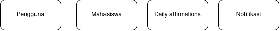

<i>Gambar 2. Diagram Kelas Use Case UC-01</i>

 

| ID Kelas | Nama Kelas       | Atribut | Metode/Operasi |
| :------- | :--------------- | :------ | :------------- |
| C02      | Mahasiswa        |         |                |
| C05      | DailyAffirmation |         |                |
| C07      | Notifikasi       |         |                |

### 4.2.2 Use Case UC-02

**Nama Use Case:** Menyetel Pengingat Kesehatan

#### Identifikasi Kelas

| ID Kelas | Nama Kelas | Deskripsi Kelas |
| :------- | :--------- | :-------------- |
| C02      | Mahasiswa  |                 |
| C06      | Reminder   |                 |
| C07      | Notifikasi |                 |

#### Diagram Kelas

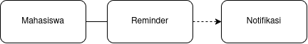

<i>Gambar 3. Diagram Kelas Use Case UC-02</i>

 

| ID Kelas | Nama Kelas | Atribut | Metode/Operasi |
| :------- | :--------- | :------ | :------------- |
| C02      | Mahasiswa  |         |                |
| C06      | Reminder   |         |                |
| C07      | Notifikasi |         |                |

### 4.2.3 Use Case UC-03

**Nama Use Case:** Melihat Kalender Terintegrasi

#### Identifikasi Kelas

| ID Kelas | Nama Kelas            | Deskripsi Kelas |
| :------- | :-------------------- | :-------------- |
| C02      | Mahasiswa             |                 |
| C08      | GoogleCalendarService |                 |
| C09      | KalenderGabungan      |                 |

#### Diagram Kelas

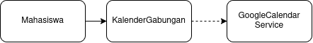

<i>Gambar 4. Diagram Kelas Use Case UC-03</i>

 

| ID Kelas | Nama Kelas            | Atribut | Metode/Operasi |
| :------- | :-------------------- | :------ | :------------- |
| C02      | Mahasiswa             |         |                |
| C08      | GoogleCalendarService |         |                |
| C09      | KalenderGabungan      |         |                |

### 4.2.4 Use Case UC-04

**Nama Use Case:** Memesan Sesi Konsultasi

#### Identifikasi Kelas

| ID Kelas | Nama Kelas            | Deskripsi Kelas |
| :------- | :-------------------- | :-------------- |
| C02      | Mahasiswa             |                 |
| C08      | GoogleCalendarService |                 |
| C10      | Konsultan             |                 |
| C11      | JadwalKonsultasi      |                 |

#### Diagram Kelas

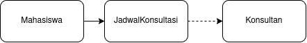

<i>Gambar 5. Diagram Kelas Use Case UC-04</i>

 

| ID Kelas | Nama Kelas            | Atribut | Metode/Operasi |
| :------- | :-------------------- | :------ | :------------- |
| C02      | Mahasiswa             |         |                |
| C08      | GoogleCalendarService |         |                |
| C10      | Konsultan             |         |                |
| C11      | JadwalKonsultasi      |         |                |

### 4.2.5 Use Case UC-05

**Nama Use Case:** Mengelola Jadwal Konsultan

#### Identifikasi Kelas

| ID Kelas | Nama Kelas       | Deskripsi Kelas |
| :------- | :--------------- | :-------------- |
| C03      | Administrator    |                 |
| C10      | Konsultan        |                 |
| C11      | JadwalKonsultasi |                 |

#### Diagram Kelas

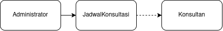

<i>Gambar 6. Diagram Kelas Use Case UC-05</i>

 

| ID Kelas | Nama Kelas       | Atribut | Metode/Operasi |
| :------- | :--------------- | :------ | :------------- |
| C03      | Administrator    |         |                |
| C10      | Konsultan        |         |                |
| C11      | JadwalKonsultasi |         |                |

### 4.2.6 Use Case UC-06

**Nama Use Case:** Melihat FAQ

#### Identifikasi Kelas

| ID Kelas | Nama Kelas | Deskripsi Kelas |
| :------- | :--------- | :-------------- |
| C02      | Mahasiswa  |                 |
| C12      | FAQ        |                 |

#### Diagram Kelas

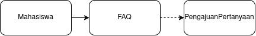

<i>Gambar 7. Diagram Kelas Use Case UC-06</i>

 

| ID Kelas | Nama Kelas | Atribut | Metode/Operasi |
| :------- | :--------- | :------ | :------------- |
| C02      | Mahasiswa  |         |                |
| C12      | FAQ        |         |                |

### 4.2.7 Use Case UC-07

**Nama Use Case:** Mengelola FAQ

#### Identifikasi Kelas

| ID Kelas | Nama Kelas    | Deskripsi Kelas |
| :------- | :------------ | :-------------- |
| C03      | Administrator |                 |
| C12      | FAQ           |                 |

#### Diagram Kelas

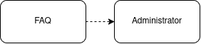

<i>Gambar 8. Diagram Kelas Use Case UC-07</i>

 

| ID Kelas | Nama Kelas    | Atribut | Metode/Operasi |
| :------- | :------------ | :------ | :------------- |
| C03      | Administrator |         |                |
| C12      | FAQ           |         |                |

### 4.2.8 Use Case UC-08

**Nama Use Case:** Memberikan Umpan Balik

#### Identifikasi Kelas

| ID Kelas | Nama Kelas | Deskripsi Kelas |
| :------- | :--------- | :-------------- |
| C02      | Mahasiswa  |                 |
| C14      | UmpanBalik |                 |

#### Diagram Kelas

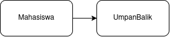

<i>Gambar 9. Diagram Kelas Use Case UC-08</i>

 

| ID Kelas | Nama Kelas | Atribut | Metode/Operasi |
| :------- | :--------- | :------ | :------------- |
| C02      | Mahasiswa  |         |                |
| C14      | UmpanBalik |         |                |

### 4.2.9 Use Case UC-09

**Nama Use Case:** Menanggapi Umpan Balik

#### Identifikasi Kelas

| ID Kelas | Nama Kelas    | Deskripsi Kelas |
| :------- | :------------ | :-------------- |
| C03      | Administrator |                 |
| C14      | UmpanBalik    |                 |

#### Diagram Kelas

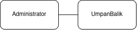

<i>Gambar 10. Diagram Kelas Use Case UC-09</i>

 

| ID Kelas | Nama Kelas    | Atribut | Metode/Operasi |
| :------- | :------------ | :------ | :------------- |
| C03      | Administrator |         |                |
| C14      | UmpanBalik    |         |                |

### 4.2.10 Use Case UC-10

**Nama Use Case:** Memantau Status Server

#### Identifikasi Kelas

| ID Kelas | Nama Kelas    | Deskripsi Kelas |
| :------- | :------------ | :-------------- |
| C03      | Administrator |                 |
| C15      | StatusServer  |                 |

#### Diagram Kelas

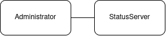

<i>Gambar 11. Diagram Kelas Use Case UC-10</i>

 

| ID Kelas | Nama Kelas    | Atribut | Metode/Operasi |
| :------- | :------------ | :------ | :------------- |
| C03      | Administrator |         |                |
| C15      | StatusServer  |         |                |

### 4.2.11 Use Case UC-11

**Nama Use Case:** Masuk Melalui Akun Google

#### Identifikasi Kelas

| ID Kelas | Nama Kelas      | Deskripsi Kelas |
| :------- | :-------------- | :-------------- |
| C01      | Pengguna        |                 |
| C02      | Mahasiswa       |                 |
| C03      | Administrator   |                 |
| C04      | SesiAutentikasi |                 |

#### Diagram Kelas

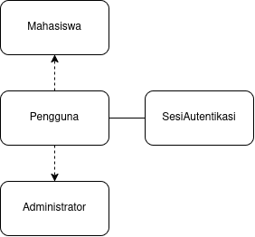

<i>Gambar 12. Diagram Kelas Use Case UC-11</i>

 

| ID Kelas | Nama Kelas      | Atribut | Metode/Operasi |
| :------- | :-------------- | :------ | :------------- |
| C01      | Pengguna        |         |                |
| C02      | Mahasiswa       |         |                |
| C03      | Administrator   |         |                |
| C04      | SesiAutentikasi |         |                |

## 4.3 Diagram Kelas Keseluruhan

Gabungkan seluruh kelas dan hubungan antarkelas dari diagram kelas setiap use case menjadi satu diagram kelas keseluruhan. Pastikan tidak ada kelas yang terduplikasi.

<i>Gambar X. Diagram Kelas Keseluruhan</i>

 

| ID Kelas | Nama Kelas         | Atribut                      | Metode/Operasi                             |
| :------- | :----------------- | :--------------------------- | :----------------------------------------- |
| _C01_    | _Pelanggan_        | _idPelanggan, nama, email_   | _lihatRiwayatPesanan()_                    |
| _C02_    | _Pesanan_          | _idPesanan, total, status_   | _hitungTotal(), perbaruiStatus()_          |
| _C03_    | _Keranjang_        | _daftarItem_                 | _tambahItem(), checkout()_                 |
| _C04_    | _MetodePembayaran_ | _-_                          | _kirimKePaymentGatewayDummy()_             |
| _C05_    | _Kartu_            | _nomorKartu, masaBerlaku_    | _kirimKePaymentGatewayDummy()_             |
| _C06_    | _EWallet_          | _saldo, idAkun_              | _cekSaldo(), kirimKePaymentGatewayDummy()_ |
| _C07_    | _RiwayatTransaksi_ | _idTransaksi, waktu, status_ | _catatTransaksi(), tampilkanNotifikasi()_  |
| _..._    | _..._              | _..._                        | _..._                                      |

---

# BAB 5: Traceability

| ID Kelas | ID Use Case                              | ID KF                                           |
| -------- | ---------------------------------------- | ----------------------------------------------- |
| C-01     | UC-11                                    | KF-11                                           |
| C-02     | UC-01, UC-04, UC-06, UC-08, UC-11, UC-12 | KF-01, KF-02, KF-05, KF-06, KF-07, KF-08, KF-11 |
| C-03     | UC-05, UC-07, UC-09, UC-10, UC-11        | KF-06, KF-07, KF-09, KF-10, KF-11               |
| C-04     | UC-11                                    | KF-11                                           |
| C-05     | UC-01                                    | KF-01, KF-02                                    |
| C-06     | UC-02                                    | KF-03, KF-04                                    |
| C-07     | UC-01, UC-02                             | KF-01, KF02, KF-03, KF-04                       |
| C-08     | UC-03, UC-04                             | KF-02, KF-05, KF-06                             |
| C-09     | UC-03                                    | KF-02, KF-05, KF-06                             |
| C-10     | UC-04, UC-05                             | KF-05, KF-06                                    |
| C-11     | UC-04, UC-05                             | KF-05, KF-06                                    |
| C-12     | UC-06, UC-07                             | KF-07                                           |
| C-13     | UC-12                                    | KF-07                                           |
| C-14     | UC-08, UC-09                             | KF-08, KF-10                                    |
| C-15     | UC-10                                    | KF-09                                           |

---

# Referensi

- Diagram UML: [https://www.drawio.com/](https://www.drawio.com/), [https://staruml.io/](https://staruml.io/)
