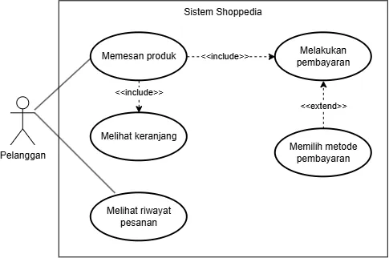

<h1>
IF2150 REKAYASA PERANGKAT LUNAK
 
TUGAS 5
 
SPESIFIKASI KEBUTUHAN PERANGKAT LUNAK (SKPL)
</h1>
 

## Sehati

### Untuk: Aurelia Jennifer Gunawan

Dipersiapkan oleh:

| Informasi | Keterangan |
| --------- | ---------- |
| Kelas     | K01        |
| Kelompok  | G04        |

| NIM      | Nama                         |
| -------- | ---------------------------- |
| 13525052 | Daniel Charisma Christian    |
| 13525061 | Rifqi Irfan Indrawan         |
| 13525082 | Ausa Haadiyaan Mukhtar Yusuf |
| 13525058 | Farish Firstian Erifiawan    |

---

## Daftar Perubahan

| Revisi | Deskripsi |
| ------ | --------- |
| -      | -         |

 

# BAB 1: Pendahuluan

## 1.1 Tujuan Penulisan Dokumen

Dokumen Spesifikasi Kebutuhan Perangkat Lunak (SKPL) ini menjabarkan kebutuhan perangkat lunak Sehati: deskripsi sistem, kebutuhan fungsional dan non-fungsional, pemodelan *use case*, pemodelan kelas, dan keterlacakan (*traceability*) antara kelas, *use case*, dan kebutuhan fungsional. Dokumen ini menjadi acuan tentang apa yang harus dilakukan Sehati sebelum perancangan dan implementasi dimulai.

Pengguna dokumen ini adalah tim pengembang (Kelompok G04, Kelas K01), yang memakainya sebagai dasar perancangan, implementasi, dan pengujian, serta Aurelia Jennifer Gunawan, yang meninjau kesesuaian dan kelengkapan spesifikasi.

## 1.2 Lingkup Masalah

Sehati adalah perangkat lunak untuk menjaga kesehatan mental dan kesejahteraan mahasiswa, sesuai dengan SDG 3 (kehidupan sehat dan sejahtera). Di Indonesia, kesehatan mental masih sering diabaikan dan terapi psikologis dianggap tabu. Kasus bunuh diri juga tinggi, terutama pada remaja dan mahasiswa, dengan estimasi sekitar 2 kematian per 100.000 penduduk pada tahun 2023 menurut IHME dan *Global Burden of Disease*. Kondisi mental yang kurang baik turut menurunkan produktivitas dan kualitas aktivitas sosial. Ulasan pengguna atas aplikasi serupa memuat keluhan tentang penggunaan yang sulit, jadwal konsultasi yang kaku, *bug*, tarif tinggi, iklan pihak ketiga yang menjual data pribadi pengguna, dan pengguna yang ditinggalkan tanpa pengganti ketika layanan beralih ke model *enterprise*. Sehati menargetkan mahasiswa dan menyediakan *daily affirmations*, pengingat makan, tidur, dan olahraga, tampilan jadwal harian yang terhubung dengan Google Calendar, serta pemesanan sesi konsultasi yang mengecek bentrok dengan jadwal di kalender pengguna.

## 1.3 Definisi, Istilah, dan Singkatan

Tabel 1.3. Definisi Istilah dan Singkatan

| Singkatan, Akronim, atau Istilah | Penjelasan |
| --- | --- |
| P/L | Singkatan dari Perangkat Lunak, yaitu aplikasi yang memberikan perintah kepada komputer untuk menjalankan tugas tertentu. |
| SKPL | Singkatan dari Spesifikasi Kebutuhan Perangkat Lunak, yaitu dokumen yang merangkum kriteria-kriteria yang diperlukan untuk membangun aplikasi menjalankan tugasnya. |
| KF | Singkatan dari Kebutuhan Fungsional, yaitu kebutuhan yang menjelaskan apa yang harus dapat dilakukan oleh sistem. |
| KNF | Singkatan dari Kebutuhan Non-Fungsional, yaitu kebutuhan yang menjelaskan kualitas sistem, seperti ketersediaan, keamanan, dan kemudahan penggunaan. |
| UC | Singkatan dari *Use Case*, yaitu gambaran interaksi antara aktor dan sistem untuk mencapai suatu tujuan. |
| UML | Singkatan dari *Unified Modeling Language*, yaitu bahasa pemodelan standar yang digunakan untuk membuat *use case diagram* dan diagram kelas. |
| SDG | Singkatan dari *Sustainable Development Goals* (Tujuan Pengembangan Berkelanjutan), yaitu 17 tujuan global yang dicanangkan PBB. SDG 3 berfokus pada kehidupan yang sehat dan sejahtera. |
| Sehati | Nama perangkat lunak yang dikembangkan untuk mendukung kesehatan mental dan kesejahteraan mahasiswa. |
| Mahasiswa | Aktor pengguna utama Sehati yang menggunakan pengingat, *daily affirmations*, jadwal, dan pemesanan sesi konsultasi. |
| Administrator | Aktor yang mengelola Sehati, termasuk memasukkan jadwal konsultan, mengelola FAQ dan umpan balik, serta memantau status *server*. |
| Konsultan | Tenaga profesional yang menyediakan sesi konsultasi. Konsultan bukan aktor sistem; data dan jadwalnya dikelola oleh Administrator. |
| *Daily Affirmations* | Pesan positif yang dikirimkan kepada pengguna pada waktu yang diatur pengguna untuk menjaga suasana hati dan kepercayaan diri. |
| Pengingat | Notifikasi dengan waktu yang diatur pengguna untuk makan, tidur, dan berolahraga. |
| Notifikasi | Pesan yang ditampilkan sistem kepada pengguna, misalnya untuk *daily affirmations* dan pengingat. |
| Google Calendar | Layanan kalender milik Google yang datanya diintegrasikan ke Sehati untuk menampilkan jadwal pengguna. |
| API | Singkatan dari *Application Programming Interface*, yaitu antarmuka yang memungkinkan satu perangkat lunak berkomunikasi dengan perangkat lunak lain, misalnya Google Calendar API. |
| OAuth | Protokol otorisasi yang memungkinkan aplikasi mendapat akses terbatas ke akun pengguna di layanan lain (misalnya Google) tanpa mengetahui kata sandi pengguna. |
| Autentikasi | Proses memverifikasi identitas pengguna sebelum diberi akses ke aplikasi. Pada Sehati, autentikasi dilakukan melalui akun Google. |
| *Free/busy* | Informasi rentang waktu pengguna yang sibuk atau kosong pada kalender, tanpa rincian acaranya. Dipakai untuk mendeteksi bentrok jadwal. |
| Bentrok jadwal | Kondisi ketika waktu sesi konsultasi yang dipilih tumpang tindih dengan acara lain di kalender pengguna. |
| *Database* | Basis data tempat sistem menyimpan data seperti jadwal konsultasi, FAQ, dan umpan balik. |
| *Server* | Komponen sistem yang menjalankan logika aplikasi dan melayani permintaan dari pengguna. |
| *Uptime* | Persentase waktu sistem dapat diakses dan beroperasi dalam suatu periode. |
| FAQ | Singkatan dari *Frequently Asked Questions*, yaitu daftar pertanyaan yang sering diajukan beserta jawabannya. |
| Umpan balik | Masukan dari pengguna terhadap aplikasi, yang dapat ditanggapi oleh Administrator. |
| *Traceability* | Keterlacakan hubungan antara kelas, *use case*, dan kebutuhan fungsional. |

## 1.4 Aturan Penomoran

Tabel 1.4. Aturan Penomoran

| Hal/Bagian | Penomoran | Keterangan |
| --- | --- | --- |
| Kebutuhan | R-XX | Huruf R, tanda hubung, lalu nomor urut dua digit mulai dari 01 (contoh: R-01). Dipakai pada kolom ID Kebutuhan. |
| Kebutuhan Fungsional | KF-XX | Nomor urut dua digit mulai dari 01 (contoh: KF-01). |
| Kebutuhan Non-Fungsional | KNF-XX | Nomor urut dua digit mulai dari 01 (contoh: KNF-01). |
| Aktivitas | A-XX | Nomor urut dua digit mulai dari 01 (contoh: A-01), sesuai dokumen *Requirement Gathering*. |
| *User Story* | US-XX | Nomor urut dua digit mulai dari 01 (contoh: US-01), sesuai dokumen *Requirement Gathering*. |
| *Use Case* | UC-XX | Nomor urut dua digit mulai dari 01 (contoh: UC-01). |
| Kelas | C-XX | Nomor urut dua digit mulai dari 01 (contoh: C-01). |
| Aktor | Tidak ada | Aktor tidak diberi ID dan dirujuk dengan namanya (Mahasiswa, Administrator). |

## 1.5 Referensi

1. Kelompok G04 K01, dokumen *Topic Brainstorming*, *Requirement Gathering*, *Use Case & Scenario Use Case*, dan *Class Diagram* untuk Sehati, IF2150 Rekayasa Perangkat Lunak.
2. Google, *Google Calendar API Documentation*. https://developers.google.com/calendar
3. Google, *Google Identity: OAuth 2.0*. https://developers.google.com/identity/protocols/oauth2
4. Our World in Data, *Suicide death rates* (data IHME/*Global Burden of Disease*). https://ourworldindata.org/grapher/suicide-death-rates
5. UNDP, *Sustainable Development Goals: Good Health and Well-being*. https://www.undp.org/sustainable-development-goals/good-health
6. Alat pembuatan diagram UML: draw.io (https://www.drawio.com/) dan StarUML (https://staruml.io/).

## 1.6 Deskripsi Umum Dokumen (Ikhtisar)

Dokumen SKPL ini terdiri dari enam bab. 
BAB 1 berisi tujuan penulisan, lingkup masalah, definisi dan singkatan, aturan penomoran, referensi, dan ikhtisar dokumen. 
BAB 2 menguraikan deskripsi umum sistem dan proses bisnis, deskripsi umum P/L, pengguna dan kebutuhannya, batasan P/L, serta lingkungan operasi. 
BAB 3 memuat kebutuhan fungsional (KF) dan kebutuhan non-fungsional (KNF). 
BAB 4 memodelkan *use case*: aktor, daftar *use case*, *use case diagram*, dan skenario tiap *use case*. 
BAB 5 memodelkan kelas melalui identifikasi kelas, diagram kelas per *use case*, dan diagram kelas keseluruhan. 
BAB 6 memetakan hubungan antara kelas, *use case*, dan KF. 
Bagian Referensi di akhir dokumen mendaftar sumber yang dipakai.

---

# BAB 2: Deskripsi Perangkat Lunak

## 2.1 Deskripsi Umum Sistem

Bagian ini dapat disalin dari BAB 1.1 _Deskripsi Umum Sistem_ pada dokumen _Requirement Gathering_, disesuaikan bila ada perubahan alur bisnis. Lengkapi dengan gambaran proses bisnis dalam bentuk _Activity Diagram_ (boleh disalin dan diperbarui dari 3.3 _Model Proses Bisnis_ pada dokumen _Topic Brainstorming_).

<i>Gambar 1. Contoh Activity Diagram Proses Bisnis</i>

## 2.2 Deskripsi Umum Perangkat Lunak

Diisi dengan deskripsi umum perangkat lunak untuk mendukung proses bisnis yang telah diuraikan pada sub-bab sebelumnya. Uraian harus menunjukkan lingkup perangkat lunak, mencakup keterkaitan perangkat lunak dengan sistem lain di luar (misalnya _Payment Gateway_ atau layanan pihak ketiga lain yang dipakai).

_Contoh narasi:_ "_[Nama P/L]_ merupakan aplikasi _[deskripsi singkat]_ yang berinteraksi dengan _Payment Gateway (dummy)_ untuk memproses otorisasi pembayaran. Sistem menerima input dari _Pelanggan_ melalui antarmuka aplikasi dan mengirimkan permintaan transaksi ke _Payment Gateway_ setiap kali pelanggan melakukan checkout."

## 2.3 Pengguna dan Kebutuhan Pengguna Perangkat Lunak

| Aktor         | Deskripsi                                                                                                                                             |
| ------------- | ----------------------------------------------------------------------------------------------------------------------------------------------------- |
| Mahasiswa     | Pengguna ini akan menggunakan fitur-fitur pengingat makan, olahraga, dan tidur serta mendapatkan daily affirmations dan dapat memesan sesi konsultasi |
| Administrator | Pengguna ini akan menambahkan jadwal konsultasi sesuai jadwal yang terdapat pada informasi konsultan.                                                 |

## 2.4 Batasan Perangkat Lunak

Batasan yang harus dituliskan, di antaranya:

1. _P/L harus memakai file data/API dari sistem lain (sebutkan, misal Payment Gateway dummy)._
2. _P/L harus memakai format data yang sama dengan sistem lain._
3. _P/L harus berfungsi pada platform tertentu (misal: web browser modern, atau desktop Windows dan Linux)._
4. _..._

## 2.5 Lingkungan Operasi Perangkat Lunak

Spesifikasi _operating system_ atau lingkungan yang dibutuhkan P/L untuk beroperasi. Bagian ini digunakan untuk memastikan pengguna memiliki spesifikasi yang cukup untuk menjalankan P/L. Misalnya mencakup komponen server, client, OS, DBMS, tetapi tidak menutupi kemungkinan komponen lain.

| Komponen | Spesifikasi                                                      |
| -------- | ---------------------------------------------------------------- |
| _Server_ | _[contoh: Node.js v20, dijalankan pada layanan cloud]_           |
| _Client_ | _[contoh: Web Browser modern (Chrome, Firefox terbaru)]_         |
| _DBMS_   | _[contoh: PostgreSQL 15]_                                        |
| _OS_     | _[contoh: Cross-platform (Windows/Linux/MacOS) melalui browser]_ |
| _..._    | _..._                                                            |

---

# BAB 3: Deskripsi Kebutuhan Perangkat Lunak

## 3.1 Kebutuhan Fungsional (KF)

Tabel 3.1. Kebutuhan Fungsional

| ID KF | ID Kebutuhan     | Penjelasan                                                                                                                                                                                 |
| ----- | ---------------- | ------------------------------------------------------------------------------------------------------------------------------------------------------------------------------------------ |
| KF-01 | R-01             | Sistem menyediakan opsi untuk menyetel waktu pengiriman **daily affirmations** dan dapat mengirim notifikasi **daily affirmations** di waktu yang disetel                                  |
| KF-02 | R-03             | Sistem dapat mengambil data Google Calendar pengguna melalui API yang tersedia dan menampilkannya di antarmuka                                                                             |
| KF-03 | R-04, R-05, R-06 | Sistem menyediakan opsi untuk menyetel waktu pengiriman pengingat makan, tidur, olahraga dan dapat mengirim pengingatnya di waktu yang disetel                                             |
| KF-04 | R-07             | Sistem memberikan tampilan notifikasi di mana pun user berada dalam aplikasi, dilengkapi juga dengan konten seperti label yang diberikan pengguna                                          |
| KF-05 | R-08             | Sistem dapat menampilkan kalender yang telah terintegrasi dengan Google Calendar pengguna lalu memberikan kalender gabungan dengan data jadwal sesi konsultasi yang terdapat di _database_ |
| KF-06 | R-09, R-10       | Sistem dapat mengambil data jadwal dari _database_ dan dapat ditampilkan data tersebut ke pengguna                                                                                         |
| KF-07 | R-12             | Sistem dapat menampilkan daftar pertanyaan yang sering diajukan (FAQ) pada aplikasi.                                                                                                       |
| KF-08 | R-14             | Sistem menyediakan fitur bagi pengguna untuk memberikan umpan balik terhadap aplikasi.                                                                                                     |
| KF-09 | R-15             | Sistem dapat menampilkan status _server_ (_up/down_) kepada administrator.                                                                                                                 |
| KF-10 | R-17             | Sistem dapat memberikan akses kepada administrator untuk memberikan tanggapan/feedback terhadap umpan balik pengguna.                                                                      |
| KF-11 | R-22             | Sistem dapat memverifikasi identitas pengguna melalui _log in_ akun Google dan memberikan akses ke aplikasi setelah autentikasi berhasil.                                                  |

## 3.2 Kebutuhan Non-Fungsional (KNF)

Tabel 3.2. Kebutuhan Non-Fungsional

| ID KNF | ID Kebutuhan | Parameter    | Deskripsi Kebutuhan                                         |
| ------ | ------------ | ------------ | ----------------------------------------------------------- |
| KNF-01 | R-08         | Availability | P/L dapat tersedia setiap saat dengan minimal uptime 90%    |
| KNF-02 | R-29         | Security     | P/L hdapat mengamankan datanya dari pihak tak berwenang     |
| KNF-03 | R-20         | Ergonomy     | P/L dapat dengan mudah digunakan untuk mahasiswa 8-24 tahum |
| KNF-04 | R-09         | Reliability  | P/L dapat memberikan feedback menuju administrator          |

---

# BAB 4: Pemodelan Use Case

## 4.1 Identifikasi Aktor

| Aktor         | Deskripsi                                                                                                                                               |
| ------------- | ------------------------------------------------------------------------------------------------------------------------------------------------------- |
| Mahasiswa     | Pengguna ini akan menggunakan fitur-fitur pengingat makan, olahraga, dan tidur serta mendapatkan _daily affirmations_ dan dapat memesan sesi konsultasi |
| Administrator | Pengguna ini akan menambahkan jadwal konsultasi sesuai jadwal yang terdapat pada informasi konsultan.                                                   |

## 4.2 Identifikasi Use Case

| ID UC | Nama _Use Case_               | Deskripsi Singkat                                                                                             | Aktor Terlibat           | ID KF Terkait       |
| ----- | ----------------------------- | ------------------------------------------------------------------------------------------------------------- | ------------------------ | ------------------- |
| UC-01 | Menyetel _Daily Affirmations_ | Mahasiswa mengatur waktu penerimaan _daily affirmations_ dan menerima notifikasinya.                          | Mahasiswa                | KF-01, KF-02        |
| UC-02 | Menyetel Pengingat Kesehatan  | Mahasiswa mengatur waktu pengingat makan, tidur, dan olahraga, serta menerima notifikasinya.                  | Mahasiswa                | KF-03, KF-04        |
| UC-03 | Melihat Kalender Terintegrasi | Mahasiswa melihat jadwal gabungan antara Google Calendar dan jadwal sesi konsultasi dalam satu tampilan.      | Mahasiswa                | KF-02, KF-05, KF-06 |
| UC-04 | Memesan Sesi Konsultasi       | Mahasiswa memilih dan memesan sesi konsultasi pada jadwal yang tersedia.                                      | Mahasiswa                | KF-05, KF-06        |
| UC-05 | Mengelola Jadwal Konsultan    | Administrator memasukkan dan memperbarui jadwal sesi konsultasi ke dalam sistem tanpa mengubah _source code_. | Administrator            | KF-06               |
| UC-06 | Melihat FAQ                   | Mahasiswa membuka dan mencari daftar pertanyaan yang sering diajukan.                                         | Mahasiswa                | KF-07               |
| UC-07 | Mengelola FAQ                 | Administrator menambah, mengubah, atau menghapus daftar FAQ.                                                  | Administrator            | KF-07               |
| UC-08 | Memberikan Umpan Balik        | Mahasiswa mengirimkan umpan balik terhadap aplikasi.                                                          | Mahasiswa                | KF-08               |
| UC-09 | Menanggapi Umpan Balik        | Administrator melihat dan memberikan tanggapan atas umpan balik yang masuk.                                   | Administrator            | KF-10               |
| UC-10 | Memantau Status _Server_      | Administrator memeriksa status _up/down_ _server_ secara berkala.                                             | Administrator            | KF-09               |
| UC-11 | Masuk Melalui Akun Google     | Pengguna _log in_ ke aplikasi menggunakan akun Google sebelum mengakses fitur lainnya.                        | Mahasiswa, Administrator | KF-11               |
| UC-12 | Form Pengajuan pertanyaan     | Pengguna mengajukan pertanyaan diluar yang ada di FAQ                                                         | Mahasiswa                | KF-07               |

## 4.3 Use Case Diagram

Salin ulang Use Case Diagram dari BAB 3.3 dokumen _Use Case & Scenario Use Case_ atau _Class Diagram_ (gunakan versi paling akhir/terbaru apabila terdapat perubahan).

<i>Gambar 2. Contoh Use Case Diagram</i>

## 4.4 Skenario Use Case

Salin ulang skenario **setiap** use case (skenario normal dan alternatif) dari BAB 3.4 dokumen _Use Case & Scenario Use Case_, sesuaikan dengan daftar UC final pada 4.2. Jika use case melibatkan lebih dari satu aktor manusia yang benar-benar berinteraksi langsung (misalnya _Kasir_ yang memverifikasi transaksi setelah _Pelanggan_ membayar), tambahkan kolom aksi tersendiri untuk aktor tersebut di samping kolom "Reaksi Perangkat Lunak". Sistem eksternal otomatis seperti _payment gateway_ **bukan aktor**, sehingga interaksinya cukup dituliskan sebagai bagian dari "Reaksi Perangkat Lunak", bukan kolom aktor terpisah.

### 4.4.1 Skenario UC-01

**Nama _Use Case_:** _Menyetel_ _Daily Affirmations_

**Skenario Normal**

| No  | Aksi Aktor                                                      | Reaksi Perangkat Lunak                                           |
| --- | --------------------------------------------------------------- | ---------------------------------------------------------------- |
| 1   | Mahasiswa memasukkan input waktu pengiriman _daily affirmation_ | Sistem menampilkan input pada _input box_                        |
| 2   | Mahasiswa mengklik tombol konfirmasi                            | Sistem menyimpan preferensi waktu pengiriman _daily affirmation_ |

 

**Skenario Alternatif 1: Sistem tidak mampu menyimpan setelan**

| No  | Aksi Aktor                                                      | Reaksi Perangkat Lunak                                                                                     |
| --- | --------------------------------------------------------------- | ---------------------------------------------------------------------------------------------------------- |
| 1   | Mahasiswa memasukkan input waktu pengiriman _daily affirmation_ | Sistem menampilkan input pada _input box_                                                                  |
| 2   | Mahasiswa mengklik tombol konfirmasi                            | Sistem tidak dapat menyimpan preferensi waktu pengiriman _daily affirmation_ dan menampilkan pesan _error_ |

### 4.4.2 Skenario UC-02

**Nama _Use Case_:** _Menyetel Pengingat Kesehatan_

**Skenario Normal**

| No  | Aksi Aktor                                                      | Reaksi Perangkat Lunak                                           |
| --- | --------------------------------------------------------------- | ---------------------------------------------------------------- |
| 1   | Mahasiswa memasukkan input waktu pengiriman pengingat kesehatan | Sistem menampilkan input pada _input box_                        |
| 2   | Mahasiswa mengklik tombol konfirmasi                            | Sistem menyimpan preferensi waktu pengiriman pengingat kesehatan |

 

**Skenario Alternatif 1: Sistem tidak mampu menyimpan setelan**

| No  | Aksi Aktor                                                      | Reaksi Perangkat Lunak                                                                                     |
| --- | --------------------------------------------------------------- | ---------------------------------------------------------------------------------------------------------- |
| 1   | Mahasiswa memasukkan input waktu pengiriman pengingat kesehatan | Sistem menampilkan input pada _input box_                                                                  |
| 2   | Mahasiswa mengklik tombol konfirmasi                            | Sistem tidak dapat menyimpan preferensi waktu pengiriman pengingat kesehatan dan menampilkan pesan _error_ |

### 4.4.3 Skenario UC-03

**Nama _Use Case_:** _Melihat Kalender Terintegrasi_

**Skenario Normal**

| No  | Aksi Aktor                                 | Reaksi Perangkat Lunak                                         |
| --- | ------------------------------------------ | -------------------------------------------------------------- |
| 1   | Mahasiswa mengklik tombol "Lihat Kalender" | Sistem menampilkan kalender dengan data-data _event_ mahasiswa |

 

**Skenario Alternatif 1: Sistem tidak mampu mengambil data _event_**

| No  | Aksi Aktor                                 | Reaksi Perangkat Lunak                                                                                                              |
| --- | ------------------------------------------ | ----------------------------------------------------------------------------------------------------------------------------------- |
| 1   | Mahasiswa mengklik tombol "Lihat Kalender" | Sistem tidak menampilkan kalender dengan data-data _event_ mahasiswa dan menyediakan pesan _error_ dan tombol untuk mengulangi aksi |
| 2   | Mahasiswa mengklik tombol "Refresh"        | Jika gagal, sama seperti no. 1. Jika berhasil, sistem bereaksi pada skenario normal                                                 |

### 4.4.4 Skenario UC-04

**Nama _Use Case_:** _Memesan Sesi Konsultasi_

| No  | Aksi Aktor                                      | Reaksi Perangkat Lunak                                                                               |
| --- | ----------------------------------------------- | ---------------------------------------------------------------------------------------------------- |
| 1   | Mahasiswa mengklik tombol "Pesan Sesi"          | Sistem menampilkan kalender dengan data-data _event_ mahasiswa dan jadwal konsultasi                 |
| 2   | Mahasiswa mengklik salah satu jadwal konsultasi | Sistem menampilkan informasi mengenai jadwal konsultasi tersebut dan menyediakan tombol "Konfirmasi" |
| 3   | Mahasiswa mengklik tombol "Konfirmasi"          | Sistem mengingat bahwa pengguna tersebut memesan sesi konsultasi yang dikonfirmasi                   |

**Skenario Alternatif 1: Sistem tidak mampu mengambil data jadwal konsultasi**

| No  | Aksi Aktor                             | Reaksi Perangkat Lunak                                                                                                                                         |
| --- | -------------------------------------- | -------------------------------------------------------------------------------------------------------------------------------------------------------------- |
| 1   | Mahasiswa mengklik tombol "Pesan Sesi" | Sistem tidak menampilkan kalender dengan data jadwal konsultasi dan/atau data _event_ mahasiswa dan menyediakan pesan _error_ dan tombol untuk mengulangi aksi |
| 2   | Mahasiswa mengklik tombol "Refresh"    | Jika gagal, sama seperti no. 1. Jika berhasil, sistem bereaksi pada skenario normal                                                                            |

**Skenario Alternatif 2: Sistem tidak mampu menyimpan jadwal konsultasi yang dipesan**

| No  | Aksi Aktor                             | Reaksi Perangkat Lunak                                                                                                                               |
| --- | -------------------------------------- | ---------------------------------------------------------------------------------------------------------------------------------------------------- |
| 1   | Mahasiswa mengklik tombol "Konfirmasi" | Sistem tidak menyimpan pesanan dan menampilkan pesan _error_. Jika ingin mengulangi, mahasiswa hanya perlu mengklik tombol "Konfirmasi" sekali lagi. |

### 4.4.5 Skenario UC-05

**Nama _Use Case_:** _Mengelola Jadwal Konsultan_

**Skenario Normal**

| No  | Aksi Aktor                                                                                | Reaksi Perangkat Lunak                                         |
| --- | ----------------------------------------------------------------------------------------- | -------------------------------------------------------------- |
| 1   | Administrator membuka _dashboard_ untuk mengelola jadwal konsultasi                       | Sistem menampilkan kalender dengan data-data jadwal konsultasi |
| 2   | Administrator mengklik salah satu jadwal konsultasi di _dashboard_                        | Sistem menampilkan laman untuk mengedit data jadwal konsultasi |
| 3   | Administrator memasukkan perubahan pada jadwal di laman edit dan mengklik tombol "Simpan" | Sistem menyimpan perubahan jadwal konsultasi                   |

**Skenario Alternatif 1: Sistem tidak mampu mengambil data jadwal konsultasi**

| No  | Aksi Aktor                                                          | Reaksi Perangkat Lunak                                                                                                         |
| --- | ------------------------------------------------------------------- | ------------------------------------------------------------------------------------------------------------------------------ |
| 1   | Administrator membuka _dashboard_ untuk mengelola jadwal konsultasi | Sistem tidak menampilkan kalender dengan data jadwal konsultasi dan menyediakan pesan _error_ dan tombol untuk mengulangi aksi |
| 2   | Administrator mengklik tombol "Refresh"                             | Jika gagal, sama seperti no. 1. Jika berhasil, sistem bereaksi pada skenario normal                                            |

**Skenario Alternatif 2: Sistem tidak mampu mengedit data jadwal konsultasi**

| No  | Aksi Aktor                                                                                | Reaksi Perangkat Lunak                                                                                                                                       |
| --- | ----------------------------------------------------------------------------------------- | ------------------------------------------------------------------------------------------------------------------------------------------------------------ |
| 1   | Administrator memasukkan perubahan pada jadwal di laman edit dan mengklik tombol "Simpan" | Sistem tidak menyimpan pergantian data dan menyediakan pesan _error_. Jika ingin mengulangi, administrator hanya perlu mengklik tombol "Simpan" sekali lagi. |

### 4.4.6 Skenario UC-06

**Nama _Use Case_:** Melihat FAQ

**Skenario Normal**

| No  | Aksi Aktor                                     | Reaksi Perangkat Lunak                                    |
| --- | ---------------------------------------------- | --------------------------------------------------------- |
| 1   | Mahasiswa mencari pertanyaan di search bar FAQ | Sistem menunjukkan pertanyaan dan jawaban yang disediakan |

 

**Skenario Alternatif 1: Tidak ada pertanyaan yang dicari pengguna

| No  | Aksi Aktor                                     | Reaksi Perangkat Lunak                                                                                          |
| --- | ---------------------------------------------- | --------------------------------------------------------------------------------------------------------------- |
| 1   | Mahasiswa mencari pertanyaan di search bar FAQ | Sistem tidak menunjukkan pertanyaan yang dicari mahasiswa, lalu menawarkan untuk mengajukan pertanyaan di forum |

### 4.4.7 Skenario UC-07

**Nama _Use Case_:** Mengelola FAQ

**Skenario Normal**

| No  | Aksi Aktor                                        | Reaksi Perangkat Lunak                                                          |
| --- | ------------------------------------------------- | ------------------------------------------------------------------------------- |
| 1   | Admin menambahkan pertanyaan dan jawaban di FAQ   | Sistem berhasil menambahkan pertanyaan & jawabannya di _database_               |
| 2   | Admin mengurangi pertanyaan di FAQ                | Sistem berhasil menghapus pertanyaan (dan jawabannya) dari _database_           |
| 3   | Admin mengubah pertanyaan dan/atau jawaban di FAQ | Sistem berhasil menyimpan perubahan pertanyaan dan/atau jawaban pada _database_ |

 

**Skenario Alternatif 1: Tidak ada pertanyaan maupun jawaban yang berhasil disimpan

| No  | Aksi Aktor                                        | Reaksi Perangkat Lunak                                                       |
| --- | ------------------------------------------------- | ---------------------------------------------------------------------------- |
| 1   | Admin menambahkan pertanyaan dan jawaban di FAQ   | Sistem tidak menambahkan pertanyaan maupun jawabannya di _database_          |
| 2   | Admin mengurangi pertanyaan di FAQ                | Sistem tidak menghapus pertanyaan (dan jawabannya) dari _database_           |
| 3   | Admin mengubah pertanyaan dan/atau jawaban di FAQ | Sistem tidak menyimpan perubahan pertanyaan dan/atau jawaban pada _database_ |

### 4.4.8 Skenario UC-08

**Nama _Use Case_:** Memberikan Umpan Balik

**Skenario Normal**

| No  | Aksi Aktor                                                      | Reaksi Perangkat Lunak                                    |
| --- | --------------------------------------------------------------- | --------------------------------------------------------- |
| 1   | Mahasiswa memberikan umpan balik di forum pemberian umpan balik | Sistem menerima dan menyimpan umpan balik pada _database_ |

 

**Skenario Alternatif 1: Umpan balik tidak disimpan pada _database_

| No  | Aksi Aktor                                                      | Reaksi Perangkat Lunak                                                |
| --- | --------------------------------------------------------------- | --------------------------------------------------------------------- |
| 1   | Mahasiswa memberikan umpan balik di forum pemberian umpan balik | Sistem tidak menerima dan tidak menyimpan umpan balik pada _database_ |

### 4.4.9 Skenario UC-09

**Nama _Use Case_:** Menanggapi Umpan Balik

**Skenario Normal**

| No  | Aksi Aktor                                                               | Reaksi Perangkat Lunak                                         |
| --- | ------------------------------------------------------------------------ | -------------------------------------------------------------- |
| 1   | Admin memberikan tanggapan pada umpan balik yang diterima oleh mahasiswa | Sistem menunjukkan jawaban dari tanggapan yang diberikan admin |

 

**Skenario Alternatif 1: Tanggapan umpan balik tidak berhasil ditampilkan

| No  | Aksi Aktor                                                               | Reaksi Perangkat Lunak                                  |
| --- | ------------------------------------------------------------------------ | ------------------------------------------------------- |
| 1   | Admin memberikan tanggapan pada umpan balik yang diterima oleh mahasiswa | Sistem tidak menunjukkan konten pada tampilan mahasiswa |

### 4.4.10 Skenario UC-10

**Nama _Use Case_:** Memantau Status _Server_

**Skenario Normal**

| No  | Aksi Aktor                             | Reaksi Perangkat Lunak                      |
| --- | -------------------------------------- | ------------------------------------------- |
| 1   | Admin melihat status _uptime_ website  | Sistem memberikan status _uptime_ website   |
| 2   | Admin melihat status _uptime_ _server_ | Sistem menunjukkan status _uptime_ _server_ |

 

### 4.4.11 Skenario UC-11

**Nama _Use Case_:** Masuk Melalui Akun Google

**Skenario Normal**

| No  | Aksi Aktor                                         | Reaksi Perangkat Lunak                                            |
| --- | -------------------------------------------------- | ----------------------------------------------------------------- |
| 1   | Mahasiswa melakukan autentikasi dengan akun Google | Sistem menampilkan tampilan selanjutnya setelah _log in_ berhasil |

 

**Skenario Alternatif 1: OAuth Google tidak berfungsi saat _log in_

| No  | Aksi Aktor                                         | Reaksi Perangkat Lunak                                                                |
| --- | -------------------------------------------------- | ------------------------------------------------------------------------------------- |
| 1   | Mahasiswa melakukan autentikasi dengan akun Google | Sistem tidak melakukan _log in_ untuk mahasiswa, mahasiswa kembali ke _log in_ screen |

### 4.4.12 Skenario UC-12

**Nama _Use Case_:** Form Pengajuan pertanyaan

**Skenario Normal**

| No  | Aksi Aktor                                          | Reaksi Perangkat Lunak                                                     |
| --- | --------------------------------------------------- | -------------------------------------------------------------------------- |
| 1   | Mahasiswa melakukan pengajuan pertanyaan pada forms | Sistem memberikan konfirmasi bahwa pertanyaan telah disimpan pada database |

 

**Skenario Alternatif 1: Pertanyaan tidak tersimpan di database

| No  | Aksi Aktor                                          | Reaksi Perangkat Lunak                                                                                            |
| --- | --------------------------------------------------- | ----------------------------------------------------------------------------------------------------------------- |
| 1   | Mahasiswa melakukan pengajuan pertanyaan pada forms | Sistem tidak berhasil menyimpan pertanyaan pada database dan memberikan informasi bahwa pertanyaan tidak disimpan |

---

# BAB 5: Pemodelan Kelas

## 5.1 Identifikasi Kelas

| ID Kelas | Nama Kelas            | Deskripsi Kelas                                                                                                               | ID _Use Case_                           |
| -------- | --------------------- | ----------------------------------------------------------------------------------------------------------------------------- | --------------------------------------- |
| C-01     | Pengguna              | Kelas abstrak menyimpan atribut umum akun (id, nama, email, googleId) yang dibagikan Mahasiswa dan Administrator.             | UC-11                                   |
| C-02     | Mahasiswa             | Merealisasikan Pengguna; merepresentasikan pengguna utama aplikasi.                                                           | UC-01–UC-04, UC-06, UC-08, UC-11, UC-12 |
| C-03     | Administrator         | Merealisasikan Pengguna; mengelola jadwal konsultan, FAQ, dan umpan balik.                                                    | UC-05, UC-07, UC-09, UC-10, UC-11       |
| C-04     | SesiAutentikasi       | Menyimpan token sesi aplikasi dan status _log in_ setelah autentikasi Google berhasil.                                        | UC-11                                   |
| C-05     | DailyAffirmation      | Menyimpan konten afirmasi dan jadwal pengiriman yang ditentukan pengguna.                                                     | UC-01                                   |
| C-06     | Reminder              | Menyimpan jenis pengingat (makan/tidur/olahraga) beserta waktu yang ditentukan pengguna.                                      | UC-02                                   |
| C-07     | Notifikasi            | Merepresentasikan satu notifikasi yang dikirim ke pengguna (dari DailyAffirmation atau Reminder).                             | UC-01, UC-02                            |
| C-08     | GoogleCalendarService | Menangani komunikasi ke Google Calendar API — mengambil event pengguna dan melakukan pengecekan bentrok jadwal (_free/busy_). | UC-03, UC-04                            |
| C-09     | KalenderGabungan      | Menggabungkan event dari GoogleCalendarService dengan data JadwalKonsultasi untuk ditampilkan sebagai satu tampilan kalender. | UC-03                                   |
| C-10     | Konsultan             | Menyimpan data konsultan (nama, spesialisasi) yang didaftarkan oleh Administrator.                                            | UC-04, UC-05                            |
| C-11     | JadwalKonsultasi      | Menyimpan slot jadwal konsultasi (konsultan, waktu, status tersedia/terpesan) pada _database_.                                | UC-04, UC-05                            |
| C-12     | FAQ                   | Menyimpan pasangan pertanyaan dan jawaban yang dikelola Administrator.                                                        | UC-06, UC-07                            |
| C-13     | PengajuanPertanyaan   | Menyimpan pertanyaan yang diajukan pengguna di luar FAQ yang tersedia.                                                        | UC-12                                   |
| C-14     | UmpanBalik            | Menyimpan umpan balik pengguna beserta tanggapan Administrator (jika ada).                                                    | UC-08, UC-09                            |
| C-15     | Status*Server*        | Merepresentasikan status _uptime_ layanan yang dipantau Administrator.                                                        | UC-10                                   |

## 5.2 Diagram Kelas per Use Case

### 5.2.1 _Use Case_ UC-01

**Nama _Use Case_:** Menyetel _Daily Affirmations_

#### Identifikasi Kelas

| ID Kelas | Nama Kelas       | Deskripsi Kelas                                                                                   |
| -------- | ---------------- | ------------------------------------------------------------------------------------------------- |
| C-02     | Mahasiswa        | Merealisasikan Pengguna; merepresentasikan pengguna utama aplikasi.                               |
| C-05     | DailyAffirmation | Menyimpan konten afirmasi dan jadwal pengiriman yang ditentukan pengguna.                         |
| C-07     | Notifikasi       | Merepresentasikan satu notifikasi yang dikirim ke pengguna (dari DailyAffirmation atau Reminder). |

#### Diagram Kelas

<i>Gambar 2. Diagram Kelas _Use Case_ UC-01</i>

 

| ID Kelas | Nama Kelas       | Atribut                       | Metode/Operasi                           |
| -------- | ---------------- | ----------------------------- | ---------------------------------------- |
| C-02     | Mahasiswa        | nim                           | -                                        |
| C-05     | DailyAffirmation | konten, waktuKirim            | aturWaktuKirim(), kirimAfirmasi()        |
| C-07     | Notifikasi       | idNotifikasi, isi, waktuKirim | kirimNotifikasi(), tampilkanNotifikasi() |

### 5.2.2 _Use Case_ UC-02

**Nama _Use Case_:** Menyetel Pengingat Kesehatan

#### Identifikasi Kelas

| ID Kelas | Nama Kelas | Deskripsi Kelas                                                                                   |
| -------- | ---------- | ------------------------------------------------------------------------------------------------- |
| C-02     | Mahasiswa  | Merealisasikan Pengguna; merepresentasikan pengguna utama aplikasi.                               |
| C-06     | Reminder   | Menyimpan jenis pengingat (makan/tidur/olahraga) beserta waktu yang ditentukan pengguna.          |
| C-07     | Notifikasi | Merepresentasikan satu notifikasi yang dikirim ke pengguna (dari DailyAffirmation atau Reminder). |

#### Diagram Kelas

<i>Gambar 3. Diagram Kelas _Use Case_ UC-02</i>

 

| ID Kelas | Nama Kelas | Atribut                       | Metode/Operasi                           |
| -------- | ---------- | ----------------------------- | ---------------------------------------- |
| C-02     | Mahasiswa  | nim                           | -                                        |
| C-06     | Reminder   | jenis, waktu                  | aturWaktuPengingat(), kirimPengingat()   |
| C-07     | Notifikasi | idNotifikasi, isi, waktuKirim | kirimNotifikasi(), tampilkanNotifikasi() |

### 5.2.3 _Use Case_ UC-03

**Nama _Use Case_:** Melihat Kalender Terintegrasi

#### Identifikasi Kelas

| ID Kelas | Nama Kelas            | Deskripsi Kelas                                                                                                               |
| -------- | --------------------- | ----------------------------------------------------------------------------------------------------------------------------- |
| C-02     | Mahasiswa             | Merealisasikan Pengguna; merepresentasikan pengguna utama aplikasi.                                                           |
| C-08     | GoogleCalendarService | Menangani komunikasi ke Google Calendar API — mengambil event pengguna dan melakukan pengecekan bentrok jadwal (_free/busy_). |
| C-09     | KalenderGabungan      | Menggabungkan event dari GoogleCalendarService dengan data JadwalKonsultasi untuk ditampilkan sebagai satu tampilan kalender. |

#### Diagram Kelas

<i>Gambar 4. Diagram Kelas _Use Case_ UC-03</i>

 

| ID Kelas | Nama Kelas            | Atribut     | Metode/Operasi                         |
| -------- | --------------------- | ----------- | -------------------------------------- |
| C-02     | Mahasiswa             | nim         | -                                      |
| C-08     | GoogleCalendarService | accessToken | ambilEvent(), cekBentrokJadwal()       |
| C-09     | KalenderGabungan      | daftarEvent | gabungkanJadwal(), tampilkanKalender() |

### 5.2.4 _Use Case_ UC-04

**Nama _Use Case_:** Memesan Sesi Konsultasi

#### Identifikasi Kelas

| ID Kelas | Nama Kelas            | Deskripsi Kelas                                                                                                               |
| -------- | --------------------- | ----------------------------------------------------------------------------------------------------------------------------- |
| C-02     | Mahasiswa             | Merealisasikan Pengguna; merepresentasikan pengguna utama aplikasi.                                                           |
| C-08     | GoogleCalendarService | Menangani komunikasi ke Google Calendar API — mengambil event pengguna dan melakukan pengecekan bentrok jadwal (_free/busy_). |
| C-10     | Konsultan             | Menyimpan data konsultan (nama, spesialisasi) yang didaftarkan oleh Administrator.                                            |
| C-11     | JadwalKonsultasi      | Menyimpan slot jadwal konsultasi (konsultan, waktu, status tersedia/terpesan) pada _database_.                                |

#### Diagram Kelas

<i>Gambar 5. Diagram Kelas _Use Case_ UC-04</i>

 

| ID Kelas | Nama Kelas            | Atribut                 | Metode/Operasi                                |
| -------- | --------------------- | ----------------------- | --------------------------------------------- |
| C-02     | Mahasiswa             | nim                     | -                                             |
| C-08     | GoogleCalendarService | accessToken             | ambilEvent(), cekBentrokJadwal()              |
| C-10     | Konsultan             | nama, spesialisasi      | -                                             |
| C-11     | JadwalKonsultasi      | idJadwal, waktu, status | simpanJadwal(), perbaruiJadwal(), pesanSesi() |

### 5.2.5 _Use Case_ UC-05

**Nama _Use Case_:** Mengelola Jadwal Konsultan

#### Identifikasi Kelas

| ID Kelas | Nama Kelas       | Deskripsi Kelas                                                                                |
| -------- | ---------------- | ---------------------------------------------------------------------------------------------- |
| C-03     | Administrator    | Merealisasikan Pengguna; mengelola jadwal konsultan, FAQ, dan umpan balik.                     |
| C-10     | Konsultan        | Menyimpan data konsultan (nama, spesialisasi) yang didaftarkan oleh Administrator.             |
| C-11     | JadwalKonsultasi | Menyimpan slot jadwal konsultasi (konsultan, waktu, status tersedia/terpesan) pada _database_. |

#### Diagram Kelas

<i>Gambar 6. Diagram Kelas _Use Case_ UC-05</i>

 

| ID Kelas | Nama Kelas       | Atribut                 | Metode/Operasi                                |
| -------- | ---------------- | ----------------------- | --------------------------------------------- |
| C-03     | Administrator    | -                       | -                                             |
| C-10     | Konsultan        | nama, spesialisasi      | -                                             |
| C-11     | JadwalKonsultasi | idJadwal, waktu, status | simpanJadwal(), perbaruiJadwal(), pesanSesi() |

### 5.2.6 _Use Case_ UC-06

**Nama _Use Case_:** Melihat FAQ

#### Identifikasi Kelas

| ID Kelas | Nama Kelas | Deskripsi Kelas                                                        |
| -------- | ---------- | ---------------------------------------------------------------------- |
| C-02     | Mahasiswa  | Merealisasikan Pengguna; merepresentasikan pengguna utama aplikasi.    |
| C-12     | FAQ        | Menyimpan pasangan pertanyaan dan jawaban yang dikelola Administrator. |

#### Diagram Kelas

<i>Gambar 7. Diagram Kelas _Use Case_ UC-06</i>

 

| ID Kelas | Nama Kelas | Atribut             | Metode/Operasi                     |
| -------- | ---------- | ------------------- | ---------------------------------- |
| C-02     | Mahasiswa  | nim                 | -                                  |
| C-12     | FAQ        | pertanyaan, jawaban | tambahFAQ(), ubahFAQ(), hapusFAQ() |

### 5.2.7 _Use Case_ UC-07

**Nama _Use Case_:** Mengelola FAQ

#### Identifikasi Kelas

| ID Kelas | Nama Kelas    | Deskripsi Kelas                                                            |
| -------- | ------------- | -------------------------------------------------------------------------- |
| C-03     | Administrator | Merealisasikan Pengguna; mengelola jadwal konsultan, FAQ, dan umpan balik. |
| C-12     | FAQ           | Menyimpan pasangan pertanyaan dan jawaban yang dikelola Administrator.     |

#### Diagram Kelas

<i>Gambar 8. Diagram Kelas _Use Case_ UC-07</i>

 

| ID Kelas | Nama Kelas    | Atribut             | Metode/Operasi                     |
| -------- | ------------- | ------------------- | ---------------------------------- |
| C-03     | Administrator | -                   | -                                  |
| C-12     | FAQ           | pertanyaan, jawaban | tambahFAQ(), ubahFAQ(), hapusFAQ() |

### 5.2.8 _Use Case_ UC-08

**Nama _Use Case_:** Memberikan Umpan Balik

#### Identifikasi Kelas

| ID Kelas | Nama Kelas | Deskripsi Kelas                                                            |
| -------- | ---------- | -------------------------------------------------------------------------- |
| C-02     | Mahasiswa  | Merealisasikan Pengguna; merepresentasikan pengguna utama aplikasi.        |
| C-14     | UmpanBalik | Menyimpan umpan balik pengguna beserta tanggapan Administrator (jika ada). |

#### Diagram Kelas

<i>Gambar 9. Diagram Kelas _Use Case_ UC-08</i>

 

| ID Kelas | Nama Kelas | Atribut                      | Metode/Operasi                        |
| -------- | ---------- | ---------------------------- | ------------------------------------- |
| C-02     | Mahasiswa  | nim                          | -                                     |
| C-14     | UmpanBalik | idUmpanBalik, isi, tanggapan | kirimUmpanBalik(), berikanTanggapan() |

### 5.2.9 _Use Case_ UC-09

**Nama _Use Case_:** Menanggapi Umpan Balik

#### Identifikasi Kelas

| ID Kelas | Nama Kelas    | Deskripsi Kelas                                                            |
| -------- | ------------- | -------------------------------------------------------------------------- |
| C-03     | Administrator | Merealisasikan Pengguna; mengelola jadwal konsultan, FAQ, dan umpan balik. |
| C-14     | UmpanBalik    | Menyimpan umpan balik pengguna beserta tanggapan Administrator (jika ada). |

#### Diagram Kelas

<i>Gambar 10. Diagram Kelas _Use Case_ UC-09</i>

 

| ID Kelas | Nama Kelas    | Atribut                      | Metode/Operasi                        |
| -------- | ------------- | ---------------------------- | ------------------------------------- |
| C-03     | Administrator | -                            | -                                     |
| C-14     | UmpanBalik    | idUmpanBalik, isi, tanggapan | kirimUmpanBalik(), berikanTanggapan() |

### 5.2.10 _Use Case_ UC-10

**Nama _Use Case_:** Memantau Status _Server_

#### Identifikasi Kelas

| ID Kelas | Nama Kelas     | Deskripsi Kelas                                                            |
| -------- | -------------- | -------------------------------------------------------------------------- |
| C-03     | Administrator  | Merealisasikan Pengguna; mengelola jadwal konsultan, FAQ, dan umpan balik. |
| C-15     | Status*Server* | Merepresentasikan status _uptime_ layanan yang dipantau Administrator.     |

#### Diagram Kelas

<i>Gambar 11. Diagram Kelas _Use Case_ UC-10</i>

 

| ID Kelas | Nama Kelas     | Atribut                | Metode/Operasi                       |
| -------- | -------------- | ---------------------- | ------------------------------------ |
| C-03     | Administrator  | -                      | -                                    |
| C-15     | Status*Server* | statusUptime, waktuCek | cekStatusServer(), tampilkanStatus() |

### 5.2.11 _Use Case_ UC-11

**Nama _Use Case_:** Masuk Melalui Akun Google

#### Identifikasi Kelas

| ID Kelas | Nama Kelas      | Deskripsi Kelas                                                                                                   |
| -------- | --------------- | ----------------------------------------------------------------------------------------------------------------- |
| C-01     | Pengguna        | Kelas abstrak menyimpan atribut umum akun (id, nama, email, googleId) yang dibagikan Mahasiswa dan Administrator. |
| C-02     | Mahasiswa       | Merealisasikan Pengguna; merepresentasikan pengguna utama aplikasi.                                               |
| C-03     | Administrator   | Merealisasikan Pengguna; mengelola jadwal konsultan, FAQ, dan umpan balik.                                        |
| C-04     | SesiAutentikasi | Menyimpan token sesi aplikasi dan status _log in_ setelah autentikasi Google berhasil.                            |

#### Diagram Kelas

<i>Gambar 12. Diagram Kelas _Use Case_ UC-11</i>

 

| ID Kelas | Nama Kelas      | Atribut                   | Metode/Operasi                                   |
| -------- | --------------- | ------------------------- | ------------------------------------------------ |
| C-01     | Pengguna        | id, nama, email, googleId | -                                                |
| C-02     | Mahasiswa       | nim                       | -                                                |
| C-03     | Administrator   | -                         | -                                                |
| C-04     | SesiAutentikasi | token, waktuLogin, status | autentikasiGoogle(), verifikasiToken(), logout() |

### 5.2.12 _Use Case_ UC-12

**Nama _Use Case_:** Form Pengajuan Pertanyaan

#### Identifikasi Kelas

| ID Kelas | Nama Kelas          | Deskripsi Kelas                                                        |
| -------- | ------------------- | ---------------------------------------------------------------------- |
| C-02     | Mahasiswa           | Merealisasikan Pengguna; merepresentasikan pengguna utama aplikasi.    |
| C-13     | PengajuanPertanyaan | Menyimpan pertanyaan yang diajukan pengguna di luar FAQ yang tersedia. |

#### Diagram Kelas

<i>Gambar 13. Diagram Kelas _Use Case_ UC-12</i>

 

| ID Kelas | Nama Kelas          | Atribut                     | Metode/Operasi     |
| -------- | ------------------- | --------------------------- | ------------------ |
| C-02     | Mahasiswa           | nim                         | -                  |
| C-13     | PengajuanPertanyaan | idPertanyaan, isiPertanyaan | ajukanPertanyaan() |

## 5.3 Diagram Kelas Keseluruhan

| ID Kelas | Nama Kelas            | Atribut                       | Metode/Operasi                                   |
| -------- | --------------------- | ----------------------------- | ------------------------------------------------ |
| C-01     | Pengguna              | id, nama, email, googleId     | -                                                |
| C-02     | Mahasiswa             | nim                           | -                                                |
| C-03     | Administrator         | -                             | -                                                |
| C-04     | SesiAutentikasi       | token, waktuLogin, status     | autentikasiGoogle(), verifikasiToken(), logout() |
| C-05     | DailyAffirmation      | konten, waktuKirim            | aturWaktuKirim(), kirimAfirmasi()                |
| C-06     | Reminder              | jenis, waktu                  | aturWaktuPengingat(), kirimPengingat()           |
| C-07     | Notifikasi            | idNotifikasi, isi, waktuKirim | kirimNotifikasi(), tampilkanNotifikasi()         |
| C-08     | GoogleCalendarService | accessToken                   | ambilEvent(), cekBentrokJadwal()                 |
| C-09     | KalenderGabungan      | daftarEvent                   | gabungkanJadwal(), tampilkanKalender()           |
| C-10     | Konsultan             | nama, spesialisasi            | -                                                |
| C-11     | JadwalKonsultasi      | idJadwal, waktu, status       | simpanJadwal(), perbaruiJadwal(), pesanSesi()    |
| C-12     | FAQ                   | pertanyaan, jawaban           | tambahFAQ(), ubahFAQ(), hapusFAQ()               |
| C-13     | PengajuanPertanyaan   | idPertanyaan, isiPertanyaan   | ajukanPertanyaan()                               |
| C-14     | UmpanBalik            | idUmpanBalik, isi, tanggapan  | kirimUmpanBalik(), berikanTanggapan()            |
| C-15     | Status*Server*        | statusUptime, waktuCek        | cekStatusServer(), tampilkanStatus()             |

---

# BAB 6: Traceability

| ID Kelas | ID _Use Case_                            | ID KF                                           |
| -------- | ---------------------------------------- | ----------------------------------------------- |
| C-01     | UC-11                                    | KF-11                                           |
| C-02     | UC-01, UC-04, UC-06, UC-08, UC-11, UC-12 | KF-01, KF-02, KF-05, KF-06, KF-07, KF-08, KF-11 |
| C-03     | UC-05, UC-07, UC-09, UC-10, UC-11        | KF-06, KF-07, KF-09, KF-10, KF-11               |
| C-04     | UC-11                                    | KF-11                                           |
| C-05     | UC-01                                    | KF-01, KF-02                                    |
| C-06     | UC-02                                    | KF-03, KF-04                                    |
| C-07     | UC-01, UC-02                             | KF-01, KF02, KF-03, KF-04                       |
| C-08     | UC-03, UC-04                             | KF-02, KF-05, KF-06                             |
| C-09     | UC-03                                    | KF-02, KF-05, KF-06                             |
| C-10     | UC-04, UC-05                             | KF-05, KF-06                                    |
| C-11     | UC-04, UC-05                             | KF-05, KF-06                                    |
| C-12     | UC-06, UC-07                             | KF-07                                           |
| C-13     | UC-12                                    | KF-07                                           |
| C-14     | UC-08, UC-09                             | KF-08, KF-10                                    |
| C-15     | UC-10                                    | KF-09                                           |

---

# Referensi

- Diagram UML: [https://www.drawio.com/](https://www.drawio.com/), [https://staruml.io/](https://staruml.io/)
