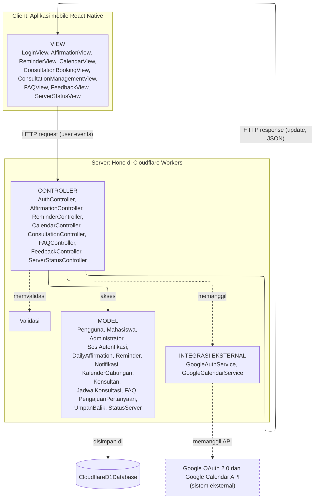
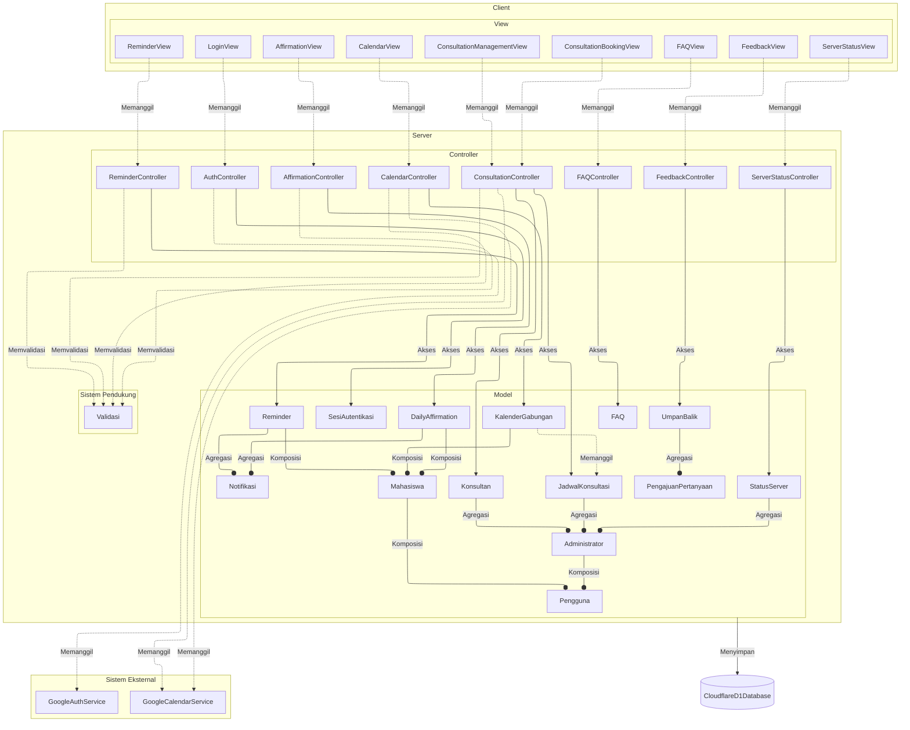

<h1>
IF2150 REKAYASA PERANGKAT LUNAK
 
TUGAS 6
 
ARSITEKTUR PERANGKAT LUNAK (APL)
</h1>
 

## Sehati

### Untuk: Aurelia Jennifer Gunawan

Dipersiapkan oleh:

| Informasi | Keterangan |
| --------- | ---------- |
| Kelas     | K01        |
| Kelompok  | G04        |

| NIM      | Nama                         |
| -------- | ---------------------------- |
| 13525052 | Daniel Charisma Christian    |
| 13525061 | Rifqi Irfan Indrawan         |
| 13525082 | Ausa Haadiyaan Mukhtar Yusuf |
| 13525058 | Farish Firstian Erifiawan    |

---

# BAB 1: Style/Pattern Arsitektur Acuan

## Style yang dipilih: Client-Server dengan MVC (Model-View-Controller)

Sehati memakai gabungan dua pattern. **Client-Server** menentukan di mana komponen berjalan, sedangkan **MVC** menentukan pembagian tanggung jawab antarkomponen. Keduanya dipetakan sebagai berikut:

| Peran MVC           | Berjalan di                                                 | Komponen                                                                                                                                                                                       | Tanggung jawab                                                                                                                                                                             |
| ------------------- | ----------------------------------------------------------- | ---------------------------------------------------------------------------------------------------------------------------------------------------------------------------------------------- | ------------------------------------------------------------------------------------------------------------------------------------------------------------------------------------------ |
| **View**            | Client (aplikasi mobile React Native di perangkat pengguna) | LoginView, AffirmationView, ReminderView, CalendarView, ConsultationBookingView, ConsultationManagementView, FAQView, FeedbackView, ServerStatusView                                           | Menampilkan antarmuka, menerima aksi pengguna, dan mengirimkannya ke server sebagai _request_. View tidak menyimpan data permanen dan tidak memegang _secret_ Google.                      |
| **Controller**      | Server (Hono di Cloudflare Workers)                         | AuthController, AffirmationController, ReminderController, CalendarController, ConsultationController, FAQController, FeedbackController, ServerStatusController, dibantu Validasi             | Menerima _request_ dari View, memvalidasi input, mengakses Model atau memanggil Integrasi Eksternal, lalu mengembalikan _response_ JSON.                                                   |
| **Model**           | Server                                                      | Pengguna, Mahasiswa, Administrator, SesiAutentikasi, DailyAffirmation, Reminder, Notifikasi, KalenderGabungan, Konsultan, JadwalKonsultasi, FAQ, PengajuanPertanyaan, UmpanBalik, StatusServer | Menyimpan data dan aturan domain, dan disimpan secara _persistent_ di CloudflareD1Database.                                                                                                |
| Integrasi Eksternal | Server                                                      | GoogleAuthService, GoogleCalendarService                                                                                                                                                       | Berkomunikasi dengan Google OAuth 2.0 dan Google Calendar API. Hanya dipanggil dari Controller, sehingga _client secret_ dan _access token_ Google tidak pernah ada di perangkat pengguna. |
| Penyimpanan Data    | Server                                                      | CloudflareD1Database                                                                                                                                                                           | Menyimpan seluruh data Model.                                                                                                                                                              |

**Cara kerja gabungan.** Pada MVC klasik, View dan Controller berada dalam satu program dan saling berinteraksi langsung. Pada Sehati, batas Client-Server memisahkan View dari Controller dan Model, sehingga interaksi MVC berjalan lewat HTTP:

- _User events_ dari View ke Controller menjadi **HTTP request**.
- _Update_ dari Controller ke View menjadi **HTTP response** (JSON).
- _Update request_ dan _data access_ antara Controller, Model, dan database terjadi seluruhnya di dalam server.
- View tidak membaca Model secara langsung. Keadaan Model sampai ke View hanya lewat _response_ Controller.

Server tidak me-_render_ halaman (tidak ada _server-rendered view_ seperti Django/Rails), sehingga sisi server hanya berisi Controller dan Model, dan seluruh View ada di client.

## Alasan pemilihan

**Alasan memilih Client-Server**

1. **Dua aktor, satu pusat data.** Mahasiswa dan Administrator memakai client yang sama dan harus melihat data yang sama (jadwal konsultasi, FAQ, umpan balik). Jadwal yang sudah dipesan satu Mahasiswa harus langsung tidak tersedia bagi yang lain (UC-04, UC-05), yang hanya terjamin bila data dipegang satu server.
2. **Integrasi pihak ketiga (KF-02, KF-05, UC-11).** Pengambilan _event_ dan pengecekan _free/busy_ Google Calendar serta autentikasi Google memakai _client secret_ dan _access token_. Bila dipanggil dari client, kredensial itu ada di perangkat pengguna. Dengan Client-Server, semua panggilan ke Google berjalan di server.
3. **KNF-01 (uptime 90%).** Ketersediaan cukup dijaga dan dipantau pada satu titik, yaitu server, sehingga fitur memantau status _server_ (UC-10) bermakna.
4. **KNF-02 (keamanan data).** Autentikasi, validasi input, dan akses ke database ditegakkan di server, bukan diserahkan ke client.

**Alasan memilih MVC**

1. **Satu Model dipakai banyak View.** Misalnya JadwalKonsultasi dipakai oleh CalendarView, ConsultationBookingView, dan ConsultationManagementView (UC-03, UC-04, UC-05). Dengan Model terpisah dari View, perubahan tampilan tidak mengubah struktur data.
2. **Pemisahan tim dan teknologi.** Antarmuka (React Native) dan logika server (Hono) dapat dikembangkan terpisah selama kontrak HTTP/JSON antara View dan Controller tetap.
3. **Tiap fitur punya jalur yang jelas.** Setiap use case dijalankan oleh satu rantai View, Controller, dan Model (misalnya UC-06: FAQView, FAQController, FAQ), sehingga mudah ditelusuri dan diuji.
4. **Sesuai pengelompokan Tabel 2.1.** Kolom Jenis pada BAB 2 mengikuti pola View, Controller, dan Model, ditambah Pendukung, Integrasi Eksternal, dan Penyimpanan Data.

## Gambar style/pattern pada P/L Sehati

<i>Gambar 1. Pattern Client-Server dengan MVC diterapkan pada Sehati</i>

Tabel 1.1. Lingkungan Operasi Perangkat Lunak

| Komponen            | Spesifikasi                                                                                            |
| ------------------- | ------------------------------------------------------------------------------------------------------ |
| Server              | Cloudflare Workers (runtime V8 isolates) menjalankan Hono (TypeScript) sebagai REST API                |
| Client              | Aplikasi mobile React Native (Expo), Android dan iOS                                                   |
| DBMS                | Cloudflare D1 (SQLite terdistribusi di edge)                                                           |
| OS                  | Android 10+ dan iOS 15+ pada client; Cloudflare Workers tidak memerlukan OS tradisional di sisi server |
| Integrasi Eksternal | Google OAuth 2.0 (autentikasi) dan Google Calendar API (event, free/busy)                              |

Kaitan teknologi dengan pattern: React Native menjalankan seluruh View di perangkat pengguna, sesuai peran client yang hanya menampilkan dan meneruskan aksi. Hono dipilih karena merupakan _router_ tipis untuk lingkungan _edge_, sehingga cocok menjadi server yang hanya berisi Controller dan Model tanpa View. Cloudflare Workers memungkinkan satu server melayani semua client, dan Cloudflare D1 menjadi penyimpanan terpusat di bawah Model, terpisah dari logika Controller.

---

# BAB 2: Identifikasi Komponen / Modul / Subsistem

Tabel 2.1. Identifikasi Komponen/Modul/Subsistem

| Nama Komponen              | Jenis               | Penjelasan                                                                                                      |
| -------------------------- | ------------------- | --------------------------------------------------------------------------------------------------------------- |
| LoginView                  | View                | Menampilkan tombol masuk dengan akun Google dan meneruskan hasil autentikasi ke AuthController.                 |
| AffirmationView            | View                | Menampilkan input waktu pengiriman daily affirmations dan meneruskan ke AffirmationController.                  |
| ReminderView               | View                | Menampilkan input waktu pengingat makan/tidur/olahraga dan meneruskan ke ReminderController.                    |
| CalendarView               | View                | Menampilkan kalender gabungan dan meneruskan aksi "Lihat Kalender"/"Refresh" ke CalendarController.             |
| ConsultationBookingView    | View                | Menampilkan jadwal konsultasi yang tersedia dan meneruskan pemesanan ke ConsultationController.                 |
| ConsultationManagementView | View                | Menampilkan dashboard admin untuk mengelola jadwal konsultan, meneruskan perubahan ke ConsultationController.   |
| FAQView                    | View                | Menampilkan daftar FAQ, kolom pencarian, pengelolaan FAQ oleh admin, dan form pengajuan pertanyaan di luar FAQ. |
| FeedbackView               | View                | Menampilkan form umpan balik bagi Mahasiswa dan tampilan tanggapan bagi Administrator.                          |
| ServerStatusView           | View                | Menampilkan status uptime server dan website kepada Administrator.                                              |
| AuthController             | Controller          | Memproses autentikasi Google, membuat/memverifikasi SesiAutentikasi, dan memanggil GoogleAuthService.           |
| AffirmationController      | Controller          | Memproses penyetelan waktu dan pengiriman DailyAffirmation, memicu Notifikasi.                                  |
| ReminderController         | Controller          | Memproses penyetelan waktu dan pengiriman Reminder, memicu Notifikasi.                                          |
| CalendarController         | Controller          | Mengambil data dari GoogleCalendarService dan JadwalKonsultasi, menggabungkannya lewat KalenderGabungan.        |
| ConsultationController     | Controller          | Memproses pemesanan dan pengelolaan JadwalKonsultasi, memanggil GoogleCalendarService untuk cek bentrok.        |
| FAQController              | Controller          | Memproses pencarian, penambahan, perubahan, dan penghapusan FAQ, serta penyimpanan PengajuanPertanyaan.         |
| FeedbackController         | Controller          | Memproses pengiriman UmpanBalik dan penyimpanan tanggapan Administrator.                                        |
| ServerStatusController     | Controller          | Mengambil data StatusServer untuk ditampilkan ke Administrator.                                                 |
| Validasi                   | Pendukung           | Memvalidasi input (format waktu, field wajib) sebelum diproses controller terkait.                              |
| Pengguna                   | Model               | Menyimpan atribut umum akun (id, nama, email, googleId) yang dipakai bersama Mahasiswa dan Administrator.       |
| Mahasiswa                  | Model               | Merepresentasikan akun mahasiswa sebagai pengguna utama aplikasi.                                               |
| Administrator              | Model               | Merepresentasikan akun administrator pengelola aplikasi.                                                        |
| SesiAutentikasi            | Model               | Menyimpan token sesi aplikasi dan status login setelah autentikasi Google berhasil.                             |
| DailyAffirmation           | Model               | Menyimpan konten afirmasi dan jadwal pengiriman yang ditentukan pengguna.                                       |
| Reminder                   | Model               | Menyimpan jenis pengingat (makan/tidur/olahraga) beserta waktu yang ditentukan pengguna.                        |
| Notifikasi                 | Model               | Merepresentasikan satu notifikasi yang dikirim ke pengguna.                                                     |
| KalenderGabungan           | Model               | Menggabungkan event dari GoogleCalendarService dengan data JadwalKonsultasi untuk satu tampilan kalender.       |
| Konsultan                  | Model               | Menyimpan data konsultan (nama, spesialisasi) yang didaftarkan Administrator.                                   |
| JadwalKonsultasi           | Model               | Menyimpan slot jadwal konsultasi (konsultan, waktu, status tersedia/terpesan).                                  |
| FAQ                        | Model               | Menyimpan pasangan pertanyaan dan jawaban yang dikelola Administrator.                                          |
| PengajuanPertanyaan        | Model               | Menyimpan pertanyaan yang diajukan pengguna di luar FAQ yang tersedia.                                          |
| UmpanBalik                 | Model               | Menyimpan umpan balik pengguna beserta tanggapan Administrator (jika ada).                                      |
| StatusServer               | Model               | Merepresentasikan status uptime layanan yang dipantau Administrator.                                            |
| GoogleAuthService          | Integrasi Eksternal | Menangani pertukaran kode otorisasi dengan Google OAuth 2.0 dan penerimaan access/refresh token.                |
| GoogleCalendarService      | Integrasi Eksternal | Mengambil event pengguna dari Google Calendar API dan melakukan pengecekan bentrok jadwal (free/busy).          |
| CloudflareD1Database       | Penyimpanan Data    | Menyimpan seluruh data Model secara persisten di Cloudflare D1.                                                 |

Ketentuan pengisian Tabel 2.1:

1. Kolom **Jenis** mengikuti pengelompokan pada _style/pattern_ di BAB 1. Untuk MVC, jenisnya adalah _Model_, _View_, dan _Controller_. Jenis lain boleh ditambahkan, misalnya _Pendukung_ untuk komponen bantu yang dipakai bersama, atau _Integrasi Eksternal_ untuk penghubung ke sistem di luar P/L yang disebutkan pada subbab 2.2 dokumen SKPL. Kolom ini juga boleh diisi dengan _Subsistem_, _Modul_, atau _Komponen_ apabila komponen dikelompokkan berdasarkan fungsinya. Tuliskan subsistem terlebih dahulu, lalu komponen penyusunnya di baris-baris berikutnya.
2. Komponen **tidak sama dengan** kelas. Satu komponen boleh mewadahi beberapa kelas dari diagram kelas pada dokumen SKPL. Pastikan seluruh kelas tercakup oleh setidaknya satu komponen.
3. Pastikan seluruh use case pada dokumen SKPL dapat dijalankan oleh komponen-komponen yang didaftarkan di tabel ini. Jangan menambahkan komponen untuk fitur yang tidak ada di SKPL.

<b><i>Catatan</i></b>: <i>Nama komponen pada Tabel 2.1 harus dipakai sama persis pada gambar di BAB 1 dan setiap view di BAB 3. Jika saat membuat view ternyata dibutuhkan komponen baru, tambahkan komponen tersebut ke Tabel 2.1 terlebih dahulu.</i>

---

# BAB 3: Model Arsitektur Perangkat Lunak

BAB ini menggambarkan arsitektur Sehati dari satu sudut pandang yang mencakup seluruh sistem, yaitu _Logical View_. Diagram memuat seluruh 35 komponen pada Tabel 2.1 dengan nama yang sama, dan mengikuti pattern Client-Server dengan MVC pada BAB 1.

## 3.1 Logical View

Logical View dipilih karena hal terpenting yang perlu dijelaskan pada Sehati adalah pembagian tanggung jawab antar komponen: View di sisi _client_, serta Controller, Model, dan layanan pendukung di sisi _server_. Pembagian ini langsung menjawab kebutuhan SKPL, yaitu satu server yang memegang data bersama untuk dua aktor dan satu-satunya yang memanggil Google. Process View tidak dipilih karena sistem ini tidak memiliki alur proses paralel yang rumit, dan Physical View tidak dipilih karena lingkungan operasinya sudah dijelaskan pada Tabel 1.1.

Diagram pada Gambar 2 adalah _block diagram_ yang memuat seluruh 35 komponen Tabel 2.1: 9 View, 8 Controller, 1 Validasi, 14 Model, 2 Integrasi Eksternal, dan 1 Penyimpanan Data. Komponen dikelompokkan sesuai BAB 1. Kotak _Client_ berisi View, dan kotak _Server_ berisi Controller, Model, dan Sistem Pendukung (Validasi). Layanan Google (GoogleAuthService dan GoogleCalendarService) berada dalam kotak Sistem Eksternal, dan CloudflareD1Database berada di luar kotak Server. Garis putus-putus menandakan pemanggilan atau validasi. Garis penuh menandakan akses ke Model atau penyimpanan data.

<i>Gambar 2. Logical View pada P/L Sehati</i>

Relasi antar komponen pada Gambar 2:

- **View → Controller** (_Memanggil_): setiap View memanggil Controller untuk fiturnya. LoginView memanggil AuthController, dan ConsultationBookingView serta ConsultationManagementView sama-sama memanggil ConsultationController.
- **Controller → Model** (_Akses_): setiap Controller mengakses Model yang dikelolanya, misalnya FAQController ke FAQ dan ConsultationController ke JadwalKonsultasi dan Konsultan.
- **Controller → Validasi** (_Memvalidasi_): Controller yang menerima input waktu atau isian wajib memeriksanya lewat Validasi sebelum diproses.
- **Controller → Sistem Eksternal** (_Memanggil_): AuthController memanggil GoogleAuthService, sedangkan CalendarController dan ConsultationController memanggil GoogleCalendarService.
- **Antar-Model** (_Agregasi_ dan _Komposisi_): Notifikasi, PengajuanPertanyaan, dan Administrator menghimpun Model terkait secara agregasi. DailyAffirmation, Reminder, dan KalenderGabungan menjadi bagian dari Mahasiswa secara komposisi, begitu pula Mahasiswa dan Administrator terhadap Pengguna.
- **Model → CloudflareD1Database** (_Menyimpan_): seluruh Model disimpan secara persisten di D1.

Pada diagram ini, simbol lingkaran di ujung garis antar-Model berada di sisi komponen yang menghimpun (agregat atau induk).

---

# Referensi

- Sommerville, I. (2016). _Software Engineering_ (10th ed.). Pearson. Chapter 6: _Architectural Design_: [https://software-engineering-book.com/slides/](https://software-engineering-book.com/slides/)
- Diagram arsitektur: [https://mermaid.js.org/](https://mermaid.js.org/)
