<h1>
IF2150 REKAYASA PERANGKAT LUNAK
<br>
TUGAS 6
<br>
ARSITEKTUR PERANGKAT LUNAK (APL)
</h1>
<br>

## Sehati

### Untuk: Aurelia Jennifer Gunawan

Dipersiapkan oleh:

| Informasi | Keterangan |
| --------- | ---------- |
| Kelas     | K01        |
| Kelompok  | G04        |

| NIM      | Nama                         |
| -------- | ---------------------------- |
| 13525052 | Daniel Charisma Christian    |
| 13525061 | Rifqi Irfan Indrawan         |
| 13525082 | Ausa Haadiyaan Mukhtar Yusuf |
| 13525058 | Farish Firstian Erifiawan    |

---

# BAB 1: Style/Pattern Arsitektur Acuan

## Style yang dipilih: Client-Server, dengan backend berpola Layered Architecture

Sehati tidak memiliki server yang me-render halaman (tidak ada *server-rendered view* seperti Django/Rails), karena *client*-nya adalah aplikasi mobile React Native yang berjalan independen dan hanya berkomunikasi dengan backend lewat HTTP/JSON. Ini membuat **client-server** pattern yang sesuai, bukan MVC klasik satu-*runtime*. Backend sendiri (Hono di Cloudflare Workers) disusun berlapis:

- **View** — Aplikasi React Native. Seluruhnya berjalan di perangkat pengguna, me-render UI, dan memanggil API lewat HTTP.
- **Controller** — *Route handler* Hono di Cloudflare Workers. Menerima *request* dari View, memvalidasi input, memanggil Model atau Integrasi Eksternal, dan mengembalikan JSON.
- **Model** — Entitas data (mis. `JadwalKonsultasi`, `UmpanBalik`, `PengajuanPertanyaan`) beserta operasinya, disimpan secara *persistent* di **Penyimpanan Data**.
- **Integrasi Eksternal** — Komunikasi ke Google OAuth 2.0 (autentikasi, KF-12) dan Google Calendar API (pengambilan *event* dan pengecekan *free/busy*, KF-02/KF-05), dipanggil dari Controller, bukan dari View, sehingga *client secret* dan *access token* Google tidak pernah ada di perangkat pengguna.

## Alasan pemilihan

Dua aktor (Mahasiswa, Administrator) mengakses sistem lewat *client* yang sama sekali terpisah dari server, sehingga pemisahan client-server sudah melekat pada bentuk sistemnya, bukan pilihan tambahan. KF-02/KF-05 (integrasi Google Calendar) dan KF-12 (autentikasi Google) keduanya melibatkan komunikasi ke sistem pihak ketiga, yang paling wajar ditempatkan sebagai lapisan Integrasi Eksternal yang berdiri sendiri dari Model, agar Controller bisa mengganti penyedia kalender tanpa mengubah struktur data. KNF-01 (uptime 90%) dan KNF-02 (keamanan data) juga mengarah ke pola ini: ketersediaan dan keamanan ditegakkan di satu titik (server), bukan tersebar di tiap perangkat client.

## Gambar style/pattern pada P/L Sehati

NOTE: Double check the line type usage, iirc there's different meanings during asistensi

```mermaid
swimlane-beta TB
    subgraph Client["Client"]
        RN["React Native App"]
    end

    subgraph OurServer["Our Servers"]
        Hono["Hono API Router"]
        DB[("Cloudflare D1 Database")]
    end

	subgraph ExtServer["External Servers"]
		Google["Google OAuth 2.0 &<br/>Calendar API"]
	end

    RN <-->|"HTTP request/response"| Hono
    Hono <-->|"data query"| DB
    Hono <-.->|"autentikasi & ambil event"| Google

    style Google stroke-dasharray: 5 5
```
<p align="center">
<i>Gambar 1. Pattern Client-Server diterapkan pada Sehati</i>
</p>

Tabel 1.1. Lingkungan Operasi Perangkat Lunak

| Komponen | Spesifikasi |
| --- | --- |
| Server | Cloudflare Workers (runtime V8 isolates) menjalankan Hono (TypeScript) sebagai REST API |
| Client | Aplikasi mobile React Native (Expo), Android dan iOS |
| DBMS | Cloudflare D1 (SQLite terdistribusi di edge) |
| OS | Android 10+ dan iOS 15+ pada client; Cloudflare Workers tidak memerlukan OS tradisional di sisi server |
| Integrasi Eksternal | Google OAuth 2.0 (autentikasi) dan Google Calendar API (event, free/busy) |

Kaitan teknologi dengan pattern: Hono tidak mengikuti MVC bawaan seperti Django/Rails karena memang dirancang sebagai *router* tipis untuk lingkungan edge. 
Ini justru cocok untuk client-server murni, di mana seluruh *rendering* ada di client (React Native) dan server hanya menjadi Controller + Model tanpa View. 
Cloudflare D1 berperan sebagai lapisan penyimpanan di bawah Model, terpisah dari logika Controller, sesuai prinsip pemisahan tanggung jawab pada *layered architecture*.

---

# BAB 2: Identifikasi Komponen / Modul / Subsistem

Tabel 2.1. Identifikasi Komponen/Modul/Subsistem

| Nama Komponen | Jenis | Penjelasan |
| --- | --- | --- |
| LoginView | View | Menampilkan tombol masuk dengan akun Google dan meneruskan hasil autentikasi ke AuthController. |
| AffirmationView | View | Menampilkan input waktu pengiriman daily affirmations dan meneruskan ke AffirmationController. |
| ReminderView | View | Menampilkan input waktu pengingat makan/tidur/olahraga dan meneruskan ke ReminderController. |
| CalendarView | View | Menampilkan kalender gabungan dan meneruskan aksi "Lihat Kalender"/"Refresh" ke CalendarController. |
| ConsultationBookingView | View | Menampilkan jadwal konsultasi yang tersedia dan meneruskan pemesanan ke ConsultationController. |
| ConsultationManagementView | View | Menampilkan dashboard admin untuk mengelola jadwal konsultan, meneruskan perubahan ke ConsultationController. |
| FAQView | View | Menampilkan daftar FAQ, kolom pencarian, pengelolaan FAQ oleh admin, dan form pengajuan pertanyaan di luar FAQ. |
| FeedbackView | View | Menampilkan form umpan balik bagi Mahasiswa dan tampilan tanggapan bagi Administrator. |
| ServerStatusView | View | Menampilkan status uptime server dan website kepada Administrator. |
| AuthController | Controller | Memproses autentikasi Google, membuat/memverifikasi SesiAutentikasi, dan memanggil GoogleAuthService. |
| AffirmationController | Controller | Memproses penyetelan waktu dan pengiriman DailyAffirmation, memicu Notifikasi. |
| ReminderController | Controller | Memproses penyetelan waktu dan pengiriman Reminder, memicu Notifikasi. |
| CalendarController | Controller | Mengambil data dari GoogleCalendarService dan JadwalKonsultasi, menggabungkannya lewat KalenderGabungan. |
| ConsultationController | Controller | Memproses pemesanan dan pengelolaan JadwalKonsultasi, memanggil GoogleCalendarService untuk cek bentrok. |
| FAQController | Controller | Memproses pencarian, penambahan, perubahan, dan penghapusan FAQ, serta penyimpanan PengajuanPertanyaan. |
| FeedbackController | Controller | Memproses pengiriman UmpanBalik dan penyimpanan tanggapan Administrator. |
| ServerStatusController | Controller | Mengambil data StatusServer untuk ditampilkan ke Administrator. |
| Validasi | Pendukung | Memvalidasi input (format waktu, field wajib) sebelum diproses controller terkait. |
| Pengguna | Model | Menyimpan atribut umum akun (id, nama, email, googleId) yang dipakai bersama Mahasiswa dan Administrator. |
| Mahasiswa | Model | Merepresentasikan akun mahasiswa sebagai pengguna utama aplikasi. |
| Administrator | Model | Merepresentasikan akun administrator pengelola aplikasi. |
| SesiAutentikasi | Model | Menyimpan token sesi aplikasi dan status login setelah autentikasi Google berhasil. |
| DailyAffirmation | Model | Menyimpan konten afirmasi dan jadwal pengiriman yang ditentukan pengguna. |
| Reminder | Model | Menyimpan jenis pengingat (makan/tidur/olahraga) beserta waktu yang ditentukan pengguna. |
| Notifikasi | Model | Merepresentasikan satu notifikasi yang dikirim ke pengguna. |
| KalenderGabungan | Model | Menggabungkan event dari GoogleCalendarService dengan data JadwalKonsultasi untuk satu tampilan kalender. |
| Konsultan | Model | Menyimpan data konsultan (nama, spesialisasi) yang didaftarkan Administrator. |
| JadwalKonsultasi | Model | Menyimpan slot jadwal konsultasi (konsultan, waktu, status tersedia/terpesan). |
| FAQ | Model | Menyimpan pasangan pertanyaan dan jawaban yang dikelola Administrator. |
| PengajuanPertanyaan | Model | Menyimpan pertanyaan yang diajukan pengguna di luar FAQ yang tersedia. |
| UmpanBalik | Model | Menyimpan umpan balik pengguna beserta tanggapan Administrator (jika ada). |
| StatusServer | Model | Merepresentasikan status uptime layanan yang dipantau Administrator. |
| GoogleAuthService | Integrasi Eksternal | Menangani pertukaran kode otorisasi dengan Google OAuth 2.0 dan penerimaan access/refresh token. |
| GoogleCalendarService | Integrasi Eksternal | Mengambil event pengguna dari Google Calendar API dan melakukan pengecekan bentrok jadwal (free/busy). |
| CloudflareD1Database | Penyimpanan Data | Menyimpan seluruh data Model secara persisten di Cloudflare D1. |

Ketentuan pengisian Tabel 2.1:

1. Kolom **Jenis** mengikuti pengelompokan pada _style/pattern_ di BAB 1. Untuk MVC, jenisnya adalah _Model_, _View_, dan _Controller_. Jenis lain boleh ditambahkan, misalnya _Pendukung_ untuk komponen bantu yang dipakai bersama, atau _Integrasi Eksternal_ untuk penghubung ke sistem di luar P/L yang disebutkan pada subbab 2.2 dokumen SKPL. Kolom ini juga boleh diisi dengan _Subsistem_, _Modul_, atau _Komponen_ apabila komponen dikelompokkan berdasarkan fungsinya. Tuliskan subsistem terlebih dahulu, lalu komponen penyusunnya di baris-baris berikutnya.
2. Komponen **tidak sama dengan** kelas. Satu komponen boleh mewadahi beberapa kelas dari diagram kelas pada dokumen SKPL. Pastikan seluruh kelas tercakup oleh setidaknya satu komponen.
3. Pastikan seluruh use case pada dokumen SKPL dapat dijalankan oleh komponen-komponen yang didaftarkan di tabel ini. Jangan menambahkan komponen untuk fitur yang tidak ada di SKPL.

<sub><b><i>Catatan</i></b>: <i>Nama komponen pada Tabel 2.1 harus dipakai sama persis pada gambar di BAB 1 dan setiap view di BAB 3. Jika saat membuat view ternyata dibutuhkan komponen baru, tambahkan komponen tersebut ke Tabel 2.1 terlebih dahulu.</i></sub>

---

# BAB 3: Model Arsitektur Perangkat Lunak

***NOTE: Remove this text before publishing release***

_Architectural View_ adalah bagaimana cara kita melihat/mendeskripsikan arsitektur sebuah sistem dari sudut pandang tertentu. Dalam perancangan arsitektur aplikasi, dibutuhkan _Architectural View_ yang dapat mempermudah pemahaman dari proses aplikasi yang akan dikembangkan. Tujuan dari _Architectural View_ adalah menjadi bahan komunikasi, pemisahan masalah, mempermudah analisis, dan pemandu saat eksekusi pengembangan sistem tersebut.

Buatlah model arsitektur dari aplikasi yang akan dirancang dalam bentuk _view_. Model arsitektur ini berfungsi untuk memperlihatkan bagaimana setiap komponen, modul, dan subsistem saling berinteraksi serta berkolaborasi dalam menjalankan fungsi utama sistem secara keseluruhan. Anda dapat membuat satu atau lebih _view_ tergantung kebutuhan dalam bentuk gambar. Pilihlah notasi yang sesuai. Contoh _view_ yang dapat digunakan antara lain _**Logical View**_, _**Process View**_, _**Development View**_, serta _**Physical View**_.

Ketentuan pengisian BAB 3:

1. Setiap view menggambarkan **keseluruhan sistem**, bukan satu use case atau satu fitur saja.
2. Buat **minimal satu view**. Setiap view dituliskan dalam subbab tersendiri (3.1, 3.2, dan seterusnya). Tidak perlu membuat keempat view, pilih yang paling membantu menjelaskan P/L Anda, lalu jelaskan alasan pemilihannya.
3. Setiap view harus **konsisten dengan BAB 2**. Seluruh komponen pada Tabel 2.1 harus muncul dengan nama yang sama, dan tidak boleh ada komponen pada view yang tidak terdaftar di Tabel 2.1.
4. Setiap view harus **mencerminkan style/pattern pada BAB 1**. Misalnya, jika memilih MVC, pembagian _Model_, _View_, dan _Controller_ harus terlihat jelas pada diagram.
5. Jika membuat lebih dari satu view, setiap view harus menggambarkan sistem yang sama dari sudut pandang berbeda. View tambahan melengkapi view pertama, bukan mengulanginya.
6. Beri label pada setiap garis atau panah yang menghubungkan komponen agar hubungan antarkomponen dapat dipahami tanpa penjelasan tambahan.
7. Jika membuat _Physical View_, gambarkan lingkungan operasi pada Tabel 1.1.

## 3.1 Logical View

Logical View dipilih karena yang paling penting dijelaskan di Sehati adalah pembagian tanggung jawab antar lapisan (View, Controller, Model, Integrasi Eksternal, Penyimpanan Data) — bukan urutan proses (Process View) atau distribusi fisik server (Physical View, meskipun bisa ditambahkan sebagai pelengkap karena Tabel 1.1 sudah memuat datanya).

```mermaid
flowchart TB
    subgraph VIEW["View"]
        direction LR
        AffirmationView
        ReminderView
        FAQView
        FeedbackView
        ServerStatusView
        LoginView
        CalendarView
        ConsultationBookingView
        ConsultationManagementView
    end

    subgraph CONTROLLER["Controller"]
        direction LR
        AffirmationController
        ReminderController
        FAQController
        FeedbackController
        ServerStatusController
        AuthController
        CalendarController
        ConsultationController
    end

    subgraph MODEL["Model"]
        direction LR
        DailyAffirmation
        Reminder
        FAQ
        UmpanBalik
        StatusServer
        SesiAutentikasi
        KalenderGabungan
        JadwalKonsultasi
        Konsultan
        Notifikasi
        PengajuanPertanyaan
        Mahasiswa
        Administrator
        Pengguna
    end

    subgraph PENDUKUNG["Sistem Pendukung"]
        Validasi
    end

    subgraph EKSTERNAL["Sistem Eksternal"]
        GoogleCalendarService
        GoogleAuthService
    end

    CloudflareD1Database[("CloudflareD1Database")]

    %% View -> Controller
    AffirmationView -.->|Memanggil| AffirmationController
    ReminderView -.->|Memanggil| ReminderController
    FAQView -.->|Memanggil| FAQController
    FeedbackView -.->|Memanggil| FeedbackController
    ServerStatusView -.->|Memanggil| ServerStatusController
    LoginView -.->|Memanggil| AuthController
    CalendarView -.->|Memanggil| CalendarController
    ConsultationBookingView -.->|Memanggil| ConsultationController
    ConsultationManagementView -.->|Memanggil| ConsultationController

    %% Controller -> Model
    AffirmationController -->|Akses| DailyAffirmation
    ReminderController -->|Akses| Reminder
    FAQController -->|Akses| FAQ
    FeedbackController -->|Akses| UmpanBalik
    ServerStatusController -->|Akses| StatusServer
    AuthController -->|Akses| SesiAutentikasi
    CalendarController -->|Akses| KalenderGabungan
    ConsultationController -->|Akses| JadwalKonsultasi
    ConsultationController -->|Akses| Konsultan
    KalenderGabungan -.->|Memanggil| JadwalKonsultasi

    %% Controller -> Validasi
    AffirmationController -.->|Memvalidasi| Validasi
    ReminderController -.->|Memvalidasi| Validasi
    CalendarController -.->|Memvalidasi| Validasi
    ConsultationController -.->|Memvalidasi| Validasi

    %% Controller -> Sistem Eksternal
    AuthController -.->|Memanggil| GoogleAuthService
    CalendarController -.->|Memanggil| GoogleCalendarService
    ConsultationController -.->|Memanggil| GoogleCalendarService

    %% Antar-Model (ujung o = sisi "keseluruhan")
    DailyAffirmation --o|Agregasi| Notifikasi
    Reminder --o|Agregasi| Notifikasi
    UmpanBalik --o|Agregasi| PengajuanPertanyaan
    StatusServer --o|Agregasi| Administrator
    JadwalKonsultasi --o|Agregasi| Administrator
    Konsultan --o|Agregasi| Administrator
    DailyAffirmation --o|Komposisi| Mahasiswa
    Reminder --o|Komposisi| Mahasiswa
    KalenderGabungan --o|Komposisi| Mahasiswa
    Mahasiswa --o|Komposisi| Pengguna
    Administrator --o|Komposisi| Pengguna

    MODEL -->|Menyimpan| CloudflareD1Database
```

<p align="center">
<i>Gambar 2. Logical View pada P/L Sehati</i>
</p>

Gambar 2 adalah contoh _Logical View_ dalam bentuk _block diagram_. Seluruh komponen pada Tabel 2.1 digambarkan dan dikelompokkan sesuai pola MVC (_View_, _Controller_, _Model_), ditambah komponen pendukung dan basis data. Sistem di luar P/L, seperti _Payment Gateway (dummy)_, digambarkan dengan garis putus-putus dan tidak perlu dimasukkan ke Tabel 2.1. Setiap garis diberi label: "Memanggil" untuk _View_ yang memanggil _Controller_, "akses" untuk _Controller_ yang mengakses _Model_, serta agregasi dan komposisi untuk hubungan antar-_Model_.

<sub><b><i>Catatan</i></b>: <i>Ganti XXX dengan nama view yang dibuat, misalnya Logical View. Gambar 2 hanya contoh untuk P/L e-commerce, ganti dengan view milik kelompok Anda yang memuat seluruh komponen pada Tabel 2.1. Jenis view dan notasinya boleh berbeda dari contoh. Jika membuat view tambahan, lanjutkan pola 3.x ini (3.2, 3.3, dan seterusnya).</i></sub>

---

# Referensi

- Sommerville, I. (2016). _Software Engineering_ (10th ed.). Pearson. Chapter 6: _Architectural Design_: [https://software-engineering-book.com/slides/](https://software-engineering-book.com/slides/)
- Diagram arsitektur: [https://www.drawio.com/](https://www.drawio.com/), [https://staruml.io/](https://staruml.io/)
