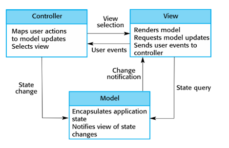

<h1>
IF2150 REKAYASA PERANGKAT LUNAK
 
TUGAS 6
 
ARSITEKTUR PERANGKAT LUNAK (APL)
</h1>
 

## Sehati

### Untuk: Aurelia Jennifer Gunawan

Dipersiapkan oleh:

| Informasi | Keterangan |
| --------- | ---------- |
| Kelas     | K01        |
| Kelompok  | G04        |

| NIM      | Nama                         |
| -------- | ---------------------------- |
| 13525052 | Daniel Charisma Christian    |
| 13525061 | Rifqi Irfan Indrawan         |
| 13525082 | Ausa Haadiyaan Mukhtar Yusuf |
| 13525058 | Farish Firstian Erifiawan    |

---

 
 

# BAB 1: Style/Pattern Arsitektur Acuan

Pada bagian ini, tentukan _architectural style_ atau _pattern_ yang menjadi acuan untuk aplikasi yang Anda kembangkan. Misalnya _layered architecture_, _client-server_, _repository_, _pipe and filter architecture_, atau MVC (_Model-View-Controller_).

<i>Gambar 1. Contoh Arsitektur MVC</i>

Isi bab ini dengan hal-hal berikut:

1. **Style/pattern yang dipilih** beserta penjelasan singkat peran setiap bagiannya. Untuk MVC, jelaskan peran _Model_, _View_, dan _Controller_.
2. **Alasan pemilihan** berdasarkan karakteristik P/L Anda, misalnya jenis pengguna, alur proses bisnis, serta KF dan KNF pada dokumen SKPL.
3. **Gambar style/pattern yang diterapkan pada P/L Anda.** Jangan hanya menyalin Gambar 1. Isi setiap bagian pattern dengan komponen milik P/L Anda. Misalnya, kotak _Controller_ berisi daftar _controller_ yang ada di aplikasi dan kotak _Model_ berisi daftar _model_ yang ada di aplikasi.

Selain _style/pattern_, tuliskan juga lingkungan operasi P/L. Tabel berikut **disalin dari subbab 2.5 _Lingkungan Operasi Perangkat Lunak_ pada dokumen SKPL** tanpa perubahan. Setelah tabel, jelaskan kaitan teknologi yang dipakai dengan _style/pattern_ yang dipilih. Contohnya, Django (Python) secara bawaan mengikuti pola MVT (_Model-View-Template_), yaitu varian dari MVC.

Tabel 1.1. Lingkungan Operasi Perangkat Lunak

| Komponen | Spesifikasi                                                                 |
| :------- | :-------------------------------------------------------------------------- |
| _Server_ | _[contoh: Node.js v20 dengan Next.js, dijalankan secara lokal (localhost)]_ |
| _Client_ | _[contoh: Web Browser modern (Chrome, Firefox terbaru)]_                    |
| _DBMS_   | _[contoh: PostgreSQL 15 pada Supabase sebagai basis data terpusat]_         |
| _OS_     | _[contoh: Cross-platform (Windows/Linux/MacOS) melalui browser]_            |
| _..._    | _..._                                                                       |

<b><i>Catatan</i></b>: <i>Style/pattern yang dipilih di bab ini menjadi acuan untuk BAB 2 (pengelompokan komponen) dan BAB 3 (model arsitektur). Contoh pada dokumen ini memakai MVC secara konsisten dari BAB 1 sampai BAB 3. Kelompok boleh memakai pattern lain selama alasannya dijelaskan dan BAB 2 serta BAB 3 disesuaikan. Tabel 1.1 harus sama persis dengan subbab 2.5 dokumen SKPL; jangan menambah atau mengubah isinya karena SKPL sudah final.</i>

---

# BAB 2: Identifikasi Komponen / Modul / Subsistem

Pada bagian ini, lakukan identifikasi terhadap komponen, modul, atau subsistem yang menyusun aplikasi berdasarkan _pattern_ arsitektur yang telah ditetapkan sebelumnya. Setiap komponen memiliki tanggung jawab tertentu dalam mendukung fungsionalitas sistem.

Setiap komponen memiliki tanggung jawab tertentu dalam mendukung fungsionalitas sistem secara keseluruhan. Komponen dapat dikelompokkan berdasarkan lapisan arsitektur (misalnya _Model_, _View_, dan _Controller_ pada pattern MVC), atau berdasarkan fungsi atau peran komponen di dalam sistem (misalnya modul autentikasi, manajemen data, dan integrasi eksternal).

Tabel 2.1. Identifikasi Komponen/Modul/Subsistem

| Nama Komponen/Modul/Subsistem | Jenis                 | Penjelasan                                                                                                           |
| :---------------------------- | :-------------------- | :------------------------------------------------------------------------------------------------------------------- |
| _KatalogView_                 | _View_                | _Menampilkan daftar produk dan meneruskan aksi pelanggan (misalnya "Tambah ke Keranjang") ke KatalogController._     |
| _KeranjangView_               | _View_                | _Menampilkan isi keranjang pelanggan beserta tombol checkout._                                                       |
| _CheckoutView_                | _View_                | _Menampilkan ringkasan pesanan dan pilihan metode pembayaran kepada pelanggan._                                      |
| _RiwayatPesananView_          | _View_                | _Menampilkan daftar pesanan yang pernah dibuat pelanggan beserta statusnya._                                         |
| _KatalogController_           | _Controller_          | _Memproses permintaan daftar produk dan penambahan produk ke keranjang._                                             |
| _KeranjangController_         | _Controller_          | _Memproses perubahan isi keranjang dan membuat pesanan baru saat checkout._                                          |
| _PembayaranController_        | _Controller_          | _Memproses pemilihan metode pembayaran dan meneruskan permintaan otorisasi ke PaymentGatewayAdapter._                |
| _PesananController_           | _Controller_          | _Memproses permintaan riwayat pesanan milik pelanggan._                                                              |
| _Produk_                      | _Model_               | _Merepresentasikan data produk beserta stoknya serta metode untuk mengakses dan mengubahnya._                        |
| _Keranjang_                   | _Model_               | _Merepresentasikan item yang dipilih pelanggan sebelum checkout serta metode untuk mengakses dan mengubahnya._       |
| _Pesanan_                     | _Model_               | _Merepresentasikan data pesanan beserta status pembayarannya serta metode untuk mengakses dan mengubahnya._          |
| _Pelanggan_                   | _Model_               | _Merepresentasikan data akun pelanggan serta metode untuk mengakses dan mengubahnya._                                |
| _Validasi_                    | _Pendukung_           | _Memvalidasi input pelanggan sebelum diproses oleh controller._                                                      |
| _PaymentGatewayAdapter_       | _Integrasi Eksternal_ | _Mengirim permintaan otorisasi ke payment gateway (dummy) dan meneruskan status pembayaran ke PembayaranController._ |
| _Database_                    | _Penyimpanan Data_    | _Menyimpan seluruh data model secara persisten, baik lokal (misalnya SQLite) maupun terpusat (misalnya Supabase)._   |
| _..._                         | _..._                 | _..._                                                                                                                |

Ketentuan pengisian Tabel 2.1:

1. Kolom **Jenis** mengikuti pengelompokan pada _style/pattern_ di BAB 1. Untuk MVC, jenisnya adalah _Model_, _View_, dan _Controller_. Jenis lain boleh ditambahkan, misalnya _Pendukung_ untuk komponen bantu yang dipakai bersama, atau _Integrasi Eksternal_ untuk penghubung ke sistem di luar P/L yang disebutkan pada subbab 2.2 dokumen SKPL. Kolom ini juga boleh diisi dengan _Subsistem_, _Modul_, atau _Komponen_ apabila komponen dikelompokkan berdasarkan fungsinya. Tuliskan subsistem terlebih dahulu, lalu komponen penyusunnya di baris-baris berikutnya.
2. Komponen **tidak sama dengan** kelas. Satu komponen boleh mewadahi beberapa kelas dari diagram kelas pada dokumen SKPL. Pastikan seluruh kelas tercakup oleh setidaknya satu komponen.
3. Pastikan seluruh use case pada dokumen SKPL dapat dijalankan oleh komponen-komponen yang didaftarkan di tabel ini. Jangan menambahkan komponen untuk fitur yang tidak ada di SKPL.

<b><i>Catatan</i></b>: <i>Nama komponen pada Tabel 2.1 harus dipakai sama persis pada gambar di BAB 1 dan setiap view di BAB 3. Jika saat membuat view ternyata dibutuhkan komponen baru, tambahkan komponen tersebut ke Tabel 2.1 terlebih dahulu.</i>

---

# BAB 3: Model Arsitektur Perangkat Lunak

_Architectural View_ adalah bagaimana cara kita melihat/mendeskripsikan arsitektur sebuah sistem dari sudut pandang tertentu. Dalam perancangan arsitektur aplikasi, dibutuhkan _Architectural View_ yang dapat mempermudah pemahaman dari proses aplikasi yang akan dikembangkan. Tujuan dari _Architectural View_ adalah menjadi bahan komunikasi, pemisahan masalah, mempermudah analisis, dan pemandu saat eksekusi pengembangan sistem tersebut.

Buatlah model arsitektur dari aplikasi yang akan dirancang dalam bentuk _view_. Model arsitektur ini berfungsi untuk memperlihatkan bagaimana setiap komponen, modul, dan subsistem saling berinteraksi serta berkolaborasi dalam menjalankan fungsi utama sistem secara keseluruhan. Anda dapat membuat satu atau lebih _view_ tergantung kebutuhan dalam bentuk gambar. Pilihlah notasi yang sesuai. Contoh _view_ yang dapat digunakan antara lain _**Logical View**_, _**Process View**_, _**Development View**_, serta _**Physical View**_.

Ketentuan pengisian BAB 3:

1. Setiap view menggambarkan **keseluruhan sistem**, bukan satu use case atau satu fitur saja.
2. Buat **minimal satu view**. Setiap view dituliskan dalam subbab tersendiri (3.1, 3.2, dan seterusnya). Tidak perlu membuat keempat view, pilih yang paling membantu menjelaskan P/L Anda, lalu jelaskan alasan pemilihannya.
3. Setiap view harus **konsisten dengan BAB 2**. Seluruh komponen pada Tabel 2.1 harus muncul dengan nama yang sama, dan tidak boleh ada komponen pada view yang tidak terdaftar di Tabel 2.1.
4. Setiap view harus **mencerminkan style/pattern pada BAB 1**. Misalnya, jika memilih MVC, pembagian _Model_, _View_, dan _Controller_ harus terlihat jelas pada diagram.
5. Jika membuat lebih dari satu view, setiap view harus menggambarkan sistem yang sama dari sudut pandang berbeda. View tambahan melengkapi view pertama, bukan mengulanginya.
6. Beri label pada setiap garis atau panah yang menghubungkan komponen agar hubungan antarkomponen dapat dipahami tanpa penjelasan tambahan.
7. Jika membuat _Physical View_, gambarkan lingkungan operasi pada Tabel 1.1.

## 3.1 XXX View

Tuliskan secara singkat mengenai model arsitektur perangkat lunak yang Anda pilih dan sertakan alasan mengapa model arsitektur tersebut cocok untuk aplikasi Anda.

<i>Gambar 2. Contoh Logical View pada P/L E-Commerce</i>

Gambar 2 adalah contoh _Logical View_ dalam bentuk _block diagram_. Seluruh komponen pada Tabel 2.1 digambarkan dan dikelompokkan sesuai pola MVC (_View_, _Controller_, _Model_), ditambah komponen pendukung dan basis data. Sistem di luar P/L, seperti _Payment Gateway (dummy)_, digambarkan dengan garis putus-putus dan tidak perlu dimasukkan ke Tabel 2.1. Setiap garis diberi label: "Memanggil" untuk _View_ yang memanggil _Controller_, "akses" untuk _Controller_ yang mengakses _Model_, serta agregasi dan komposisi untuk hubungan antar-_Model_.

<b><i>Catatan</i></b>: <i>Ganti XXX dengan nama view yang dibuat, misalnya Logical View. Gambar 2 hanya contoh untuk P/L e-commerce, ganti dengan view milik kelompok Anda yang memuat seluruh komponen pada Tabel 2.1. Jenis view dan notasinya boleh berbeda dari contoh. Jika membuat view tambahan, lanjutkan pola 3.x ini (3.2, 3.3, dan seterusnya).</i>

---

# Referensi

- Sommerville, I. (2016). _Software Engineering_ (10th ed.). Pearson. Chapter 6: _Architectural Design_: [https://software-engineering-book.com/slides/](https://software-engineering-book.com/slides/)
- Diagram arsitektur: [https://www.drawio.com/](https://www.drawio.com/), [https://staruml.io/](https://staruml.io/)
