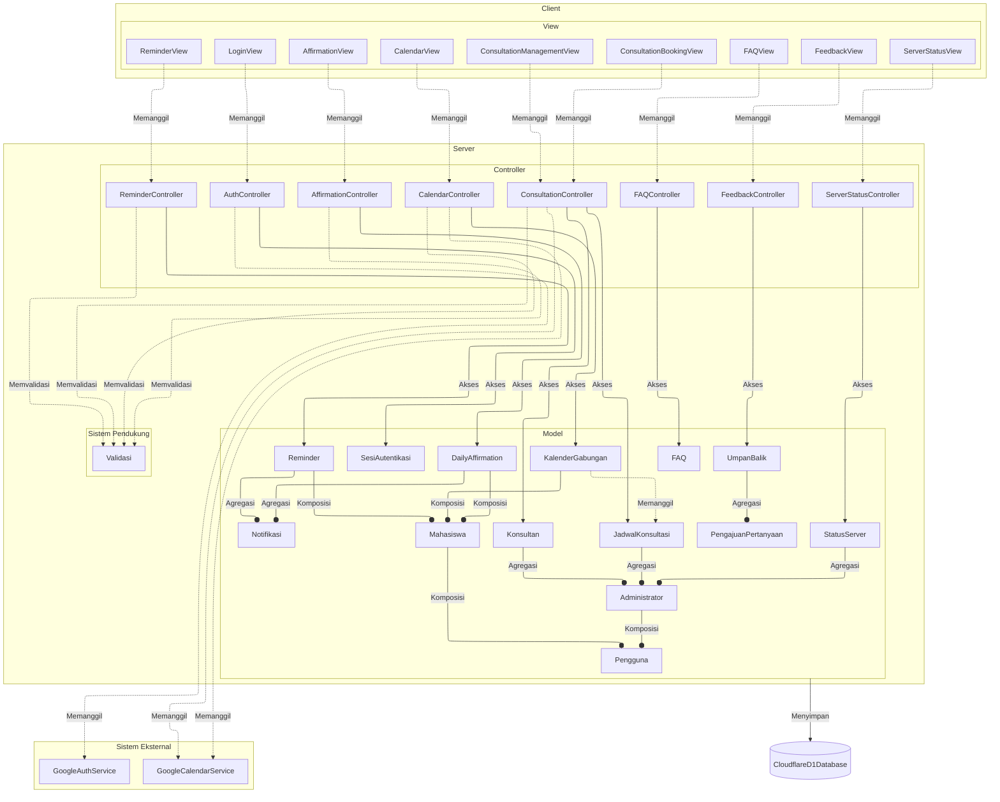

<h1>
IF2150 REKAYASA PERANGKAT LUNAK
 
TUGAS 5
 
DESKRIPSI PERANCANGAN PERANGKAT LUNAK (DPPL)
</h1>
 

## Sehati

### _[Logo Perangkat Lunak]_

### Untuk: Aurelia Jennifer Gunawan

Dipersiapkan oleh:

| Informasi | Keterangan |
| --------- | ---------- |
| Kelas     | K01        |
| Kelompok  | G04        |

| NIM      | Nama                         |
| -------- | ---------------------------- |
| 13525052 | Daniel Charisma Christian    |
| 13525061 | Rifqi Irfan Indrawan         |
| 13525082 | Ausa Haadiyaan Mukhtar Yusuf |
| 13525058 | Farish Firstian Erifiawan    |

---

## Daftar Perubahan

| Revisi | Deskripsi                                                                                                                               |
| ------ | --------------------------------------------------------------------------------------------------------------------------------------- |
| _A_    | _Deskripsikan perubahan yang dilakukan dari dokumen sebelumnya pada dokumen ini. Jika tidak terdapat perubahan, harap kosongkan tabel._ |

---

 

> **Petunjuk pengerjaan:** _[Silahkan hapus bagian ini setelah selesai mengerjakan]_
>
> Dokumen ini melanjutkan **Spesifikasi Kebutuhan Perangkat Lunak (SKPL)** dan **Arsitektur Perangkat Lunak (APL)**. Gunakan nama, ID, kebutuhan, dan use case yang konsisten dengan kedua dokumen tersebut. Contoh pola ID baru di bawah dapat disesuaikan dengan kesepakatan kelompok, ID yang sudah ada tetap dipertahankan.

 

---

# BAB 1: Pendahuluan

## 1.1 Tujuan Penulisan Dokumen

Tuliskan dengan ringkas tujuan dokumen DPPL ini dibuat dan siapa saja yang akan menggunakan dokumen ini.

## 1.2 Lingkup Masalah

Tuliskan dengan ringkas nama aplikasi dan deskripsi singkatnya. Bagian ini maksimal berisi satu paragraf, dapat diambil dari SKPL.

## 1.3 Definisi, Istilah, dan Singkatan

Semua definisi dan singkatan yang digunakan dalam dokumen ini beserta penjelasannya.

Tabel 1.3. Definisi Istilah dan Singkatan

| Singkatan, Akronim, atau Istilah | Penjelasan                                                                                                                                                                                   |
| -------------------------------- | -------------------------------------------------------------------------------------------------------------------------------------------------------------------------------------------- |
| P/L                              | Singkatan dari **Perangkat Lunak**, yaitu aplikasi yang memberikan perintah kepada komputer untuk menjalankan tugas tertentu.                                                                |
| SKPL                             | Singkatan dari **Spesifikasi Kebutuhan Perangkat Lunak**, yaitu dokumen yang merangkum kriteria-kriteria yang diperlukan untuk membangun aplikasi menjalankan tugasnya.                      |
| DPPL                             | ...                                                                                                                                                                                          |
| KF                               | Singkatan dari **Kebutuhan Fungsional**, yaitu kebutuhan yang menjelaskan apa yang harus dapat dilakukan oleh sistem.                                                                        |
| KNF                              | Singkatan dari **Kebutuhan Nonfungsional,** yaitu kebutuhan yang menjelaskan kualitas sistem, seperti ketersediaan, keamanan, dan kemudahan penggunaan.                                      |
| UC                               | Singkatan dari **_Use Case_**, yaitu gambaran interaksi antara aktor dan sistem untuk mencapai suatu tujuan.                                                                                 |
| UML                              | Singkatan dari **_Unified Modeling Language_**, yaitu bahasa pemodelan standar yang digunakan untuk membuat _use case diagram_ dan diagram kelas.                                            |
| SDG                              | Singkatan dari **_Sustainable Development Goals_** (Tujuan Pengembangan Berkelanjutan), yaitu 17 tujuan global yang dicanangkan PBB. SDG 3 berfokus pada kehidupan yang sehat dan sejahtera. |
| Sehati                           | **Nama perangkat lunak yang dikembangkan** untuk mendukung kesehatan mental dan kesejahteraan mahasiswa.                                                                                     |
| Mahasiswa                        | **Aktor pengguna utama** Sehati yang menggunakan pengingat, _daily affirmations_, jadwal, dan pemesanan sesi konsultasi.                                                                     |
| Administrator                    | **Aktor yang mengelola** Sehati, termasuk memasukkan jadwal konsultan, mengelola FAQ dan umpan balik, serta memantau status _server_.                                                        |
| Konsultan                        | Tenaga profesional yang menyediakan sesi konsultasi. Konsultan bukan aktor sistem; data dan jadwalnya dikelola oleh Administrator.                                                           |
| _Daily Affirmations_             | Pesan positif yang dikirimkan kepada pengguna pada waktu yang diatur pengguna untuk menjaga suasana hati dan kepercayaan diri.                                                               |
| Pengingat                        | Notifikasi dengan waktu yang diatur pengguna untuk makan, tidur, dan berolahraga.                                                                                                            |
| Notifikasi                       | Pesan yang ditampilkan sistem kepada pengguna, misalnya untuk _daily affirmations_ dan pengingat.                                                                                            |
| Google Calendar                  | Layanan kalender milik Google yang datanya diintegrasikan ke Sehati untuk menampilkan jadwal pengguna.                                                                                       |
| API                              | Singkatan dari **_Application Programming Interface_**, yaitu antarmuka yang memungkinkan satu perangkat lunak berkomunikasi dengan perangkat lunak lain, misalnya Google Calendar API.      |
| OAuth                            | Protokol otorisasi yang memungkinkan aplikasi mendapat akses terbatas ke akun pengguna di layanan lain (misalnya Google) tanpa mengetahui kata sandi pengguna.                               |
| Autentikasi                      | Proses memverifikasi identitas pengguna sebelum diberi akses ke aplikasi. Pada Sehati, autentikasi dilakukan melalui akun Google.                                                            |
| _Free/busy_                      | Informasi rentang waktu pengguna yang sibuk atau kosong pada kalender, tanpa rincian acaranya. Dipakai untuk mendeteksi bentrok jadwal.                                                      |
| Bentrok jadwal                   | Kondisi ketika waktu sesi konsultasi yang dipilih tumpang tindih dengan acara lain di kalender pengguna.                                                                                     |
| _Database_                       | Basis data tempat sistem menyimpan data seperti jadwal konsultasi, FAQ, dan umpan balik.                                                                                                     |
| _Server_                         | Komponen sistem yang menjalankan logika aplikasi dan melayani permintaan dari pengguna.                                                                                                      |
| _Uptime_                         | Persentase waktu sistem dapat diakses dan beroperasi dalam suatu periode.                                                                                                                    |
| FAQ                              | Singkatan dari **_Frequently Asked Questions_**, yaitu daftar pertanyaan yang sering diajukan beserta jawabannya.                                                                            |
| Umpan balik                      | Masukan dari pengguna terhadap aplikasi, yang dapat ditanggapi oleh Administrator.                                                                                                           |
| _Traceability_                   | Keterlacakan hubungan antara kelas, _use case_, dan kebutuhan fungsional.                                                                                                                    |
| Mungkin ada yang baru di sini?   | ...                                                                                                                                                                                          |

## 1.4 Aturan Penomoran

Tuliskan aturan penomoran (ID) yang digunakan dalam dokumen ini. Gunakan pola ID yang **sama** dengan yang sudah dipakai pada dokumen-dokumen sebelumnya, jangan membuat pola baru di dokumen ini.

Tabel 1.4. Aturan Penomoran

| Hal/Bagian                     | Penomoran | Keterangan                                                                                                      |
| ------------------------------ | --------- | --------------------------------------------------------------------------------------------------------------- |
| Kebutuhan                      | R-XX      | Huruf R, tanda hubung, lalu nomor urut dua digit mulai dari 01 (contoh: R-01). Dipakai pada kolom ID Kebutuhan. |
| Kebutuhan Fungsional           | KF-XX     | Nomor urut dua digit mulai dari 01 (contoh: KF-01).                                                             |
| Kebutuhan Non-Fungsional       | KNF-XX    | Nomor urut dua digit mulai dari 01 (contoh: KNF-01).                                                            |
| Aktivitas                      | A-XX      | Nomor urut dua digit mulai dari 01 (contoh: A-01), sesuai dokumen _Requirement Gathering_.                      |
| _User Story_                   | US-XX     | Nomor urut dua digit mulai dari 01 (contoh: US-01), sesuai dokumen _Requirement Gathering_.                     |
| _Use Case_                     | UC-XX     | Nomor urut dua digit mulai dari 01 (contoh: UC-01).                                                             |
| Kelas                          | C-XX      | Nomor urut dua digit mulai dari 01 (contoh: C-01).                                                              |
| Aktor                          | Tidak ada | Aktor tidak diberi ID dan dirujuk dengan namanya (Mahasiswa, Administrator).                                    |
| Mungkin ada yang baru di sini? | ...       | ...                                                                                                             |

## 1.5 Referensi

Cantumkan dokumentasi P/L yang dirujuk oleh dokumen ini, **minimal dokumen SKPL dan APL**. Tambahkan buku, panduan, atau dokumentasi lain apabila digunakan.

## 1.6 Deskripsi Umum Dokumen (Ikhtisar)

Tuliskan sistematika pembahasan dokumen ini secara ringkas dan runut, dengan maksimal 1 paragraf.

 

---

# BAB 2: Perancangan Arsitektur

## 2.1 Rancangan Lingkungan Implementasi

Sebutkan _operating system_, DBMS, _development tools_, _filing system_, dan bahasa pemrograman yang digunakan.

| Komponen                 | Spesifikasi                                                                                              |
| ------------------------ | -------------------------------------------------------------------------------------------------------- |
| _Server_                 | Cloudflare Workers (runtime V8 isolates [?]), menjalankan Hono sebagai REST API                          |
| _Client_                 | Aplikasi _mobile_ React Native (Expo), Android, dan iOS                                                  |
| DBMS                     | Cloudflare D1 (SQLite terdistribusi di _edge_)                                                           |
| OS                       | Android 10+ dan iOS 15+ pada _client_; Cloudflare Workers tidak memerlukan OS tradisional di sisi server |
| Integrasi Eksternal      | Google OAuth 2.0 (otentikasi) dan Google Calendar API (_event_, _free/busy_)                             |
| Mungkin ada yang kurang? | ...                                                                                                      |

## 2.2 Style/Pattern Arsitektur Acuan

Tentukan _architectural style_ atau _pattern_ yang menjadi acuan aplikasi, misalnya _layered architecture_, _client-server_, _repository_, _pipe and filter_, atau MVC (_Model-View-Controller_).

Gunakan hasil **BAB 1 Style/Pattern Arsitektur Acuan pada dokumen APL**, termasuk alasan pemilihan dan gambar penerapannya pada P/L kelompok. Gunakan komponen aplikasi sendiri pada gambar, bukan hanya contoh pola umum.

<i>Gambar 1. Contoh Arsitektur MVC</i>

## 2.3 Identifikasi Komponen/Modul/Subsistem

Identifikasi komponen, modul, atau subsistem penyusun aplikasi berdasarkan _pattern_ yang telah ditetapkan. Jelaskan tanggung jawab masing-masing komponen. Pengelompokan dapat mengikuti lapisan arsitektur atau fungsi/peran komponen dalam sistem.

Ambil dari **Tabel 2.1 dokumen APL**, lalu kelompokkan berdasarkan lapisan (Model/View/Controller). Kolom **Jenis** diisi sesuai pattern, misalnya View, Controller, Model, Service, Repository. Satu komponen merepresentasikan saatu tanggung jawab utama yang jelas,

Tabel 2.3. Identifikasi Komponen/Modul/Subsistem

| Nama Komponen                | Jenis               | Penjelasan                                                                                                        |
| ---------------------------- | ------------------- | ----------------------------------------------------------------------------------------------------------------- |
| `LoginView`                  | _View_              | Menampilkan tombol masuk dengan akun Google dan meneruskan hasil otentikasi ke `AuthController`.                  |
| `AffirmationView`            | _View_              | Menampilkan input waktu pengiriman _daily affirmations_ dan meneruskan ke `AffirmationController`.                |
| `ReminderView`               | _View_              | Menampilkan input waktu pengingat makan/tidur/olahraga dan meneruskan ke `ReminderController`.                    |
| `CalendarView`               | _View_              | Menampilkan kalender gabungan dan meneruskan aksi "Lihat Kalender"/"_Refresh_" ke `CalendarController`.           |
| `ConsultationBookingView`    | _View_              | Menampilkan jadwal konsultasi yang tersedia dan meneruskan pemesanan ke `ConsultationController`.                 |
| `ConsultationManagementView` | _View_              | Menampilkan _dashboard_ admin untuk mengelola jadwal konsultan, meneruskan perubahan ke `ConsultationController`. |
| `FAQView`                    | _View_              | Menampilkan daftar FAQ, kolom pencarian, pengelolaan FAQ oleh admin, dan form pengajuan pertanyaan di luar FAQ.   |
| `FeedbackView`               | _View_              | Menampilkan form umpan balik bagi Mahasiswa dan tampilan tanggapan bagi Administrator.                            |
| `ServerStatusView`           | _View_              | Menampilkan status _uptime_ _server_ dan _website_ kepada Administrator.                                          |
| `AuthController`             | _Controller_        | Memproses otentikasi Google, membuat/memverifikasi `SesiAutentikasi`, dan memanggil `GoogleAuthService`.          |
| `AffirmationController`      | _Controller_        | Memproses penyetelan waktu dan pengiriman `DailyAffirmation`, memicu `Notifikasi`.                                |
| `ReminderController`         | _Controller_        | Memproses penyetelan waktu dan pengiriman `Reminder`, memicu `Notifikasi`.                                        |
| `CalendarController`         | _Controller_        | Mengambil data dari `GoogleCalendarService` dan `JadwalKonsultasi`, menggabungkannya lewat `KalenderGabungan`.    |
| `ConsultationController`     | _Controller_        | Memproses pemesanan dan pengelolaan `JadwalKonsultasi`, memanggil `GoogleCalendarService` untuk cek bentrok.      |
| `FAQController`              | _Controller_        | Memproses pencarian, penambahan, perubahan, dan penghapusan FAQ, serta penyimpanan `PengajuanPertanyaan`.         |
| `FeedbackController`         | _Controller_        | Memproses pengiriman `UmpanBalik` dan penyimpanan tanggapan Administrator.                                        |
| `ServerStatusController`     | _Controller_        | Mengambil data `StatusServer` untuk ditampilkan ke Administrator.                                                 |
| `Validasi`                   | Pendukung           | Memvalidasi input (format waktu, _field_ wajib) sebelum diproses _controller_ terkait.                            |
| `Pengguna`                   | _Model_             | Menyimpan atribut umum akun (`id`, `nama`, `email`, `googleId`) yang dipakai bersama Mahasiswa dan Administrator. |
| `Mahasiswa`                  | _Model_             | Merepresentasikan akun mahasiswa sebagai pengguna utama aplikasi.                                                 |
| `Administrator`              | _Model_             | Merepresentasikan akun administrator pengelola aplikasi.                                                          |
| `SesiAutentikasi`            | _Model_             | Menyimpan token sesi aplikasi dan status _login_ setelah otentikasi Google berhasil.                              |
| `DailyAffirmation`           | _Model_             | Menyimpan konten afirmasi dan jadwal pengiriman yang ditentukan pengguna.                                         |
| `Reminder`                   | _Model_             | Menyimpan jenis pengingat (makan/tidur/olahraga) beserta waktu yang ditentukan pengguna.                          |
| `Notifikasi`                 | _Model_             | Merepresentasikan satu notifikasi yang dikirim ke pengguna.                                                       |
| `KalenderGabungan`           | _Model_             | Menggabungkan event dari `GoogleCalendarService` dengan data `JadwalKonsultasi` untuk satu tampilan kalender.     |
| `Konsultan`                  | _Model_             | Menyimpan data konsultan (nama, spesialisasi) yang didaftarkan Administrator.                                     |
| `JadwalKonsultasi`           | _Model_             | Menyimpan slot jadwal konsultasi (konsultan, waktu, status tersedia/terpesan).                                    |
| `FAQ`                        | _Model_             | Menyimpan pasangan pertanyaan dan jawaban yang dikelola Administrator.                                            |
| `PengajuanPertanyaan`        | _Model_             | Menyimpan pertanyaan yang diajukan pengguna di luar FAQ yang tersedia.                                            |
| `UmpanBalik`                 | _Model_             | Menyimpan umpan balik pengguna beserta tanggapan Administrator (jika ada).                                        |
| `StatusServer`               | _Model_             | Merepresentasikan status _uptime_ layanan yang dipantau Administrator.                                            |
| `GoogleAuthService`          | Integrasi eksternal | Menangani pertukaran kode otorisasi dengan Google OAuth 2.0 dan penerimaan _access/refresh token_.                |
| `GoogleCalendarService`      | Integrasi eksternal | Mengambil _event_ pengguna dari Google Calendar API dan melakukan pengecekan bentrok jadwal (_free/busy_).        |
| `CloudflareD1Database`       | Penyimpanan data    | Menyimpan seluruh data _Model_ secara persisten di Cloudflare D1.                                                 |
| Mungkin ada yang baru?       | ...                 | ...                                                                                                               |

## 2.4 Model Arsitektur Perangkat Lunak

BAB ini menggambarkan arsitektur Sehati dari satu sudut pandang yang mencakup seluruh sistem, yaitu _Logical View_. Diagram memuat seluruh 35 komponen pada Tabel 2.1 dengan nama yang sama, dan mengikuti _pattern_ _client-server_ dengan MVC pada BAB 1.

## 3.1 _Logical View_

_Logical view_ dipilih karena hal terpenting yang perlu dijelaskan pada Sehati adalah pembagian tanggung jawab antar komponen: _view_ di sisi _client_, serta _controller_, _model_, dan layanan pendukung di sisi _server_. Pembagian ini langsung menjawab kebutuhan SKPL, yaitu satu _server_ yang memegang data bersama untuk dua aktor dan satu-satunya yang memanggil Google. _Process view_ tidak dipilih karena sistem ini tidak memiliki alur proses paralel yang rumit, dan _physical view_ tidak dipilih karena lingkungan operasinya sudah dijelaskan pada Tabel 1.1.

Diagram pada Gambar 2 adalah _block diagram_ yang memuat seluruh 35 komponen Tabel 2.1:

- 9 _view_,
- 8 _controller_,
- 1 validasi,
- 14 _model_,
- 2 integrasi eksternal, dan
- 1 penyimpanan data.

Komponen dikelompokkan sesuai Bab 1. Kotak "_Client_" berisi _view_, dan kotak "_Server_" berisi _controller_, _model_, dan sistem pendukung (validasi). Layanan Google (`GoogleAuthService` dan `GoogleCalendarService`) berada dalam kotak "Sistem Eksternal", dan `CloudflareD1Database` berada di luar kotak "_Server_". Garis putus-putus menandakan pemanggilan atau validasi. Garis penuh menandakan akses ke _model_ atau penyimpanan data.

<i>Gambar 2. Logical View pada P/L Sehati</i>

Relasi antar komponen pada Gambar 2:

1. **_View_ → _Controller_** (memanggil)

Setiap _view_ memanggil _controller_ untuk fiturnya. `LoginView` memanggil `AuthController`, dan `ConsultationBookingView` serta `ConsultationManagementView` sama-sama memanggil `ConsultationController`.

2. **_Controller_ → _Model_** (akses)

Setiap _controller_ mengakses _model_ yang dikelolanya, misalnya `FAQController` ke `FAQ` dan `ConsultationController` ke `JadwalKonsultasi` dan `Konsultan`.

3. **_Controller_ → Validasi** (memvalidasi)

_Controller_ yang menerima input waktu atau isian wajib memeriksanya lewat validasi sebelum diproses.

4. **_Controller_ → Sistem Eksternal** (memanggil)

`AuthController` memanggil `GoogleAuthService`, sedangkan `CalendarController` dan `ConsultationController` memanggil `GoogleCalendarService`.

5. **Antar-Model** (agregasi dan komposisi)

`Notifikasi`, `PengajuanPertanyaan`, dan `Administrator` menghimpun _model_ terkait secara agregasi. `DailyAffirmation`, `Reminder`, dan `KalenderGabungan` menjadi bagian dari `Mahasiswa` secara komposisi, begitu pula `Mahasiswa` dan `Administrator` terhadap `Pengguna`.

6. **_Model_ → CloudflareD1Database** (menyimpan)

Seluruh _model_ disimpan secara persisten di D1.

Pada diagram ini, simbol lingkaran di ujung garis antar-_model_ berada di sisi komponen yang menghimpun (agregat atau induk).

---

# BAB 3: Realisasi Use Case

## 3.1 Use Case [Nama Use Case 1]

**ID Use Case:** _[UC01 sesuai SKPL]_  
**Nama Use Case:** _[Nama use case sesuai SKPL]_

### 3.1.1 Identifikasi Kelas

Identifikasi kelas yang terkait dengan use case tersebut. Kelas di tahap perancangan dapat berbeda dengan dengan kelas di tahap analisis. Dapat menggunakan tabel di bawah:

Tabel 3.1. Identifikasi Kelas Use Case [UC01]

| No  | Nama Kelas Perancangan     | Nama Kelas Analisis Terkait       |
| :-- | :------------------------- | :-------------------------------- |
| 1   | _[Nama kelas perancangan]_ | _[Nama kelas analisis pada SKPL]_ |
| 2   | _[Nama kelas perancangan]_ | _[Nama kelas analisis pada SKPL]_ |
| ... | _..._                      | _..._                             |

### 3.1.2 Sequence Diagram

Buat _sequence diagram_ untuk **setiap skenario use case**, mencakup skenario normal dan alternatif pada subbab 4.4 SKPL. Diagram melibatkan kelas-kelas yang telah diidentifikasi pada SKPL.

- **Skenario Normal**

<i>Gambar X. Sequence Diagram [UC01]</i>

- **Skenario Alternatif [Nomor]: [Nama Skenario]**

<i>Gambar X. Sequence Diagram [UC01] - [Nama skenario alternatif]</i>

### 3.1.3 Diagram Kelas

Buatlah diagram kelas untuk use case ini yang terdiri atas kelas-kelas dari 3.1.1. **Setiap kelas pada diagram wajib menampilkan atribut dan metode/operasi langsung di dalam kotak kelasnya**, sehingga tidak perlu membuat tabel daftar atribut dan metode per kelas pada subbab ini. Daftar lengkap atribut dan metode seluruh kelas disajikan pada Tabel 4.1 (Bab 4).

<i>Gambar X. Diagram Kelas [Nama Uce Case]</i>

Pada diagram, pastikan:

- Atribut dituliskan beserta visibilitas dan tipe datanya, misalnya `- email: String`.
- Operasi dituliskan beserta visibilitas, parameter, dan tipe kembaliannya, misalnya `+ login(email: String, password: String): Boolean`.
- Relasi antarkelas (asosiasi, agregasi, komposisi, generalisasi, dan dependensi) digambarkan lengkap dengan multiplisitas.
- Semua operasi yang dipanggil pada sequence diagram 3.1.2 (skenario normal dan alternatif) ada pada kelas yang bersangkutan.
- Kelas yang sama dengan kelas di use case lain memakai nama, atribut, dan metode yang konsisten.

## 3.2 Use Case XX

Silahkan lanjutkan untuk _use case_ berikutnya dengan content yang sama dengan 3.1

 

---

# BAB 4: Diagram Kelas Keseluruhan

## 4.1 Diagram Kelas

**Bagian ini diisi dengan diagram kelas keseluruhan.**

<i>Gambar 4.1. Diagram Kelas Perancangan Keseluruhan [Nama P/L]</i>

Tabel 4.1. Daftar Kelas Perancangan Keseluruhan

| ID Kelas | Nama Kelas     | Atribut            | Metode/Operasi            |
| :------- | :------------- | :----------------- | :------------------------ |
| _[C01]_  | _[Nama kelas]_ | _[Daftar atribut]_ | _[Daftar metode/operasi]_ |
| _[C02]_  | _[Nama kelas]_ | _[Daftar atribut]_ | _[Daftar metode/operasi]_ |
| _[C03]_  | _[Nama kelas]_ | _[Daftar atribut]_ | _[Daftar metode/operasi]_ |
| _..._    | _..._          | _..._              | _..._                     |

 

---

# BAB 5: Matriks Kerunutan

Petakan kelas perancangan dengan use case yang terkait. Gunakan **BAB 6 Traceability pada dokumen SKPL** sebagai acuan keterkaitan kelas analisis dan use case, lalu sesuaikan dengan realisasi use case dan kelas perancangan pada BAB 3–BAB 5 DPPL.

Tabel 7.1. Matriks Kerunutan Kelas terhadap Use Case

| Kelas                     | Use Case Terkait          |
| :------------------------ | :------------------------ |
| _[ID kelas - Nama kelas]_ | _[ID UC - Nama use case]_ |
| _[ID kelas - Nama kelas]_ | _[ID UC - Nama use case]_ |
| _..._                     | _..._                     |
