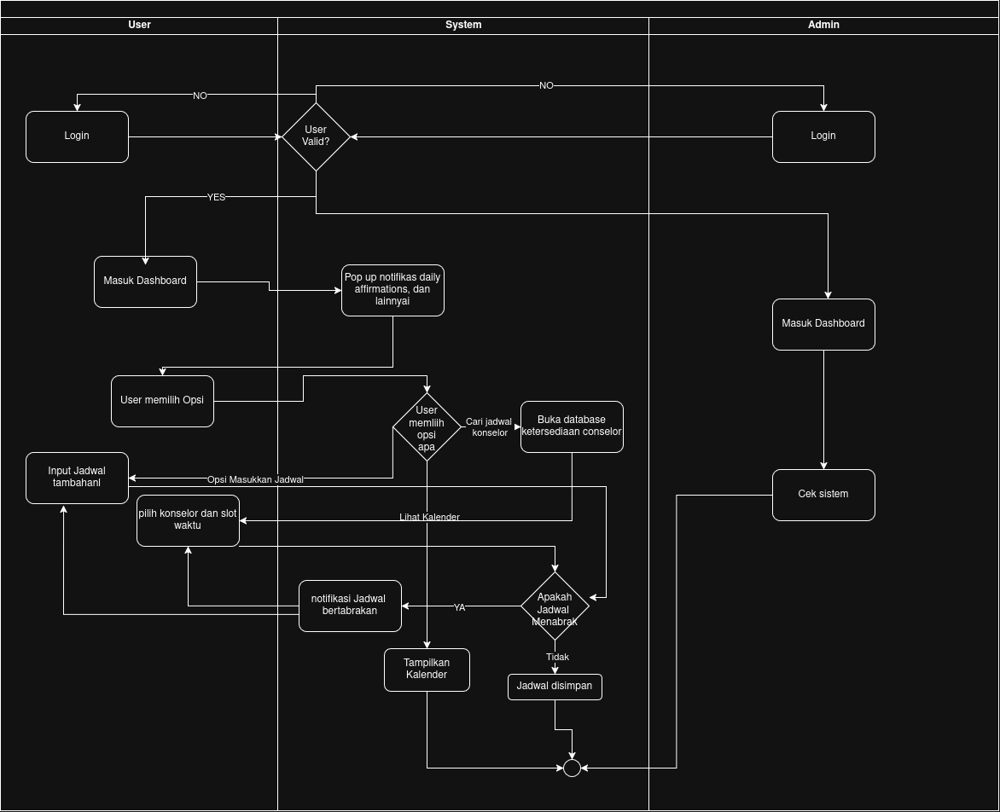

# Kamus Istillah

| Singkatan, Akronim, atau Istilah | Penjelasan |
| --- | --- |
| P/L | Singkatan dari Perangkat Lunak, yaitu aplikasi yang memberikan perintah kepada komputer untuk menjalankan tugas tertentu. |
| SKPL | Singkatan dari Spesifikasi Kebutuhan Perangkat Lunak, yaitu dokumen yang merangkum kriteria-kriteria yang diperlukan untuk membangun aplikasi menjalankan tugasnya. |
| KF | Singkatan dari Kebutuhan Fungsional, yaitu kebutuhan yang menjelaskan apa yang harus dapat dilakukan oleh sistem. |
| KNF | Singkatan dari Kebutuhan Non-Fungsional, yaitu kebutuhan yang menjelaskan kualitas sistem, seperti ketersediaan, keamanan, dan kemudahan penggunaan. |
| UC | Singkatan dari *Use Case*, yaitu gambaran interaksi antara aktor dan sistem untuk mencapai suatu tujuan. |
| UML | Singkatan dari *Unified Modeling Language*, yaitu bahasa pemodelan standar yang digunakan untuk membuat *use case diagram* dan diagram kelas. |
| SDG | Singkatan dari *Sustainable Development Goals* (Tujuan Pengembangan Berkelanjutan), yaitu 17 tujuan global yang dicanangkan PBB. SDG 3 berfokus pada kehidupan yang sehat dan sejahtera. |
| Sehati | Nama perangkat lunak yang dikembangkan untuk mendukung kesehatan mental dan kesejahteraan mahasiswa. |
| Mahasiswa | Aktor pengguna utama Sehati yang menggunakan pengingat, *daily affirmations*, jadwal, dan pemesanan sesi konsultasi. |
| Administrator | Aktor yang mengelola Sehati, termasuk memasukkan jadwal konsultan, mengelola FAQ dan umpan balik, serta memantau status *server*. |
| Konsultan | Tenaga profesional yang menyediakan sesi konsultasi. Konsultan bukan aktor sistem; data dan jadwalnya dikelola oleh Administrator. |
| *Daily Affirmations* | Pesan positif yang dikirimkan kepada pengguna pada waktu yang diatur pengguna untuk menjaga suasana hati dan kepercayaan diri. |
| Pengingat | Notifikasi dengan waktu yang diatur pengguna untuk makan, tidur, dan berolahraga. |
| Notifikasi | Pesan yang ditampilkan sistem kepada pengguna, misalnya untuk *daily affirmations* dan pengingat. |
| Google Calendar | Layanan kalender milik Google yang datanya diintegrasikan ke Sehati untuk menampilkan jadwal pengguna. |
| API | Singkatan dari *Application Programming Interface*, yaitu antarmuka yang memungkinkan satu perangkat lunak berkomunikasi dengan perangkat lunak lain, misalnya Google Calendar API. |
| OAuth | Protokol otorisasi yang memungkinkan aplikasi mendapat akses terbatas ke akun pengguna di layanan lain (misalnya Google) tanpa mengetahui kata sandi pengguna. |
| Autentikasi | Proses memverifikasi identitas pengguna sebelum diberi akses ke aplikasi. Pada Sehati, autentikasi dilakukan melalui akun Google. |
| *Free/busy* | Informasi rentang waktu pengguna yang sibuk atau kosong pada kalender, tanpa rincian acaranya. Dipakai untuk mendeteksi bentrok jadwal. |
| Bentrok jadwal | Kondisi ketika waktu sesi konsultasi yang dipilih tumpang tindih dengan acara lain di kalender pengguna. |
| *Database* | Basis data tempat sistem menyimpan data seperti jadwal konsultasi, FAQ, dan umpan balik. |
| *Server* | Komponen sistem yang menjalankan logika aplikasi dan melayani permintaan dari pengguna. |
| *Uptime* | Persentase waktu sistem dapat diakses dan beroperasi dalam suatu periode. |
| FAQ | Singkatan dari *Frequently Asked Questions*, yaitu daftar pertanyaan yang sering diajukan beserta jawabannya. |
| Umpan balik | Masukan dari pengguna terhadap aplikasi, yang dapat ditanggapi oleh Administrator. |
| *Traceability* | Keterlacakan hubungan antara kelas, *use case*, dan kebutuhan fungsional. |

# Latar Belakang

Kesehatan mental itu penting.
Namun, masyarakat Indonesia cenderung untuk mengabaikan hal ini.
Buktinya, pergi ke psikolog untuk terapi seringkali dipandang sebagai hal yang tabu dan dianggap melemahkan diri.

Selain itu, jumlah kasus bunuh diri di Indonesia cukup tinggi, terutama yang terjadi pada remaja dan mahasiswa.
Estimasi IHME dan Global Burden of Disease menyatakan, pada tahun 2023 untuk setiap 100.000 orang, terjadi sekitar 2 kematian akibat bunuh diri di Indonesia.

Di samping kasus bunuh diri, kondisi mental yang kurang ideal menurunkan tingkat produktivitas dan kualitas aktivitas sosial.
Kedua faktor ini sangat penting bagi mahasiswa, target utama produk kami, untuk mencapai perkuliahan yang optimal.

Kami ingin mengaitkan latar belakang ini dengan poin ketiga Tujuan Pengembangan Bersama (_Sustainable Development Goals_ [SDGs]), yaitu kehidupan yang sehat dan sejahtera.
Perserikatan Bangsa-Bangsa telah mencanangkan sejumlah SDG yang perlu pemerintah dan masyarakat dunia capai sebelum tahun 2030.
Namun, pada tahun 2024, terlaporkan bahwa hanya 17% target SDG telah tercapai.

Dari latar belakang ini, diharapkan solusi perangkat lunak ini dapat menjadi sarana untuk menggiatkan kesadaran akan kesehatan mental yang baik dan ketercapaian bersama dalam SDGs di lingkungan kami sebagai mahasiswa, serta memperkaya alternatif solusi yang telah ada.

# Analisis Kondisi Saat Ini

[Riliv](https://riliv.co/), [bicarakan.id](http://Bicarakan.id), KALM, 7 Cups, [Headspace](https://www.headspace.com/), BetterHelp, dan Woebot menawarkan beberapa solusi perangkat lunak yang telah dikembangkan sebelumnya. Ada pun _hotline_ yang disediakan oleh pemerintah (SEJIWA, yang dapat diakses via nomor telepon 119 _extension_ 8\) dan lembaga lainnya, seperti LISA Suicide Prevention Helpline, yang diprakarsai oleh 11 LSM dalam kolektif Bali Bersama Bisa.

Namun, terdapat beberapa keluhan yang diberikan oleh _review online_ yang diberikan pengguna. Beberapa hal seperti:

| ID   | Kekurangan                                                                                                                                                                                                                                                              |
| ---- | ----------------------------------------------------------------------------------------------------------------------------------------------------------------------------------------------------------------------------------------------------------------------- |
| AK-1 | Aplikasi Riliv tergolong sulit dan kurang sesuai dalam pemakaiannya, terdapat fitur pemesanan konsultasi namun harus mengikuti jadwal yang tersedia dan tidak langsung.                                                                                                 |
| AK-2 | Aplikasi Bicarakan.id yang memiliki kekurangan pada bug aplikasi yang dapat terjadi kapan saja, seperti terjadi pemesanan yang tulisannya selesai namun gagal, pembuatan akun yang terus gagal, pendaftaran yang menggunakan nomor baru namun dituliskan sudah dipakai. |
| AK-3 | Sebagian besar layanan konseling memiliki tarif yang dapat tergolong cukup tinggi maka tidak dapat meng-_cover_ keseluruhan demografi.                                                                                                                                  |
| AK-4 | Layanan BetterHelp yang memiliki marketplace konseling memiliki masalah menaruh iklan yang bersangkutan dengan pihak ketiga yang menjual data pribadi pengguna.                                                                                                         |
| AK-5 | Chatbot Woebot yang pada awalnya memiliki basis pengguna yang cukup tinggi namun karena perusahaan beralih ke model enterprise pengguna-pengguna tersebut ditinggalkan begitu saja tanpa adanya pengganti.                                                              |

# Aturan Penomoran

| Hal/Bagian | Penomoran | Keterangan |
| --- | --- | --- |
| Kebutuhan | R-XX | Huruf R, tanda hubung, lalu nomor urut dua digit mulai dari 01 (contoh: R-01). Dipakai pada kolom ID Kebutuhan. |
| Kebutuhan Fungsional | KF-XX | Nomor urut dua digit mulai dari 01 (contoh: KF-01). |
| Kebutuhan Non-Fungsional | KNF-XX | Nomor urut dua digit mulai dari 01 (contoh: KNF-01). |
| Aktivitas | A-XX | Nomor urut dua digit mulai dari 01 (contoh: A-01), sesuai dokumen *Requirement Gathering*. |
| *User Story* | US-XX | Nomor urut dua digit mulai dari 01 (contoh: US-01), sesuai dokumen *Requirement Gathering*. |
| *Use Case* | UC-XX | Nomor urut dua digit mulai dari 01 (contoh: UC-01). |
| Kelas | C-XX | Nomor urut dua digit mulai dari 01 (contoh: C-01). |
| Aktor | Tidak ada | Aktor tidak diberi ID dan dirujuk dengan namanya (Mahasiswa, Administrator). |

# Analisis Solusi

## Deskripsi Perangkat Lunak

Sehati adalah aplikasi mobile (Android dan iOS) yang mempromosikan well-being mahasiswa, sejalan dengan SDG 3 (ensure healthy lives and promote well-being for all at all ages).
Aplikasi menargetkan mahasiswa secara khusus agar operasionalnya terfokus.
Pengguna utama (Mahasiswa) masuk ke aplikasi melalui akun Google, lalu dapat memesan jadwal sesi konsultasi, melihat daily affirmations, dan mengatur pengingat makan, tidur, serta olahraga.
Administrator mengelola data konsultan dan jadwal ketersediaannya, FAQ, umpan balik pengguna, serta memantau status server.

<i>Gambar 1. Contoh Activity Diagram Proses Bisnis</i>

## Asumsi dan Batasan

| ID | Asumsi |
| --- | --- |
| AB-A-1 | Pengguna (mahasiswa) memiliki akun Google aktif dan bersedia memberikan izin akses ke Google Calendar mereka untuk keperluan integrasi jadwal |
| AB-A-2 | Pengguna memiliki koneksi internet yang stabil selama menggunakan aplikasi, mengingat fitur-fitur utama (sinkronisasi kalender, pemesanan konsultasi) bergantung pada komunikasi *real-time* dengan server |
| AB-A-3 | Data konsultan yang terdaftar diperbarui secara berkala oleh Administrator |
| AB-A-4 | Data jadwal dan preferensi yang dimasukkan pengguna (waktu makan, tidur, olahraga) mencerminkan kondisi dan kebutuhan nyata mereka |
| AB-A-5 | Pengguna memiliki perangkat mobile (Android/iOS) yang memenuhi spesifikasi minimum aplikasi |

| ID | Regulasi |
| --- | --- |
| AB-R-1 | UUD 1945 pasal 28H ayat (1) |
| AB-R-2 | UU No. 39/1999 tentang HAM |
| AB-R-3 | UU No. 3/1966 tentang Kesehatan Jiwa |
| AB-R-4 | UU No. 18/2014 tentang Kesehatan Jiwa |
| AB-R-5 | UU No. 17/2023 tentang Kesehatan (UU Kesehatan omnibus) |
| AB-R-6 | Permenkes No. 54/2017 |

| ID | Keterbatasan |
| --- | --- |
| AB-K-1 | Aplikasi bukan pengganti layanan intervensi krisis atau *hotline* darurat (seperti SEJIWA 119 ext. 8) — tidak dirancang untuk menangani situasi darurat kesehatan mental |
| AB-K-2 | Fitur integrasi jadwal bergantung pada ketersediaan dan kebijakan API pihak ketiga (Google Calendar API); jika pengguna mencabut izin akses atau layanan API mengalami gangguan, sinkronisasi jadwal tidak akan berfungsi |
| AB-K-3 | Verifikasi kredensial profesional konsultan dilakukan secara manual oleh administrator, bukan otomatis |
| AB-K-4 | Konsultan yang tersedia terbatas pada mitra yang telah terdaftar dan diverifikasi di dalam sistem, bukan direktori terbuka |
| AB-K-5 | Rilis awal hanya mencakup aplikasi mobile (Android dan iOS); belum tersedia versi web atau desktop |
| AB-K-6 | Aplikasi tidak menyediakan rekam medis elektronik atau fitur diagnosis klinis |

| ID | Di dalam ruang lingkup solusi |
| --- | --- |
| AB-RLS-D-1 | Pengaturan dan pengiriman *daily affirmations* sesuai jadwal yang ditentukan pengguna |
| AB-RLS-D-2 | Pengingat (*reminder*) makan, tidur, dan olahraga yang dapat dikustomisasi |
| AB-RLS-D-3 | Tampilan jadwal harian terintegrasi dengan Google Calendar pengguna (*read access*) |
| AB-RLS-D-4 | Pemesanan sesi konsultasi dengan konsultan, termasuk deteksi bentrok (*overlap*) antara slot yang dipilih dengan event yang sudah ada di Google Calendar pengguna |
| AB-RLS-D-5 | Panel administrator untuk mengelola ketersediaan konsultan dan data pengguna |

| ID | Di luar ruang lingkup solusi |
| --- | --- |
| AB-RLS-L-1 | Layanan konseling darurat atau intervensi krisis *real-time* |
| AB-RLS-L-2 | Rekam medis elektronik atau riwayat diagnosis klinis pengguna |
| AB-RLS-L-3 | Sistem pembayaran/*billing* (belum disebutkan sebagai fitur utama) |
| AB-RLS-L-4 | Aplikasi versi web atau desktop pada rilis awal |
| AB-RLS-L-5 | Fitur komunitas atau forum antar-pengguna |

## Spesifikasi Kebutuhan

### Identifikasi Aktor

| Aktor         | Deskripsi                                                                                                                                               |
| ------------- | ------------------------------------------------------------------------------------------------------------------------------------------------------- |
| Mahasiswa | Pengguna ini akan menggunakan fitur-fitur pengingat makan, olahraga, dan tidur serta mendapatkan *daily affirmations* dan dapat memesan sesi konsultasi |
| Administrator | Pengguna ini akan menambahkan jadwal konsultasi sesuai jadwal yang terdapat pada informasi konsultan |

### Kebutuhan Pengguna Awal

| ID    | Aktor                    | Kebutuhan / Aktivitas                                            | Tujuan / Nilai                                                                               |
| ----- | ------------------------ | ---------------------------------------------------------------- | -------------------------------------------------------------------------------------------- |
| US-01 | Mahasiswa                | Mendapatkan notifikasi pengiriman _daily affirmations_           | Menjaga _mood_ dan mental tetap stabil dan sehat.                                            |
| US-02 | Mahasiswa                | Mendapatkan pengingat makan sesuai jadwal harian                 | Menjaga kesehatan fisik                                                                      |
| US-03 | Mahasiswa                | Mendapatkan pengingat tidur sesuai jadwal harian                 | Menjaga kesehatan fisik                                                                      |
| US-04 | Mahasiswa                | Menginput dan melihat jadwal sehari-hari secara simpel dan mudah | Memudahkan untuk mengetahui kegiatan yang sedang dan akan dilakukan tanpa berpindah aplikasi |
| US-05 | Mahasiswa                | Memesan sesi konsultasi pada jadwal yang diinginkan              | Menjadikan proses pemesanan lebih fleksibel                                                  |
| US-06 | Mahasiswa                | Mendapatkan pengingat olahraga sesuai jadwal harian              | Menjaga kesehatan fisik                                                                      |
| US-07 | Administrator            | Memasukkan jadwal sesi konsultasi pada sistem                    | Menjadikan data jadwal sesi konsultasi tersedia ke sistem dan dapat diakses                  |
| US-08 | Administrator            | Menjaga dan mengelola sistem                                     | Menjaga kestabilan dan keandalan aplikasi dan sistem                                         |
| US-09 | Mahasiswa, Administrator | Masuk ke aplikasi menggunakan akun Google                        | Memudahkan proses login tanpa perlu membuat dan mengingat kredensial baru                    |

### Deskripsi Aktivitas

| ID   | Aktivitas                                              | Penjelasan                                                                                                                                                                        | ID _User_ Story |
| ---- | ------------------------------------------------------ | --------------------------------------------------------------------------------------------------------------------------------------------------------------------------------- | --------------- |
| A-01 | Menyetel jadwal pengiriman *daily affirmations* | Pengguna dapat mengatur kapan mendapatkan *daily affirmations* lewat aplikasi. | US-01 |
| A-02 | Melihat jadwal sehari-hari secara keseluruhan | Pengguna dapat melihat jadwal sehari-hari lewat integrasi Google Calendar termasuk jadwal pengingat dan kegiatan-kegiatan lain yang ada di jadwal Google Calendar pengguna. | US-04 |
| A-03 | Menyetel pengingat makan | Pengguna dapat mengatur kapan diberikan pengingat lewat aplikasi. | US-02 |
| A-04 | Menyetel pengingat tidur | Pengguna dapat mengatur kapan diberikan pengingat lewat aplikasi. | US-03 |
| A-05 | Mengatur pengingat olahraga | Pengguna dapat mengatur kapan diberikan pengingat lewat aplikasi. | US-06 |
| A-06 | Menjadwalkan konsultasi dengan konsultan | Pengguna dapat melihat jadwal konsultasi yang tersedia sekaligus melihat apakah jadwal tersebut bertabrakan dengan jadwal yang sudah ada di kalender pengguna di Google Calendar. | US-05 |
| A-07 | Menginput jadwal konsultan pada *database* | Admin memasukkan jadwal konsultan ke database agar dapat dilihat di kalender pengguna | US-07 |
| A-08 | Membuat FAQ | Admin membantu dalam pembuatan FAQ dari pertanyaan yang sering diajukan | US-08 |
| A-09 | Meng-*update* dan melakukan pengecekan terhadap server | Admin melakukan regulasi melalui pengecekan dan update keadaan server (servis up/down) | US-08 |
| A-10 | Merespons terhadap umpan balik pengguna | Admin membantu pengguna dalam penggunaan aplikasi | US-08 |
| A-11 | Melakukan autentikasi melalui akun Google | Pengguna masuk ke aplikasi dengan akun Google mereka, dan sistem memverifikasi identitas tersebut sebelum memberikan akses ke fitur aplikasi. | US-09 |

### Peta Kebutuhan

| ID Kebutuhan | ID Aktivitas     | Jenis Kebutuhan | Deskripsi Kebutuhan                                                                                                                | P/L   |
| ------------ | ---------------- | --------------- | ---------------------------------------------------------------------------------------------------------------------------------- | ----- |
| R-01         | A-01             | _User_          | _User_ dapat mengubah kapan mereka menerima _daily affirmations_ saat diinginkan                                                   | Ya    |
| R-02         | A-01             | _System_        | Sistem dapat menyimpan preferensi _user_ dengan menggunakan _cookies_                                                              | Ya    |
| R-03         | A-02             | _User_          | _User_ dapat melihat kalender dari aplikasi                                                                                        | Ya    |
| R-04         | A-02             | _System_        | Sistem dapat menampilkan kalender di aplikasi yang merupakan cerminan dari Google Calendar pengguna                                | Ya    |
| R-05         | A-03             | _User_          | _User_ dapat menyetel kapan saja ia ingin diingatkan untuk makan                                                                   | Ya    |
| R-06         | A-04             | _User_          | _User_ dapat menyetel kapan saja ia ingin diingatkan untuk tidur                                                                   | Ya    |
| R-07         | A-05             | _User_          | _User_ dapat menyetel kapan saja ia ingin diingatkan untuk olahraga                                                                | Ya    |
| R-08         | A-03, A-04, A-05 | _System_        | Sistem dapat menerima reminder dan secara sukses memberikan notifikasi ketika reminder tersebut dilewati                           | Ya    |
| R-09         | A-06             | _User_          | _User_ dapat memesan jadwal sesuai sesi yang telah terdaftar di sistem                                                             | Ya    |
| R-10         | A-06             | _System_        | Sistem dapat mengambil data (melakukan GET _request_) dari _database_ untuk ditampilkan ke pengguna                                | Ya    |
| R-11         | A-07             | _System_        | Sistem dapat menyimpan data jadwal sesi konsultasi pada _database_                                                                 | Ya    |
| R-12         | A-07             | _Business_      | Konsultan harus memberikan jadwalnya kepada administrator untuk mendaftarkannya di sistem                                          | Ya    |
| R-13         | A-08             | _System_        | Sistem harus memiliki sistem/media pemberian umpan balik                                                                           | Ya    |
| R-14         | A-08             | _System_        | Sistem harus menampilkan pertanyaan-pertanyaan yang sering diberikan _User_ pada suatu tempat di aplikasi                          | Ya    |
| R-15         | A-08             | _Business_      | Pengguna harus dapat memberikan umpan balik terhadap aplikasi                                                                      | Ya    |
| R-16         | A-09             | _System_        | Administrator melakukan pengecekan berkala pada aplikasi dan mengecek apakah sistem sedang _down_/tidak                            | Ya    |
| R-17         | A-09             | _Business_      | Administrator melakukan pelaporan jika terdapat kendala pada aplikasi                                                              | Tidak |
| R-18         | A-10             | _System_        | Sistem harus dapat menerima dan Administrator harus dapat memberikan komentar pada umpan balik _User_                              | Ya    |
| R-19         | N/A              | _System_        | Sistem dapat memastikan data pengguna tidak dapat diakses oleh pihak tak berwenang                                                 | Ya    |
| R-20         | N/A              | _System_        | Sistem dapat dinavigasikan dengan Mudah                                                                                            | Ya    |
| R-21         | A-11             | _System_        | Sistem dapat mengautentikasi pengguna (Mahasiswa dan Administrator) melalui akun Google sebelum memberikan akses ke fitur aplikasi | Ya    |

## Kebutuhan Fungsional dan Kebutuhan Non-Fungsional

| ID KF | ID Kebutuhan     | Penjelasan                                                                                                                                                                                 |
| ----- | ---------------- | ------------------------------------------------------------------------------------------------------------------------------------------------------------------------------------------ |
| KF-01 | R-01 | Sistem menyediakan opsi untuk menyetel waktu pengiriman **daily affirmations** dan dapat mengirim notifikasi **daily affirmations** di waktu yang disetel |
| KF-02 | R-04 | Sistem dapat mengambil data Google Calendar pengguna melalui API yang tersedia dan menampilkannya di antarmuka |
| KF-03 | R-05, R-06, R-07 | Sistem menyediakan opsi untuk menyetel waktu pengiriman pengingat makan, tidur, olahraga dan dapat mengirim pengingatnya di waktu yang disetel |
| KF-04 | R-08 | Sistem memberikan tampilan notifikasi di mana pun user berada dalam aplikasi, dilengkapi juga dengan konten seperti label yang diberikan pengguna |
| KF-05 | R-04 | Sistem dapat menampilkan kalender yang telah terintegrasi dengan Google Calendar pengguna lalu memberikan kalender gabungan dengan data jadwal sesi konsultasi yang terdapat di *database* |
| KF-06 | R-10 | Sistem dapat mengambil data jadwal dari *database* dan dapat ditampilkan data tersebut ke pengguna |
| KF-07 | R-09, R-11 | Sistem dapat menyimpan data jadwal sesi konsultasi (baik yang dimasukkan administrator maupun yang dipesan mahasiswa) ke dalam *database*, serta memungkinkan mahasiswa memesan sesi sesuai jadwal yang terdaftar |
| KF-08 | R-14 | Sistem dapat menampilkan daftar pertanyaan yang sering diajukan (FAQ) pada aplikasi. |
| KF-09 | R-13, R-15 | Sistem menyediakan fitur bagi pengguna untuk memberikan umpan balik terhadap aplikasi. |
| KF-10 | R-16 | Sistem dapat menampilkan status *server* (*up/down*) kepada administrator. |
| KF-11 | R-18 | Sistem dapat memberikan akses kepada administrator untuk memberikan tanggapan/feedback terhadap umpan balik pengguna. |
| KF-12 | R-21 | Sistem dapat memverifikasi identitas pengguna melalui *log in* akun Google dan memberikan akses ke aplikasi setelah autentikasi berhasil. |

| ID KNF | ID Kebutuhan | Parameter    | Deskripsi Kebutuhan                                         |
| ------ | ------------ | ------------ | ----------------------------------------------------------- |
| KNF-01 | R-08         | Availability | P/L dapat tersedia setiap saat dengan minimal uptime 90%    |
| KNF-02 | R-29         | Security     | P/L hdapat mengamankan datanya dari pihak tak berwenang     |
| KNF-03 | R-20         | Ergonomy     | P/L dapat dengan mudah digunakan untuk mahasiswa 8-24 tahum |
| KNF-04 | R-09         | Reliability  | P/L dapat memberikan feedback menuju administrator          |

- [https://www.geeksforgeeks.org/software-engineering/software-engineering-software-maintenance/](https://www.geeksforgeeks.org/software-engineering/software-engineering-software-maintenance/)

## Model Proses Bisnis

  

<i>Gambar 1. Model Proses Bisnis Sehati</i>
 
www.drawio.com

# Use Cases

| ID UC | Nama *Use Case* | Deskripsi Singkat | Aktor Terlibat | ID KF Terkait |
| --- | --- | --- | --- | --- |
| UC-01 | Menyetel *Daily Affirmations* | Mahasiswa mengatur waktu penerimaan *daily affirmations* dan menerima notifikasinya. | Mahasiswa | KF-01, KF-04 |
| UC-02 | Menyetel Pengingat Kesehatan | Mahasiswa mengatur waktu pengingat makan, tidur, dan olahraga, serta menerima notifikasinya. | Mahasiswa | KF-03, KF-04 |
| UC-03 | Melihat Kalender Terintegrasi | Mahasiswa melihat jadwal gabungan antara Google Calendar dan jadwal sesi konsultasi dalam satu tampilan. | Mahasiswa | KF-02, KF-05, KF-06 |
| UC-04 | Memesan Sesi Konsultasi | Mahasiswa memilih dan memesan sesi konsultasi pada jadwal yang tersedia. | Mahasiswa | KF-05, KF-06, KF-07 |
| UC-05 | Mengelola Jadwal Konsultan | Administrator memasukkan dan memperbarui jadwal sesi konsultasi ke dalam sistem tanpa mengubah *source code*. | Administrator | KF-06, KF-07 |
| UC-06 | Melihat FAQ | Mahasiswa membuka dan mencari daftar pertanyaan yang sering diajukan. | Mahasiswa | KF-08 |
| UC-07 | Mengelola FAQ | Administrator menambah, mengubah, atau menghapus daftar FAQ. | Administrator | KF-08 |
| UC-08 | Memberikan Umpan Balik | Mahasiswa mengirimkan umpan balik terhadap aplikasi. | Mahasiswa | KF-09 |
| UC-09 | Menanggapi Umpan Balik | Administrator melihat dan memberikan tanggapan atas umpan balik yang masuk. | Administrator | KF-11 |
| UC-10 | Memantau Status *Server* | Administrator memeriksa status *up/down* server secara berkala. | Administrator | KF-10 |
| UC-11 | Masuk Melalui Akun Google | Pengguna *log in* ke aplikasi menggunakan akun Google sebelum mengakses fitur lainnya. | Mahasiswa, Administrator | KF-12 |
| UC-12 | Form Pengajuan Pertanyaan | Pengguna mengajukan pertanyaan di luar yang ada di FAQ | Mahasiswa | KF-08 ⚠ *(lihat catatan di atas)* |

## Use Case Diagram

<i>Gambar 1. Use case Diagram</i>

## Skenario Use Case

### Skenario UC-01

**Nama _Use Case_:** _Menyetel_ _Daily Affirmations_

**Skenario Normal**

| No  | Aksi Aktor                                                      | Reaksi Perangkat Lunak                                           |
| --- | --------------------------------------------------------------- | ---------------------------------------------------------------- |
| 1   | Mahasiswa memasukkan input waktu pengiriman _daily affirmation_ | Sistem menampilkan input pada _input box_                        |
| 2   | Mahasiswa mengklik tombol konfirmasi                            | Sistem menyimpan preferensi waktu pengiriman _daily affirmation_ |

 

**Skenario Alternatif 1: Sistem tidak mampu menyimpan setelan**

| No  | Aksi Aktor                                                      | Reaksi Perangkat Lunak                                                                                     |
| --- | --------------------------------------------------------------- | ---------------------------------------------------------------------------------------------------------- |
| 1   | Mahasiswa memasukkan input waktu pengiriman _daily affirmation_ | Sistem menampilkan input pada _input box_                                                                  |
| 2   | Mahasiswa mengklik tombol konfirmasi                            | Sistem tidak dapat menyimpan preferensi waktu pengiriman _daily affirmation_ dan menampilkan pesan _error_ |

### Skenario UC-02

**Nama _Use Case_:** _Menyetel Pengingat Kesehatan_

**Skenario Normal**

| No  | Aksi Aktor                                                      | Reaksi Perangkat Lunak                                           |
| --- | --------------------------------------------------------------- | ---------------------------------------------------------------- |
| 1   | Mahasiswa memasukkan input waktu pengiriman pengingat kesehatan | Sistem menampilkan input pada _input box_                        |
| 2   | Mahasiswa mengklik tombol konfirmasi                            | Sistem menyimpan preferensi waktu pengiriman pengingat kesehatan |

 

**Skenario Alternatif 1: Sistem tidak mampu menyimpan setelan**

| No  | Aksi Aktor                                                      | Reaksi Perangkat Lunak                                                                                     |
| --- | --------------------------------------------------------------- | ---------------------------------------------------------------------------------------------------------- |
| 1   | Mahasiswa memasukkan input waktu pengiriman pengingat kesehatan | Sistem menampilkan input pada _input box_                                                                  |
| 2   | Mahasiswa mengklik tombol konfirmasi                            | Sistem tidak dapat menyimpan preferensi waktu pengiriman pengingat kesehatan dan menampilkan pesan _error_ |

### Skenario UC-03

**Nama _Use Case_:** _Melihat Kalender Terintegrasi_

**Skenario Normal**

| No  | Aksi Aktor                                 | Reaksi Perangkat Lunak                                         |
| --- | ------------------------------------------ | -------------------------------------------------------------- |
| 1   | Mahasiswa mengklik tombol "Lihat Kalender" | Sistem menampilkan kalender dengan data-data _event_ mahasiswa |

 

**Skenario Alternatif 1: Sistem tidak mampu mengambil data _event_**

| No  | Aksi Aktor                                 | Reaksi Perangkat Lunak                                                                                                              |
| --- | ------------------------------------------ | ----------------------------------------------------------------------------------------------------------------------------------- |
| 1   | Mahasiswa mengklik tombol "Lihat Kalender" | Sistem tidak menampilkan kalender dengan data-data _event_ mahasiswa dan menyediakan pesan _error_ dan tombol untuk mengulangi aksi |
| 2   | Mahasiswa mengklik tombol "Refresh"        | Jika gagal, sama seperti no. 1. Jika berhasil, sistem bereaksi pada skenario normal                                                 |

### Skenario UC-04

**Nama _Use Case_:** _Memesan Sesi Konsultasi_

| No  | Aksi Aktor                                      | Reaksi Perangkat Lunak                                                                               |
| --- | ----------------------------------------------- | ---------------------------------------------------------------------------------------------------- |
| 1   | Mahasiswa mengklik tombol "Pesan Sesi"          | Sistem menampilkan kalender dengan data-data _event_ mahasiswa dan jadwal konsultasi                 |
| 2   | Mahasiswa mengklik salah satu jadwal konsultasi | Sistem menampilkan informasi mengenai jadwal konsultasi tersebut dan menyediakan tombol "Konfirmasi" |
| 3   | Mahasiswa mengklik tombol "Konfirmasi"          | Sistem mengingat bahwa pengguna tersebut memesan sesi konsultasi yang dikonfirmasi                   |

**Skenario Alternatif 1: Sistem tidak mampu mengambil data jadwal konsultasi**

| No  | Aksi Aktor                             | Reaksi Perangkat Lunak                                                                                                                                         |
| --- | -------------------------------------- | -------------------------------------------------------------------------------------------------------------------------------------------------------------- |
| 1   | Mahasiswa mengklik tombol "Pesan Sesi" | Sistem tidak menampilkan kalender dengan data jadwal konsultasi dan/atau data _event_ mahasiswa dan menyediakan pesan _error_ dan tombol untuk mengulangi aksi |
| 2   | Mahasiswa mengklik tombol "Refresh"    | Jika gagal, sama seperti no. 1. Jika berhasil, sistem bereaksi pada skenario normal                                                                            |

**Skenario Alternatif 2: Sistem tidak mampu menyimpan jadwal konsultasi yang dipesan**

| No  | Aksi Aktor                             | Reaksi Perangkat Lunak                                                                                                                               |
| --- | -------------------------------------- | ---------------------------------------------------------------------------------------------------------------------------------------------------- |
| 1   | Mahasiswa mengklik tombol "Konfirmasi" | Sistem tidak menyimpan pesanan dan menampilkan pesan _error_. Jika ingin mengulangi, mahasiswa hanya perlu mengklik tombol "Konfirmasi" sekali lagi. |

### Skenario UC-05

**Nama _Use Case_:** _Mengelola Jadwal Konsultan_

**Skenario Normal**

| No  | Aksi Aktor                                                                                | Reaksi Perangkat Lunak                                         |
| --- | ----------------------------------------------------------------------------------------- | -------------------------------------------------------------- |
| 1   | Administrator membuka _dashboard_ untuk mengelola jadwal konsultasi                       | Sistem menampilkan kalender dengan data-data jadwal konsultasi |
| 2   | Administrator mengklik salah satu jadwal konsultasi di _dashboard_                        | Sistem menampilkan laman untuk mengedit data jadwal konsultasi |
| 3   | Administrator memasukkan perubahan pada jadwal di laman edit dan mengklik tombol "Simpan" | Sistem menyimpan perubahan jadwal konsultasi                   |

**Skenario Alternatif 1: Sistem tidak mampu mengambil data jadwal konsultasi**

| No  | Aksi Aktor                                                          | Reaksi Perangkat Lunak                                                                                                         |
| --- | ------------------------------------------------------------------- | ------------------------------------------------------------------------------------------------------------------------------ |
| 1   | Administrator membuka _dashboard_ untuk mengelola jadwal konsultasi | Sistem tidak menampilkan kalender dengan data jadwal konsultasi dan menyediakan pesan _error_ dan tombol untuk mengulangi aksi |
| 2   | Administrator mengklik tombol "Refresh"                             | Jika gagal, sama seperti no. 1. Jika berhasil, sistem bereaksi pada skenario normal                                            |

**Skenario Alternatif 2: Sistem tidak mampu mengedit data jadwal konsultasi**

| No  | Aksi Aktor                                                                                | Reaksi Perangkat Lunak                                                                                                                                       |
| --- | ----------------------------------------------------------------------------------------- | ------------------------------------------------------------------------------------------------------------------------------------------------------------ |
| 1   | Administrator memasukkan perubahan pada jadwal di laman edit dan mengklik tombol "Simpan" | Sistem tidak menyimpan pergantian data dan menyediakan pesan _error_. Jika ingin mengulangi, administrator hanya perlu mengklik tombol "Simpan" sekali lagi. |

### Skenario UC-06

**Nama _Use Case_:** Melihat FAQ

**Skenario Normal**

| No  | Aksi Aktor                                     | Reaksi Perangkat Lunak                                    |
| --- | ---------------------------------------------- | --------------------------------------------------------- |
| 1   | Mahasiswa mencari pertanyaan di search bar FAQ | Sistem menunjukkan pertanyaan dan jawaban yang disediakan |

 

**Skenario Alternatif 1: Tidak ada pertanyaan yang dicari pengguna**

| No  | Aksi Aktor                                     | Reaksi Perangkat Lunak                                                                                          |
| --- | ---------------------------------------------- | --------------------------------------------------------------------------------------------------------------- |
| 1   | Mahasiswa mencari pertanyaan di search bar FAQ | Sistem tidak menunjukkan pertanyaan yang dicari mahasiswa, lalu menawarkan untuk mengajukan pertanyaan di forum |

### Skenario UC-07

**Nama _Use Case_:** Mengelola FAQ

**Skenario Normal**

| No  | Aksi Aktor                                        | Reaksi Perangkat Lunak                                                          |
| --- | ------------------------------------------------- | ------------------------------------------------------------------------------- |
| 1   | Admin menambahkan pertanyaan dan jawaban di FAQ   | Sistem berhasil menambahkan pertanyaan & jawabannya di _database_               |
| 2   | Admin mengurangi pertanyaan di FAQ                | Sistem berhasil menghapus pertanyaan (dan jawabannya) dari _database_           |
| 3   | Admin mengubah pertanyaan dan/atau jawaban di FAQ | Sistem berhasil menyimpan perubahan pertanyaan dan/atau jawaban pada _database_ |

 

**Skenario Alternatif 1: Tidak ada pertanyaan maupun jawaban yang berhasil disimpan**

| No  | Aksi Aktor                                        | Reaksi Perangkat Lunak                                                       |
| --- | ------------------------------------------------- | ---------------------------------------------------------------------------- |
| 1   | Admin menambahkan pertanyaan dan jawaban di FAQ   | Sistem tidak menambahkan pertanyaan maupun jawabannya di _database_          |
| 2   | Admin mengurangi pertanyaan di FAQ                | Sistem tidak menghapus pertanyaan (dan jawabannya) dari _database_           |
| 3   | Admin mengubah pertanyaan dan/atau jawaban di FAQ | Sistem tidak menyimpan perubahan pertanyaan dan/atau jawaban pada _database_ |

### Skenario UC-08

**Nama _Use Case_:** Memberikan Umpan Balik

**Skenario Normal**

| No  | Aksi Aktor                                                      | Reaksi Perangkat Lunak                                    |
| --- | --------------------------------------------------------------- | --------------------------------------------------------- |
| 1   | Mahasiswa memberikan umpan balik di forum pemberian umpan balik | Sistem menerima dan menyimpan umpan balik pada _database_ |

 

**Skenario Alternatif 1: Umpan balik tidak disimpan pada _database_**

| No  | Aksi Aktor                                                      | Reaksi Perangkat Lunak                                                |
| --- | --------------------------------------------------------------- | --------------------------------------------------------------------- |
| 1   | Mahasiswa memberikan umpan balik di forum pemberian umpan balik | Sistem tidak menerima dan tidak menyimpan umpan balik pada _database_ |

### Skenario UC-09

**Nama _Use Case_:** Menanggapi Umpan Balik

**Skenario Normal**

| No  | Aksi Aktor                                                               | Reaksi Perangkat Lunak                                         |
| --- | ------------------------------------------------------------------------ | -------------------------------------------------------------- |
| 1   | Admin memberikan tanggapan pada umpan balik yang diterima oleh mahasiswa | Sistem menunjukkan jawaban dari tanggapan yang diberikan admin |

 

**Skenario Alternatif 1: Tanggapan umpan balik tidak berhasil ditampilkan**

| No  | Aksi Aktor                                                               | Reaksi Perangkat Lunak                                  |
| --- | ------------------------------------------------------------------------ | ------------------------------------------------------- |
| 1   | Admin memberikan tanggapan pada umpan balik yang diterima oleh mahasiswa | Sistem tidak menunjukkan konten pada tampilan mahasiswa |

### Skenario UC-10

**Nama _Use Case_:** Memantau Status _Server_

**Skenario Normal**

| No  | Aksi Aktor                             | Reaksi Perangkat Lunak                      |
| --- | -------------------------------------- | ------------------------------------------- |
| 1   | Admin melihat status _uptime_ website  | Sistem memberikan status _uptime_ website   |
| 2   | Admin melihat status _uptime_ _server_ | Sistem menunjukkan status _uptime_ _server_ |

 

### Skenario UC-11

**Nama _Use Case_:** Masuk Melalui Akun Google

**Skenario Normal**

| No  | Aksi Aktor                                         | Reaksi Perangkat Lunak                                            |
| --- | -------------------------------------------------- | ----------------------------------------------------------------- |
| 1   | Mahasiswa melakukan autentikasi dengan akun Google | Sistem menampilkan tampilan selanjutnya setelah _log in_ berhasil |

 

**Skenario Alternatif 1: OAuth Google tidak berfungsi saat _log in_**

| No  | Aksi Aktor                                         | Reaksi Perangkat Lunak                                                                |
| --- | -------------------------------------------------- | ------------------------------------------------------------------------------------- |
| 1   | Mahasiswa melakukan autentikasi dengan akun Google | Sistem tidak melakukan _log in_ untuk mahasiswa, mahasiswa kembali ke _log in_ screen |

### Skenario UC-12

**Nama _Use Case_:** Form Pengajuan pertanyaan

**Skenario Normal**

| No  | Aksi Aktor                                          | Reaksi Perangkat Lunak                                                     |
| --- | --------------------------------------------------- | -------------------------------------------------------------------------- |
| 1   | Mahasiswa melakukan pengajuan pertanyaan pada forms | Sistem memberikan konfirmasi bahwa pertanyaan telah disimpan pada database |

 

**Skenario Alternatif 1: Pertanyaan tidak tersimpan di database**

| No  | Aksi Aktor                                          | Reaksi Perangkat Lunak                                                                                            |
| --- | --------------------------------------------------- | ----------------------------------------------------------------------------------------------------------------- |
| 1   | Mahasiswa melakukan pengajuan pertanyaan pada forms | Sistem tidak berhasil menyimpan pertanyaan pada database dan memberikan informasi bahwa pertanyaan tidak disimpan |

# Struktur Kelas

| ID Kelas | Nama Kelas            | Deskripsi Kelas                                                                                                               | ID _Use Case_                           |
| -------- | --------------------- | ----------------------------------------------------------------------------------------------------------------------------- | --------------------------------------- |
| C-01     | Pengguna              | Kelas abstrak menyimpan atribut umum akun (id, nama, email, googleId) yang dibagikan Mahasiswa dan Administrator.             | UC-11                                   |
| C-02     | Mahasiswa             | Merealisasikan Pengguna; merepresentasikan pengguna utama aplikasi.                                                           | UC-01–UC-04, UC-06, UC-08, UC-11, UC-12 |
| C-03     | Administrator         | Merealisasikan Pengguna; mengelola jadwal konsultan, FAQ, dan umpan balik.                                                    | UC-05, UC-07, UC-09, UC-10, UC-11       |
| C-04     | SesiAutentikasi       | Menyimpan token sesi aplikasi dan status _log in_ setelah autentikasi Google berhasil.                                        | UC-11                                   |
| C-05     | DailyAffirmation      | Menyimpan konten afirmasi dan jadwal pengiriman yang ditentukan pengguna.                                                     | UC-01                                   |
| C-06     | Reminder              | Menyimpan jenis pengingat (makan/tidur/olahraga) beserta waktu yang ditentukan pengguna.                                      | UC-02                                   |
| C-07     | Notifikasi            | Merepresentasikan satu notifikasi yang dikirim ke pengguna (dari DailyAffirmation atau Reminder).                             | UC-01, UC-02                            |
| C-08     | GoogleCalendarService | Menangani komunikasi ke Google Calendar API — mengambil event pengguna dan melakukan pengecekan bentrok jadwal (_free/busy_). | UC-03, UC-04                            |
| C-09     | KalenderGabungan      | Menggabungkan event dari GoogleCalendarService dengan data JadwalKonsultasi untuk ditampilkan sebagai satu tampilan kalender. | UC-03                                   |
| C-10     | Konsultan             | Menyimpan data konsultan (nama, spesialisasi) yang didaftarkan oleh Administrator.                                            | UC-04, UC-05                            |
| C-11     | JadwalKonsultasi      | Menyimpan slot jadwal konsultasi (konsultan, waktu, status tersedia/terpesan) pada _database_.                                | UC-04, UC-05                            |
| C-12     | FAQ                   | Menyimpan pasangan pertanyaan dan jawaban yang dikelola Administrator.                                                        | UC-06, UC-07                            |
| C-13     | PengajuanPertanyaan   | Menyimpan pertanyaan yang diajukan pengguna di luar FAQ yang tersedia.                                                        | UC-12                                   |
| C-14     | UmpanBalik            | Menyimpan umpan balik pengguna beserta tanggapan Administrator (jika ada).                                                    | UC-08, UC-09                            |
| C-15     | Status*Server*        | Merepresentasikan status _uptime_ layanan yang dipantau Administrator.                                                        | UC-10                                   |

## Diagram Kelas per _Use Case_

### Diagram Kelas UC-01

**Nama _Use Case_:** Menyetel _Daily Affirmations_

**Identifikasi Kelas**

| ID Kelas | Nama Kelas       | Deskripsi Kelas                                                                                   |
| -------- | ---------------- | ------------------------------------------------------------------------------------------------- |
| C-02     | Mahasiswa        | Merealisasikan Pengguna; merepresentasikan pengguna utama aplikasi.                               |
| C-05     | DailyAffirmation | Menyimpan konten afirmasi dan jadwal pengiriman yang ditentukan pengguna.                         |
| C-07     | Notifikasi       | Merepresentasikan satu notifikasi yang dikirim ke pengguna (dari DailyAffirmation atau Reminder). |

**Diagram Kelas**

<i>Gambar 2. Diagram Kelas _Use Case_ UC-01</i>

 

| ID Kelas | Nama Kelas       | Atribut                       | Metode/Operasi                           |
| -------- | ---------------- | ----------------------------- | ---------------------------------------- |
| C-02     | Mahasiswa        | nim                           | -                                        |
| C-05     | DailyAffirmation | konten, waktuKirim            | aturWaktuKirim(), kirimAfirmasi()        |
| C-07     | Notifikasi       | idNotifikasi, isi, waktuKirim | kirimNotifikasi(), tampilkanNotifikasi() |

### Diagram Kelas UC-02

**Nama _Use Case_:** Menyetel Pengingat Kesehatan

**Identifikasi Kelas**

| ID Kelas | Nama Kelas | Deskripsi Kelas                                                                                   |
| -------- | ---------- | ------------------------------------------------------------------------------------------------- |
| C-02     | Mahasiswa  | Merealisasikan Pengguna; merepresentasikan pengguna utama aplikasi.                               |
| C-06     | Reminder   | Menyimpan jenis pengingat (makan/tidur/olahraga) beserta waktu yang ditentukan pengguna.          |
| C-07     | Notifikasi | Merepresentasikan satu notifikasi yang dikirim ke pengguna (dari DailyAffirmation atau Reminder). |

**Diagram Kelas**

<i>Gambar 3. Diagram Kelas _Use Case_ UC-02</i>

 

| ID Kelas | Nama Kelas | Atribut                       | Metode/Operasi                           |
| -------- | ---------- | ----------------------------- | ---------------------------------------- |
| C-02     | Mahasiswa  | nim                           | -                                        |
| C-06     | Reminder   | jenis, waktu                  | aturWaktuPengingat(), kirimPengingat()   |
| C-07     | Notifikasi | idNotifikasi, isi, waktuKirim | kirimNotifikasi(), tampilkanNotifikasi() |

### Diagram Kelas UC-03

**Nama _Use Case_:** Melihat Kalender Terintegrasi

**Identifikasi Kelas**

| ID Kelas | Nama Kelas            | Deskripsi Kelas                                                                                                               |
| -------- | --------------------- | ----------------------------------------------------------------------------------------------------------------------------- |
| C-02     | Mahasiswa             | Merealisasikan Pengguna; merepresentasikan pengguna utama aplikasi.                                                           |
| C-08     | GoogleCalendarService | Menangani komunikasi ke Google Calendar API — mengambil event pengguna dan melakukan pengecekan bentrok jadwal (_free/busy_). |
| C-09     | KalenderGabungan      | Menggabungkan event dari GoogleCalendarService dengan data JadwalKonsultasi untuk ditampilkan sebagai satu tampilan kalender. |

**Diagram Kelas**

<i>Gambar 4. Diagram Kelas _Use Case_ UC-03</i>

 

| ID Kelas | Nama Kelas            | Atribut     | Metode/Operasi                         |
| -------- | --------------------- | ----------- | -------------------------------------- |
| C-02     | Mahasiswa             | nim         | -                                      |
| C-08     | GoogleCalendarService | accessToken | ambilEvent(), cekBentrokJadwal()       |
| C-09     | KalenderGabungan      | daftarEvent | gabungkanJadwal(), tampilkanKalender() |

### Diagram Kelas UC-04

**Nama _Use Case_:** Memesan Sesi Konsultasi

#### Identifikasi Kelas

| ID Kelas | Nama Kelas            | Deskripsi Kelas                                                                                                               |
| -------- | --------------------- | ----------------------------------------------------------------------------------------------------------------------------- |
| C-02     | Mahasiswa             | Merealisasikan Pengguna; merepresentasikan pengguna utama aplikasi.                                                           |
| C-08     | GoogleCalendarService | Menangani komunikasi ke Google Calendar API — mengambil event pengguna dan melakukan pengecekan bentrok jadwal (_free/busy_). |
| C-10     | Konsultan             | Menyimpan data konsultan (nama, spesialisasi) yang didaftarkan oleh Administrator.                                            |
| C-11     | JadwalKonsultasi      | Menyimpan slot jadwal konsultasi (konsultan, waktu, status tersedia/terpesan) pada _database_.                                |

#### Diagram Kelas

<i>Gambar 5. Diagram Kelas _Use Case_ UC-04</i>

 

| ID Kelas | Nama Kelas            | Atribut                 | Metode/Operasi                                |
| -------- | --------------------- | ----------------------- | --------------------------------------------- |
| C-02     | Mahasiswa             | nim                     | -                                             |
| C-08     | GoogleCalendarService | accessToken             | ambilEvent(), cekBentrokJadwal()              |
| C-10     | Konsultan             | nama, spesialisasi      | -                                             |
| C-11     | JadwalKonsultasi      | idJadwal, waktu, status | simpanJadwal(), perbaruiJadwal(), pesanSesi() |

### Diagram Kelas UC-05

**Nama _Use Case_:** Mengelola Jadwal Konsultan

#### Identifikasi Kelas

| ID Kelas | Nama Kelas       | Deskripsi Kelas                                                                                |
| -------- | ---------------- | ---------------------------------------------------------------------------------------------- |
| C-03     | Administrator    | Merealisasikan Pengguna; mengelola jadwal konsultan, FAQ, dan umpan balik.                     |
| C-10     | Konsultan        | Menyimpan data konsultan (nama, spesialisasi) yang didaftarkan oleh Administrator.             |
| C-11     | JadwalKonsultasi | Menyimpan slot jadwal konsultasi (konsultan, waktu, status tersedia/terpesan) pada _database_. |

#### Diagram Kelas

<i>Gambar 6. Diagram Kelas _Use Case_ UC-05</i>

 

| ID Kelas | Nama Kelas       | Atribut                 | Metode/Operasi                                |
| -------- | ---------------- | ----------------------- | --------------------------------------------- |
| C-03     | Administrator    | -                       | -                                             |
| C-10     | Konsultan        | nama, spesialisasi      | -                                             |
| C-11     | JadwalKonsultasi | idJadwal, waktu, status | simpanJadwal(), perbaruiJadwal(), pesanSesi() |

### Diagram Kelas UC-06

**Nama _Use Case_:** Melihat FAQ

**Identifikasi Kelas**

| ID Kelas | Nama Kelas | Deskripsi Kelas                                                        |
| -------- | ---------- | ---------------------------------------------------------------------- |
| C-02     | Mahasiswa  | Merealisasikan Pengguna; merepresentasikan pengguna utama aplikasi.    |
| C-12     | FAQ        | Menyimpan pasangan pertanyaan dan jawaban yang dikelola Administrator. |

*Diagram Kelas**

<i>Gambar 7. Diagram Kelas _Use Case_ UC-06</i>

 

| ID Kelas | Nama Kelas | Atribut             | Metode/Operasi                     |
| -------- | ---------- | ------------------- | ---------------------------------- |
| C-02     | Mahasiswa  | nim                 | -                                  |
| C-12     | FAQ        | pertanyaan, jawaban | tambahFAQ(), ubahFAQ(), hapusFAQ() |

### Diagram Kelas UC-07

**Nama _Use Case_:** Mengelola FAQ

**Identifikasi Kelas**

| ID Kelas | Nama Kelas    | Deskripsi Kelas                                                            |
| -------- | ------------- | -------------------------------------------------------------------------- |
| C-03     | Administrator | Merealisasikan Pengguna; mengelola jadwal konsultan, FAQ, dan umpan balik. |
| C-12     | FAQ           | Menyimpan pasangan pertanyaan dan jawaban yang dikelola Administrator.     |

**Diagram Kelas**

<i>Gambar 8. Diagram Kelas _Use Case_ UC-07</i>

 

| ID Kelas | Nama Kelas    | Atribut             | Metode/Operasi                     |
| -------- | ------------- | ------------------- | ---------------------------------- |
| C-03     | Administrator | -                   | -                                  |
| C-12     | FAQ           | pertanyaan, jawaban | tambahFAQ(), ubahFAQ(), hapusFAQ() |

### Diagram Kelas UC-08

**Nama _Use Case_:** Memberikan Umpan Balik

**Identifikasi Kelas**

| ID Kelas | Nama Kelas | Deskripsi Kelas                                                            |
| -------- | ---------- | -------------------------------------------------------------------------- |
| C-02     | Mahasiswa  | Merealisasikan Pengguna; merepresentasikan pengguna utama aplikasi.        |
| C-14     | UmpanBalik | Menyimpan umpan balik pengguna beserta tanggapan Administrator (jika ada). |

**Diagram Kelas**

<i>Gambar 9. Diagram Kelas _Use Case_ UC-08</i>

 

| ID Kelas | Nama Kelas | Atribut                      | Metode/Operasi                        |
| -------- | ---------- | ---------------------------- | ------------------------------------- |
| C-02     | Mahasiswa  | nim                          | -                                     |
| C-14     | UmpanBalik | idUmpanBalik, isi, tanggapan | kirimUmpanBalik(), berikanTanggapan() |

### Diagram Kelas UC-09

**Nama _Use Case_:** Menanggapi Umpan Balik

**Identifikasi Kelas**

| ID Kelas | Nama Kelas    | Deskripsi Kelas                                                            |
| -------- | ------------- | -------------------------------------------------------------------------- |
| C-03     | Administrator | Merealisasikan Pengguna; mengelola jadwal konsultan, FAQ, dan umpan balik. |
| C-14     | UmpanBalik    | Menyimpan umpan balik pengguna beserta tanggapan Administrator (jika ada). |

**Diagram Kelas**

<i>Gambar 10. Diagram Kelas _Use Case_ UC-09</i>

 

| ID Kelas | Nama Kelas    | Atribut                      | Metode/Operasi                        |
| -------- | ------------- | ---------------------------- | ------------------------------------- |
| C-03     | Administrator | -                            | -                                     |
| C-14     | UmpanBalik    | idUmpanBalik, isi, tanggapan | kirimUmpanBalik(), berikanTanggapan() |

### Diagram Kelas UC-10

**Nama _Use Case_:** Memantau Status _Server_

**Identifikasi Kelas**

| ID Kelas | Nama Kelas     | Deskripsi Kelas                                                            |
| -------- | -------------- | -------------------------------------------------------------------------- |
| C-03     | Administrator  | Merealisasikan Pengguna; mengelola jadwal konsultan, FAQ, dan umpan balik. |
| C-15     | Status*Server* | Merepresentasikan status _uptime_ layanan yang dipantau Administrator.     |

**Diagram Kelas**

<i>Gambar 11. Diagram Kelas _Use Case_ UC-10</i>

 

| ID Kelas | Nama Kelas     | Atribut                | Metode/Operasi                       |
| -------- | -------------- | ---------------------- | ------------------------------------ |
| C-03     | Administrator  | -                      | -                                    |
| C-15     | Status*Server* | statusUptime, waktuCek | cekStatusServer(), tampilkanStatus() |

### Diagram Kelas UC-11

**Nama _Use Case_:** Masuk Melalui Akun Google

**Identifikasi Kelas**

| ID Kelas | Nama Kelas      | Deskripsi Kelas                                                                                                   |
| -------- | --------------- | ----------------------------------------------------------------------------------------------------------------- |
| C-01     | Pengguna        | Kelas abstrak menyimpan atribut umum akun (id, nama, email, googleId) yang dibagikan Mahasiswa dan Administrator. |
| C-02     | Mahasiswa       | Merealisasikan Pengguna; merepresentasikan pengguna utama aplikasi.                                               |
| C-03     | Administrator   | Merealisasikan Pengguna; mengelola jadwal konsultan, FAQ, dan umpan balik.                                        |
| C-04     | SesiAutentikasi | Menyimpan token sesi aplikasi dan status _log in_ setelah autentikasi Google berhasil.                            |

**Diagram Kelas**

<i>Gambar 12. Diagram Kelas _Use Case_ UC-11</i>

 

| ID Kelas | Nama Kelas      | Atribut                   | Metode/Operasi                                   |
| -------- | --------------- | ------------------------- | ------------------------------------------------ |
| C-01     | Pengguna        | id, nama, email, googleId | -                                                |
| C-02     | Mahasiswa       | nim                       | -                                                |
| C-03     | Administrator   | -                         | -                                                |
| C-04     | SesiAutentikasi | token, waktuLogin, status | autentikasiGoogle(), verifikasiToken(), logout() |

### Diagram Kelas UC-12

**Nama _Use Case_:** Form Pengajuan Pertanyaan

**Identifikasi Kelas**

| ID Kelas | Nama Kelas          | Deskripsi Kelas                                                        |
| -------- | ------------------- | ---------------------------------------------------------------------- |
| C-02     | Mahasiswa           | Merealisasikan Pengguna; merepresentasikan pengguna utama aplikasi.    |
| C-13     | PengajuanPertanyaan | Menyimpan pertanyaan yang diajukan pengguna di luar FAQ yang tersedia. |

**Diagram Kelas**

<i>Gambar 13. Diagram Kelas _Use Case_ UC-12</i>

 

| ID Kelas | Nama Kelas          | Atribut                     | Metode/Operasi     |
| -------- | ------------------- | --------------------------- | ------------------ |
| C-02     | Mahasiswa           | nim                         | -                  |
| C-13     | PengajuanPertanyaan | idPertanyaan, isiPertanyaan | ajukanPertanyaan() |

## Diagram Kelas Keseluruhan

<i>Gambar 14. Diagram Kelas Keseluruhan</i>

 

| ID Kelas | Nama Kelas | Atribut | Metode/Operasi |
| --- | --- | --- | --- |
| C-01 | Pengguna | id, nama, email, googleId | - |
| C-02 | Mahasiswa | nim | - |
| C-03 | Administrator | - | - |
| C-04 | SesiAutentikasi | token, waktuLogin, status | autentikasiGoogle(), verifikasiToken(), logout() |
| C-05 | DailyAffirmation | konten, waktuKirim | aturWaktuKirim(), kirimAfirmasi() |
| C-06 | Reminder | jenis, waktu | aturWaktuPengingat(), kirimPengingat() |
| C-07 | Notifikasi | idNotifikasi, isi, waktuKirim | kirimNotifikasi(), tampilkanNotifikasi() |
| C-08 | GoogleCalendarService | accessToken | ambilEvent(), cekBentrokJadwal() |
| C-09 | KalenderGabungan | daftarEvent | gabungkanJadwal(), tampilkanKalender() |
| C-10 | Konsultan | nama, spesialisasi | - |
| C-11 | JadwalKonsultasi | idJadwal, waktu, status | simpanJadwal(), perbaruiJadwal(), pesanSesi() |
| C-12 | FAQ | pertanyaan, jawaban | tambahFAQ(), ubahFAQ(), hapusFAQ() |
| C-13 | PengajuanPertanyaan | idPertanyaan, isiPertanyaan | ajukanPertanyaan() |
| C-14 | UmpanBalik | idUmpanBalik, isi, tanggapan | kirimUmpanBalik(), berikanTanggapan() |
| C-15 | StatusServer | statusUptime, waktuCek | cekStatusServer(), tampilkanStatus() |

## Traceability Struktur Kelas

| ID Kelas | ID *Use Case* | ID KF |
| --- | --- | --- |
| C-01 | UC-11 | KF-12 |
| C-02 | UC-01, UC-04, UC-06, UC-08, UC-11, UC-12 | KF-01, KF-04, KF-05, KF-06, KF-07, KF-08, KF-09, KF-12 |
| C-03 | UC-05, UC-07, UC-09, UC-10, UC-11 | KF-06, KF-07, KF-08, KF-10, KF-11, KF-12 |
| C-04 | UC-11 | KF-12 |
| C-05 | UC-01 | KF-01, KF-04 |
| C-06 | UC-02 | KF-03, KF-04 |
| C-07 | UC-01, UC-02 | KF-01, KF-03, KF-04 |
| C-08 | UC-03, UC-04 | KF-02, KF-05, KF-06, KF-07 |
| C-09 | UC-03 | KF-02, KF-05, KF-06 |
| C-10 | UC-04, UC-05 | KF-05, KF-06, KF-07 |
| C-11 | UC-04, UC-05 | KF-05, KF-06, KF-07 |
| C-12 | UC-06, UC-07 | KF-08 |
| C-13 | UC-12 | KF-08 |
| C-14 | UC-08, UC-09 | KF-09, KF-11 |
| C-15 | UC-10 | KF-10 |

# References

1. Kelompok G04 K01, dokumen *Topic Brainstorming*, *Requirement Gathering*, *Use Case & Scenario Use Case*, dan *Class Diagram* untuk Sehati, IF2150 Rekayasa Perangkat Lunak.
2. Google, *Google Calendar API Documentation*. https://developers.google.com/calendar
3. Google, *Google Identity: OAuth 2.0*. https://developers.google.com/identity/protocols/oauth2
4. Garuda Kemdiktisaintek, konflik/ulasan Riliv. https://garuda.kemdiktisaintek.go.id/documents/detail/4396353
5. Ulasan Bicarakan.id. https://play.google.com/store/apps/details?id=id.bicarakan.client_app
6. Ulasan Sahabatku. https://play.google.com/store/apps/details?id=com.icreativelabs.sahabatku
7. Ulasan BetterHelp. https://play.google.com/store/apps/details?id=com.betterhelp&hl=id
8. De Oliveira, Claire, et al. "The Role of Mental Health on Workplace Productivity: A Critical Review of the Literature." *Applied health economics and health policy* 21.2 (2023): 167-193.
9. Sayce, Liz. "Social inclusion and mental health." *Psychiatric Bulletin* 25.4 (2001): 121-123.
10. Our World in Data, *Suicide death rates*. https://ourworldindata.org/grapher/suicide-death-rates
11. Databoks Katadata, *Berapa Angka Bunuh Diri di Indonesia*. https://databoks.katadata.co.id/demografi/statistik/636e76fcf8dc70d/berapa-angka-bunuh-diri-di-indonesia
12. UNDP, *Sustainable Development Goals: Good Health and Well-being*. https://www.undp.org/sustainable-development-goals/good-health
13. Alat pembuatan diagram UML: draw.io (https://www.drawio.com/) dan StarUML (https://staruml.io/).
